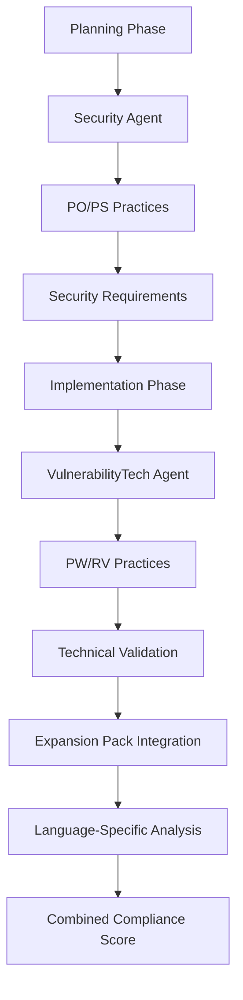

# NIST SSDF Practice Distribution Across BMad Agents

## Overview

The NIST Secure Software Development Framework (SSDF) practices are distributed across BMad agents based on the software development lifecycle phase and area of expertise. This ensures comprehensive coverage while maintaining clear separation of concerns.

## Practice Distribution

### Security Agent (Planning Phase)
**Role**: Organizational preparation and security planning
**Phase**: Planning and Architecture
**Practices Covered**: PO (Prepare the Organization) and PS (Protect the Software)

| Practice | Description | Implementation |
|----------|-------------|----------------|
| **PO.1** | Define Security Requirements | Document security requirements for development infrastructure and software |
| **PO.2** | Implement Roles and Responsibilities | Define security roles, training, and management commitment |
| **PO.3** | Implement Supporting Toolchains | Specify and configure security tools and integrations |
| **PO.4** | Define Security Check Criteria | Establish security gate criteria and acceptance thresholds |
| **PO.5** | Secure Development Environments | Implement secure development and deployment environments |
| **PS.1** | Protect Code from Unauthorized Access | Implement code access controls and integrity protection |
| **PS.2** | Software Release Integrity | Establish release integrity verification mechanisms |
| **PS.3** | Archive and Protect Software | Implement secure software archival and protection |

**Key Tasks**:
- `nist-ssdf-planning-assessment.md` - Comprehensive planning phase assessment
- `nist-ssdf-compliance.md` - Legacy compliance assessment (deprecated)

### VulnerabilityTech Agent (Implementation Phase)
**Role**: Technical security validation and vulnerability management
**Phase**: Development and Testing
**Practices Covered**: PW (Produce Well-Secured Software) and RV (Respond to Vulnerabilities)

| Practice | Description | Implementation |
|----------|-------------|----------------|
| **PW.1** | Design Software to Meet Security Requirements | Validate security requirements implementation in code |
| **PW.2** | Review Software Design | Verify design implementation against security principles |
| **PW.3** | Reuse Existing, Well-Secured Software | Assess third-party component security |
| **PW.4** | Create Source Code with Secure Coding Practices | Validate secure coding practices implementation |
| **PW.5** | Configure Compilation and Build Processes | Validate build process security configurations |
| **PW.6** | Review and/or Analyze Human-Readable Code | Validate code review processes and effectiveness |
| **PW.7** | Test Executable Code | Validate security testing implementation and coverage |
| **PW.8** | Configure Software to Have Secure Settings | Validate default security configurations |
| **RV.1** | Identify and Confirm Vulnerabilities | Validate vulnerability detection processes |
| **RV.2** | Assess, Prioritize, and Remediate Vulnerabilities | Validate vulnerability response processes |
| **RV.3** | Analyze Vulnerabilities to Identify Root Causes | Validate root cause analysis processes |

**Key Tasks**:
- `nist-ssdf-code-validation.md` - Framework-level compliance validation
- `nist-ssdf-integrated-validation.md` - Integrated validation with expansion pack

## Integration Architecture

### Layered Validation Approach



### Information Flow

1. **Planning to Implementation Handoff**:
   - Security requirements (PO.1) → Security requirements validation (PW.1)
   - Tool specifications (PO.3) → Expansion pack configurations
   - Security gate criteria (PO.4) → Compliance scoring thresholds

2. **Compliance Score Integration**:
   ```yaml
   overall_nist_ssdf_compliance:
     planning_phase: "PO/PS practices (Security Agent) - 30%"
     implementation_phase: "PW/RV practices (VulnerabilityTech Agent) - 70%"
     
     calculation: "weighted_average(planning_score * 0.3, implementation_score * 0.7)"
   ```

## Expansion Pack Integration

### Software Assurance Expansion Pack
The VulnerabilityTech agent integrates with the Software Assurance expansion pack for language-specific technical validation:

- **Integration Specification**: `expansion-packs/software-assurance/integrations/nist-ssdf-integration.md`
- **Practice Mapping**: `expansion-packs/software-assurance/nist-ssdf-mapping.yaml`
- **Language Support**: Python, JavaScript, Java, C#, Go, Rust, PHP

### Benefits of Integrated Approach

1. **Comprehensive Coverage**: All NIST SSDF practices covered across both agents
2. **Phase Alignment**: Practices aligned with appropriate SDLC phases
3. **Technical Depth**: Language-specific validation through expansion packs
4. **Unified Scoring**: Combined compliance scores for overall assessment
5. **Clear Separation**: Planning vs implementation concerns clearly separated

## Usage Patterns

### For Planning Phase (Security Agent)
```bash
# Execute planning phase NIST SSDF assessment
*nist-ssdf-planning

# Or use the enhanced integrated assessment
*nist-ssdf-planning-assessment
```

### For Implementation Phase (VulnerabilityTech Agent)
```bash
# Execute implementation phase NIST SSDF assessment
*nist-ssdf-code-validation

# Or use the integrated assessment with expansion pack
*nist-ssdf-integrated
```

### For Complete Assessment
1. **Planning Phase**: Security Agent executes PO/PS assessment
2. **Implementation Phase**: VulnerabilityTech Agent executes PW/RV assessment
3. **Combined Reporting**: Framework combines scores for overall compliance

## Compliance Reporting

### Individual Agent Reports
- **Security Agent**: PO/PS compliance with organizational readiness assessment
- **VulnerabilityTech Agent**: PW/RV compliance with technical validation details

### Combined Compliance Report
- Executive summary with overall NIST SSDF compliance score
- Phase-by-phase compliance breakdown
- Gap analysis and remediation recommendations
- Integration points and handoff documentation

## Future Enhancements

### Additional Practice Areas
- **Supply Chain Security**: Enhanced PS practices for third-party components
- **DevSecOps Integration**: Continuous compliance monitoring
- **Cloud Security**: Cloud-specific NIST SSDF implementations

### Advanced Integration
- **Real-time Compliance Monitoring**: Continuous assessment integration
- **Automated Remediation**: AI-powered gap remediation suggestions
- **Industry-Specific Adaptations**: Vertical-specific NIST SSDF implementations

This distribution ensures comprehensive NIST SSDF coverage while leveraging each agent's expertise and maintaining clear separation of concerns throughout the software development lifecycle.