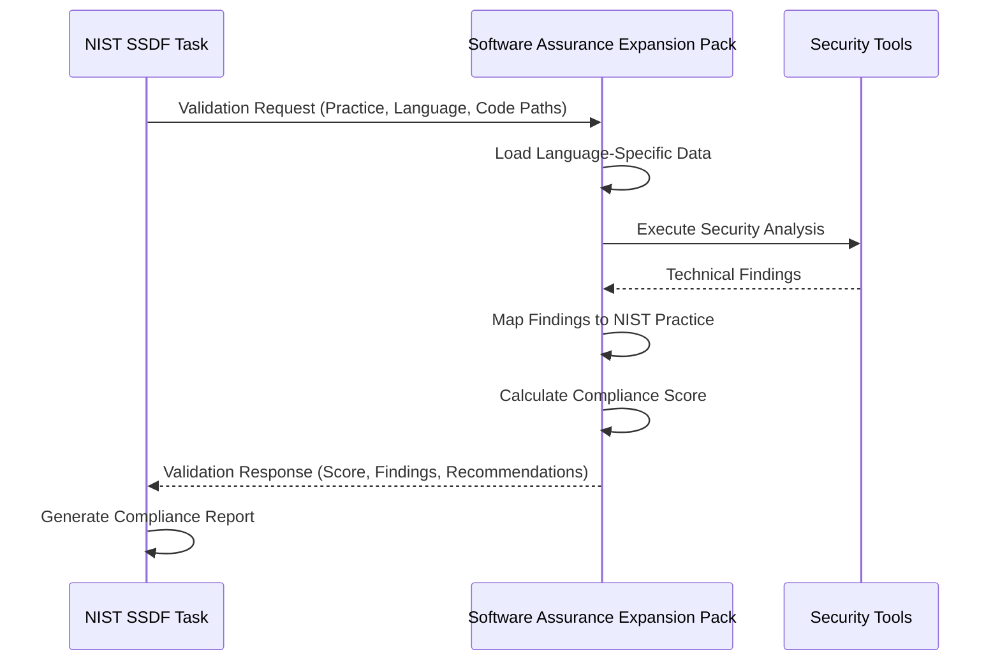

# NIST SSDF Integration Specification

## Overview

This document defines the integration interface between the BMad NIST SSDF compliance framework and the Software Assurance expansion pack. It establishes a clear API for mapping technical security findings to NIST SSDF practice compliance scores.

## Architecture

### Two-Layer Design

**Layer 1: NIST SSDF Compliance Framework (bmad-core)**

- Purpose: Process validation, compliance scoring, and reporting
- Location: `bmad-core/tasks/nist-ssdf-code-validation.md`
- Responsibility: WHAT needs to be compliant

**Layer 2: Technical Security Implementation (expansion-packs)**

- Purpose: Language-specific vulnerability detection and secure coding validation
- Location: `expansion-packs/software-assurance/`
- Responsibility: HOW to implement and validate security controls

## Integration API

### Request Interface

The NIST SSDF framework sends validation requests to the expansion pack with the following structure:

```yaml
validation_request:
  practice_id: "PW.4" # NIST SSDF practice identifier
  practice_name: "Create Source Code with Secure Coding Practices"
  language: "python" # Detected programming language
  code_paths:
    - "src/"
    - "tests/"
  context:
    project_type: "web_application"
    frameworks: ["flask", "sqlalchemy"]
    security_requirements: ["authentication", "authorization", "input_validation"]
```

### Response Interface

The expansion pack returns technical findings with compliance mapping:

```yaml
validation_response:
  practice_id: "PW.4"
  language: "python"
  technical_findings:
    secure_patterns_found:
      - pattern: "parameterized_queries"
        count: 15
        coverage: 100%
        nist_mapping: "PW.4.1"
      - pattern: "password_hashing_bcrypt"
        count: 3
        coverage: 100%
        nist_mapping: "PW.4.1"

    vulnerabilities_found:
      - type: "sql_injection"
        severity: "high"
        count: 2
        locations: ["src/auth.py:45", "src/user.py:123"]
        nist_impact: "PW.4.1"
        remediation: "Use parameterized queries"
      - type: "weak_password_hashing"
        severity: "medium"
        count: 1
        locations: ["src/legacy_auth.py:89"]
        nist_impact: "PW.4.1"
        remediation: "Replace MD5 with bcrypt"

    compliance_metrics:
      input_validation_coverage: 85%
      authentication_security_score: 90%
      cryptography_implementation_score: 75%
      error_handling_score: 95%

  compliance_score: 82 # 0-100 scale for this practice
  status: "partial" # compliant|partial|non_compliant
  recommendations:
    - "Remediate SQL injection vulnerabilities in auth and user modules"
    - "Update legacy password hashing to use bcrypt"
    - "Improve input validation coverage to 95%+"
```

## Practice Mapping Matrix

### PW (Produce Well-Secured Software) Practices

| NIST Practice | Sub-Practice                         | Technical Validation                                | Expansion Pack Data Source                                            |
| ------------- | ------------------------------------ | --------------------------------------------------- | --------------------------------------------------------------------- |
| PW.1          | Security Requirements Implementation | Architecture compliance, threat model validation    | `data/{language}-architecture-patterns.md`                            |
| PW.2          | Design Implementation Verification   | Design pattern analysis, security control placement | `data/{language}-design-patterns.md`                                  |
| PW.3          | Third-Party Component Security       | Dependency scanning, component assessment           | `data/{language}-dependency-security.md`                              |
| PW.4          | Secure Coding Practices              | Code analysis, vulnerability pattern detection      | `data/{language}-secure-coding.md`, `data/{language}-common-vulns.md` |
| PW.5          | Build Process Security               | Build configuration analysis, compiler flags        | `data/{language}-build-security.md`                                   |
| PW.6          | Code Review Process                  | Review coverage analysis, security issue detection  | `data/{language}-review-patterns.md`                                  |
| PW.7          | Security Testing                     | Test coverage analysis, security test validation    | `data/{language}-testing-patterns.md`                                 |
| PW.8          | Secure Configuration                 | Configuration analysis, default security settings   | `data/{language}-config-security.md`                                  |

### RV (Respond to Vulnerabilities) Practices

| NIST Practice | Sub-Practice            | Technical Validation                                 | Expansion Pack Data Source                  |
| ------------- | ----------------------- | ---------------------------------------------------- | ------------------------------------------- |
| RV.1          | Vulnerability Detection | SAST/DAST tool integration, vulnerability scanning   | `templates/{language}-vuln-scan-tmpl.yaml`  |
| RV.2          | Vulnerability Response  | CVSS scoring, remediation validation                 | `data/{language}-vulnerability-response.md` |
| RV.3          | Root Cause Analysis     | Pattern analysis, process improvement identification | `data/{language}-rca-patterns.md`           |

## Language-Specific Integration

### Python Integration

**Data Sources:**

- `data/python-secure-coding.md` - Secure coding patterns and practices
- `data/python-common-vulns.md` - Vulnerability patterns and detection
- `templates/python-vuln-scan-tmpl.yaml` - Scanning tool configurations

**Practice Mappings:**

```yaml
python_mappings:
  PW.4:
    input_validation:
      patterns: ["re.match validation", "wtforms validation", "marshmallow schemas"]
      anti_patterns: ["eval() usage", "exec() usage", "direct string formatting in SQL"]

    authentication:
      patterns: ["bcrypt.hashpw", "argon2.PasswordHasher", "flask_login"]
      anti_patterns: ["md5 password hashing", "plaintext passwords", "session without csrf"]

    sql_injection_prevention:
      patterns: ["parameterized queries", "SQLAlchemy ORM", "cursor.execute with tuples"]
      anti_patterns: ["string formatting in SQL", "f-strings in queries", "% operator in SQL"]
```

### Future Language Support

**JavaScript/Node.js:**

- `data/javascript-secure-coding.md`
- `data/javascript-common-vulns.md`
- Focus: NPM dependency security, XSS prevention, async security patterns

**Java:**

- `data/java-secure-coding.md`
- `data/java-common-vulns.md`
- Focus: Spring Security, JPA security, deserialization vulnerabilities

**C#/.NET:**

- `data/csharp-secure-coding.md`
- `data/csharp-common-vulns.md`
- Focus: ASP.NET security, Entity Framework, authentication patterns

## Compliance Scoring Algorithm

### Scoring Methodology

Each NIST practice receives a score from 0-100 based on:

```yaml
scoring_algorithm:
  vulnerability_impact: 40% # Severity and count of vulnerabilities found
  pattern_compliance: 30% # Percentage of secure patterns implemented
  test_coverage: 20% # Security test coverage and effectiveness
  process_compliance: 10% # Documentation and process adherence

calculation:
  vulnerability_score: 100 - (critical_vulns * 20 + high_vulns * 10 + medium_vulns * 5 + low_vulns * 1)
  pattern_score: (secure_patterns_found / total_patterns_expected) * 100
  test_score: (security_tests_passing / security_tests_total) * 100
  process_score: (documented_procedures / required_procedures) * 100

  final_score: (vulnerability_score * 0.4) + (pattern_score * 0.3) + (test_score * 0.2) + (process_score * 0.1)
```

### Status Determination

```yaml
status_thresholds:
  compliant: 90-100 # Green - Meets or exceeds requirements
  partial: 70-89 # Yellow - Substantial compliance with minor gaps
  non_compliant: 0-69 # Red - Significant gaps requiring remediation
```

## Implementation Examples

### PW.4 Secure Coding Validation

**Request:**

```yaml
practice: "PW.4"
language: "python"
code_paths: ["src/"]
```

**Expansion Pack Processing:**

1. Load `data/python-secure-coding.md` patterns
2. Load `data/python-common-vulns.md` vulnerability signatures
3. Scan code for secure/insecure patterns
4. Calculate compliance metrics
5. Generate recommendations

**Response:**

```yaml
compliance_score: 82
vulnerabilities: [sql_injection: 2, weak_crypto: 1]
secure_patterns: [parameterized_queries: 85%, password_hashing: 100%]
recommendations: ["Fix SQL injection in auth.py", "Upgrade crypto to Fernet"]
```

### RV.1 Vulnerability Detection Validation

**Request:**

```yaml
practice: "RV.1"
language: "python"
scan_types: ["sast", "dast", "dependency"]
```

**Expansion Pack Processing:**

1. Execute Bandit (SAST) with Python-specific rules
2. Run safety (dependency scanner)
3. Parse results and map to NIST RV.1 criteria
4. Calculate detection coverage and effectiveness

**Response:**

```yaml
compliance_score: 95
detection_coverage:
  sast: 100%
  dependency: 100%
  manual_testing: 80%
findings_summary:
  critical: 0
  high: 2
  medium: 5
  low: 12
```

## Integration Workflow

### Standard Integration Flow



### Error Handling

```yaml
error_scenarios:
  unsupported_language:
    response:
      compliance_score: null
      status: "not_applicable"
      message: "Language not supported by expansion pack"
      fallback: "Manual review required"

  scan_tool_failure:
    response:
      compliance_score: null
      status: "incomplete"
      message: "Security scanning tools unavailable"
      fallback: "Partial compliance assessment based on available data"

  no_code_found:
    response:
      compliance_score: 0
      status: "non_compliant"
      message: "No source code found at specified paths"
      recommendations: ["Verify code paths", "Check project structure"]
```

## Configuration and Customization

### Expansion Pack Configuration

Reference: `expansion-packs/software-assurance/config.yaml`

```yaml
nist_ssdf_integration:
  enabled: true
  supported_practices: ["PW.1", "PW.2", "PW.3", "PW.4", "PW.5", "PW.6", "PW.7", "PW.8", "RV.1", "RV.2", "RV.3"]
  scoring_weights:
    vulnerability_impact: 0.4
    pattern_compliance: 0.3
    test_coverage: 0.2
    process_compliance: 0.1
  compliance_thresholds:
    compliant: 90
    partial: 70
```

### Language-Specific Customization

Each language can customize integration parameters:

```yaml
python:
  tools:
    sast: ["bandit", "semgrep"]
    dependency: ["safety", "pip-audit"]
    linting: ["pylint", "flake8"]
  pattern_weights:
    authentication: 0.3
    input_validation: 0.25
    sql_injection_prevention: 0.25
    cryptography: 0.2
```

This integration specification ensures clean separation between framework-level compliance and language-specific technical validation while maintaining comprehensive NIST SSDF coverage.
