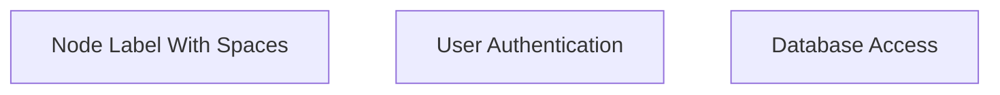
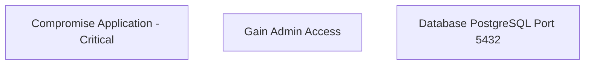
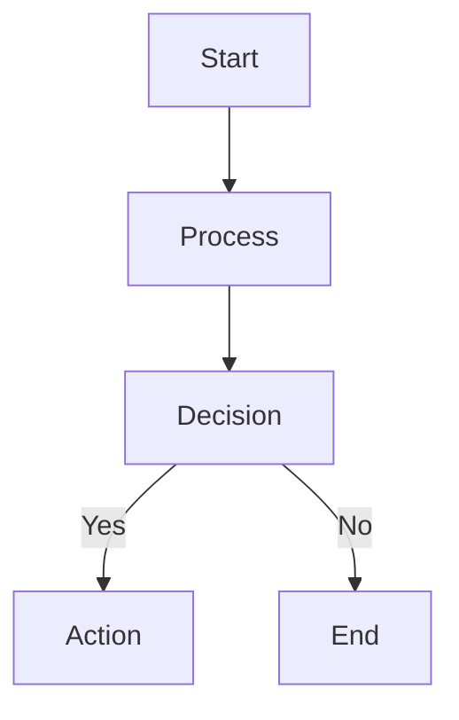
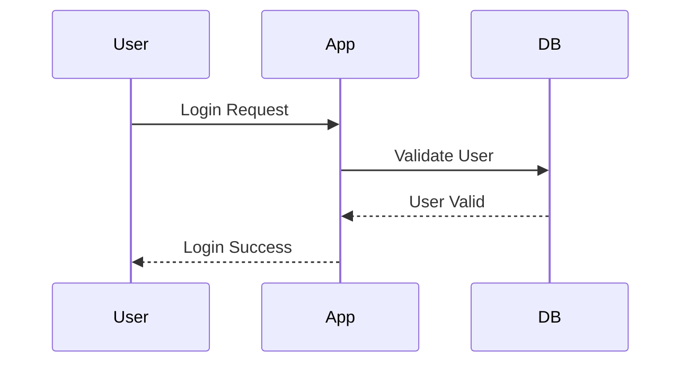
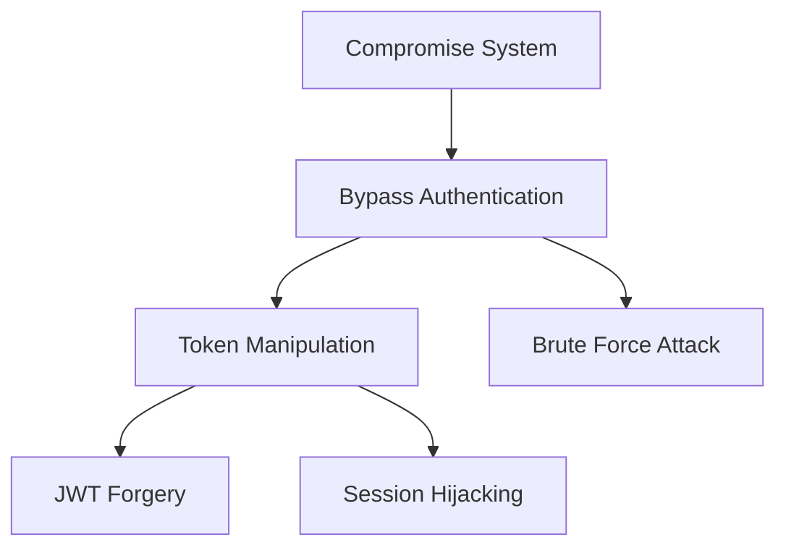
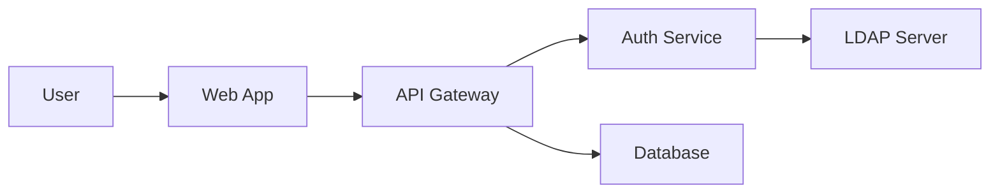
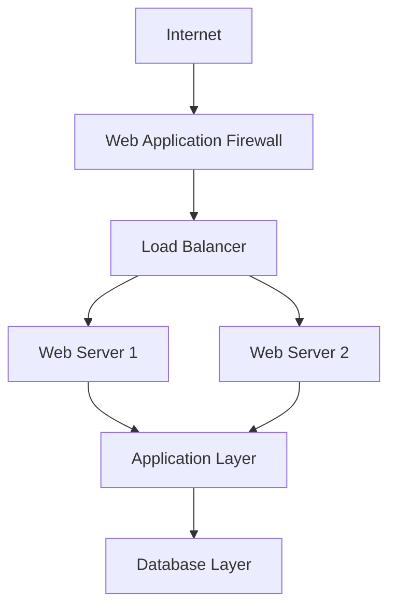

# Mermaid Diagram Syntax Guide

## CRITICAL MERMAID SYNTAX RULES

**LLMs frequently generate broken Mermaid diagrams due to syntax violations. Follow these rules strictly:**

### ❌ FORBIDDEN CHARACTERS IN NODE LABELS
- **NO double quotes (`"`)** in any node labels
- **NO parentheses (`()`)** in any node labels  
- **NO single quotes (`'`)** in node labels
- **NO special characters** like `@#$%^&*+=<>?/\|`
- **NO colons (`:`)** in node labels (conflicts with Mermaid syntax)

### ✅ CORRECT NODE LABEL SYNTAX

**Use square brackets `[]` for labels with spaces:**


**Use simple identifiers without spaces for short labels:**
```mermaid
graph TD
    start --> process --> end
```

### 📋 LABEL FORMATTING GUIDELINES

**Replace problematic characters:**
- `Authentication (OAuth)` → `Authentication - OAuth`
- `"Admin" Access` → `Admin Access`
- `User: Login Flow` → `User Login Flow` 
- `DB (PostgreSQL)` → `DB - PostgreSQL`
- `API Gateway (Rate Limited)` → `API Gateway - Rate Limited`

### 🔧 COMMON FIXES

**WRONG:**
```mermaid
graph TD
    root["Compromise Application (Critical)"]
    auth["Gain "Admin" Access"]
    db["Database: PostgreSQL (Port 5432)"]
```

**CORRECT:**


### 📊 DIAGRAM TYPES AND SYNTAX

**Flowchart/Graph:**


**Sequence Diagram:**


### ⚠️ VALIDATION CHECKLIST

Before generating any Mermaid diagram, verify:
- [ ] No double quotes in node labels
- [ ] No parentheses in node labels
- [ ] No colons in node labels (except for diagram syntax)
- [ ] Labels with spaces use square brackets `[]`
- [ ] All node connections use proper arrow syntax
- [ ] Diagram type is correctly specified

### 🛠️ ERROR DETECTION PATTERNS

**Common broken patterns to avoid:**
- `node["Label with "quotes""]` 
- `node["Label (with parentheses)"]`
- `node["Label: with colon"]`
- `node['Label with single quotes']`

**Safe replacement patterns:**
- `node[Label with quotes removed]`
- `node[Label - with dashes instead]`
- `node[Label with colon removed]`
- `node[Label without quotes]`

### 📖 EXAMPLES BY SECURITY CONTEXT

**Threat Modeling Attack Tree:**


**Data Flow Diagram:**


**Security Architecture:**


## IMPLEMENTATION NOTES FOR AGENTS

When generating Mermaid diagrams:

1. **Pre-process labels**: Remove or replace forbidden characters before diagram generation
2. **Validate syntax**: Check for common violations before outputting
3. **Test rendering**: If possible, validate that the diagram would render correctly
4. **Provide alternatives**: If a complex label is needed, use a simple label and explain in accompanying text

## ERROR RECOVERY

If a Mermaid diagram fails to render:

1. **Check for quotes and parentheses** in node labels
2. **Simplify complex labels** by removing special characters
3. **Use dashes instead of parentheses** for clarification
4. **Break long labels** into shorter, simpler text
5. **Verify arrow syntax** is correct (`-->`, `->>`, `-->>`)

Remember: **Simple, clean labels make better diagrams than complex, broken ones.**