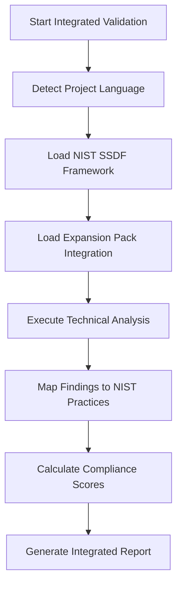

# /nist-ssdf-integrated-validation Task

When this command is used, execute the following task:

# NIST SSDF Integrated Validation (Framework + Expansion Pack)

## Objective
Execute comprehensive NIST SSDF compliance validation by combining framework-level process validation with language-specific technical security analysis from expansion packs. This integrated approach ensures both compliance scoring and deep technical validation.

## When to Use
- When requiring complete NIST SSDF compliance assessment with technical depth
- For production-ready validation combining process and implementation compliance
- When language-specific security expertise is available via expansion packs
- Before deployment to ensure comprehensive security validation

## Prerequisites
- Software Assurance expansion pack installed and configured
- Implementation code available for technical analysis
- Security requirements documented from planning phase
- Access to security scanning tools and MCP capabilities

## Integration Architecture

### Two-Layer Validation
1. **Framework Layer (bmad-core)**: NIST SSDF compliance scoring and process validation
2. **Technical Layer (expansion-pack)**: Language-specific vulnerability detection and secure coding validation

### Workflow Overview


## Process

### Phase 1: Environment Setup and Language Detection

#### Step 1: Project Analysis
**Detect Programming Language and Framework**

1. Analyze project structure and files
2. Identify primary programming language(s)
3. Detect frameworks and dependencies
4. Verify expansion pack support

**Language Detection Process:**
```bash
# Example detection logic
- Check file extensions (.py, .js, .java, etc.)
- Analyze package managers (package.json, requirements.txt, pom.xml)
- Identify frameworks (Flask, Django, Express, Spring)
- Validate expansion pack compatibility
```

#### Step 2: Integration Setup
**Configure Framework-Expansion Pack Integration**

1. Load NIST SSDF practice mappings from `expansion-packs/software-assurance/nist-ssdf-mapping.yaml`
2. Initialize language-specific validation components
3. Configure security scanning tools based on language
4. Establish integration API for bi-directional communication

### Phase 2: Integrated NIST SSDF Validation

#### Step 3: PW.1 - Security Requirements Implementation (Integrated)
**Framework Level:**
- Validate security requirements documentation
- Assess requirements traceability
- Score process compliance (0-100)

**Technical Level (via Expansion Pack):**
- Analyze authentication mechanism implementation
- Validate authorization control enforcement
- Check input validation and data protection
- Return technical findings and compliance metrics

**Integration:**
- Map technical findings to PW.1 compliance criteria
- Weight process (30%) + technical (70%) scores
- Generate combined compliance score

**Example Integration Flow:**
```yaml
# Framework sends validation request
request:
  practice: "PW.1"
  language: "python"
  code_paths: ["src/", "tests/"]
  security_requirements: ["authentication", "authorization", "input_validation"]

# Expansion pack returns technical findings
response:
  practice: "PW.1"
  technical_findings:
    authentication: 
      secure_patterns: ["bcrypt_usage", "session_security"]
      vulnerabilities: []
      score: 95
    authorization:
      secure_patterns: ["role_based_access", "permission_checks"]
      vulnerabilities: ["privilege_escalation_risk"]
      score: 80
  compliance_score: 87
  status: "partial"
  recommendations: ["Fix privilege escalation in user.py:123"]

# Framework calculates final score
final_score: (process_score * 0.3) + (technical_score * 0.7) = 89
```

#### Step 4: PW.4 - Secure Coding Practices (Integrated)
**Framework Level:**
- Validate secure coding standards adoption
- Assess code review process compliance
- Check developer training and awareness

**Technical Level (via Expansion Pack):**
- Execute SAST tools (Bandit for Python)
- Scan for vulnerability patterns from language-specific database
- Validate secure coding patterns implementation
- Check for prohibited patterns and anti-patterns

**Integration Example:**
```python
# Technical validation delegated to expansion pack
validation_request = {
    "practice": "PW.4",
    "language": "python",
    "code_paths": ["src/"],
    "validation_criteria": {
        "input_validation": {"weight": 0.25},
        "sql_injection_prevention": {"weight": 0.2},
        "authentication_security": {"weight": 0.2},
        "cryptography": {"weight": 0.2},
        "xss_prevention": {"weight": 0.15}
    }
}

# Expansion pack returns detailed technical analysis
technical_response = {
    "vulnerabilities_found": [
        {"type": "sql_injection", "severity": "high", "count": 2},
        {"type": "weak_crypto", "severity": "medium", "count": 1}
    ],
    "secure_patterns": {
        "parameterized_queries": 85,  # percentage coverage
        "password_hashing": 100,
        "input_validation": 90
    },
    "compliance_score": 82,
    "detailed_findings": {...}
}

# Framework combines with process validation
final_pw4_score = calculate_integrated_score(process_validation, technical_response)
```

#### Step 5: RV.1 - Vulnerability Detection (Integrated)
**Framework Level:**
- Validate vulnerability detection processes
- Assess tool integration and coverage
- Check detection effectiveness metrics

**Technical Level (via Expansion Pack):**
- Execute comprehensive security scanning
- Apply language-specific vulnerability detection rules
- Validate detection tool configuration and effectiveness

**Integration Process:**
1. Framework identifies required detection capabilities
2. Expansion pack executes appropriate tools:
   - SAST: Bandit, Semgrep (Python-specific rules)
   - DAST: ZAP with language-specific configurations
   - Dependency: Safety, pip-audit for Python packages
3. Results mapped back to RV.1 compliance criteria
4. Combined effectiveness score calculated

### Phase 3: Integrated Compliance Reporting

#### Step 6: Comprehensive Compliance Scoring
**Scoring Algorithm:**
```yaml
practice_score_calculation:
  components:
    process_compliance: 25%    # Framework-level process validation
    technical_implementation: 50%  # Expansion pack technical analysis
    tool_effectiveness: 15%    # Scanning tool integration and results
    documentation: 10%         # Compliance documentation completeness

final_score: weighted_average(components)
status: determine_status(final_score)  # compliant(90+), partial(70-89), non_compliant(<70)
```

#### Step 7: Integrated Report Generation
**Report Structure:**
1. **Executive Summary**: Combined compliance status with technical highlights
2. **Practice-by-Practice Analysis**: Framework + technical findings for each practice
3. **Technical Deep Dive**: Language-specific vulnerabilities and secure patterns
4. **Remediation Plan**: Prioritized actions combining process and technical improvements
5. **Compliance Matrix**: Detailed scoring breakdown by component

## Deliverables

### 1. Integrated NIST SSDF Compliance Report
**Structure:**
- Executive summary with overall compliance score
- Framework-level process compliance assessment
- Technical implementation compliance by language
- Vulnerability findings with NIST practice mapping
- Remediation recommendations prioritized by impact

### 2. Technical Security Analysis
**Components:**
- Language-specific vulnerability scan results
- Secure coding pattern analysis
- Dependency security assessment
- Framework-specific security configuration review

### 3. Compliance Improvement Roadmap
**Deliverables:**
- Immediate technical fixes required
- Process improvements needed
- Tool integration enhancements
- Training and awareness recommendations

## Supported Languages and Expansion Packs

### Current Support (Software Assurance Expansion Pack)
- **Python**: Full integration with Bandit, Safety, Semgrep
- **JavaScript/Node.js**: ESLint security, NPM audit, Snyk
- **Java**: SpotBugs, OWASP Dependency Check
- **C#/.NET**: Security Code Scan, NuGet audit
- **Go**: Gosec, govulncheck
- **Rust**: Cargo audit, Clippy security lints
- **PHP**: PHPCS Security, Composer audit

### Integration API
Each language integration follows the standard API defined in:
- `expansion-packs/software-assurance/integrations/nist-ssdf-integration.md`
- `expansion-packs/software-assurance/nist-ssdf-mapping.yaml`

## Configuration

### Expansion Pack Configuration
```yaml
# expansion-packs/software-assurance/config.yaml
nist_ssdf_integration:
  enabled: true
  default_language_detection: true
  scoring_weights:
    process_compliance: 0.25
    technical_implementation: 0.50
    tool_effectiveness: 0.15
    documentation: 0.10
  
  supported_practices: ["PW.1", "PW.2", "PW.3", "PW.4", "PW.5", "PW.6", "PW.7", "PW.8", "RV.1", "RV.2", "RV.3"]
```

### Language-Specific Tool Configuration
```yaml
# Example Python configuration
python:
  tools:
    sast: ["bandit", "semgrep"]
    dependency: ["safety", "pip-audit"]
    dast: ["zap"]
  patterns_database: "data/python-secure-coding.md"
  vulnerabilities_database: "data/python-common-vulns.md"
  nist_mapping: "nist-ssdf-mapping.yaml"
```

## Success Criteria

### Framework-Level Success
- [ ] All applicable NIST SSDF practices assessed
- [ ] Process compliance documented and scored
- [ ] Compliance gaps identified and prioritized
- [ ] Remediation timeline established

### Technical-Level Success
- [ ] Language-specific vulnerability scanning completed
- [ ] Secure coding patterns validated
- [ ] Framework-specific security configurations reviewed
- [ ] Technical findings mapped to NIST practices

### Integration Success
- [ ] Seamless communication between framework and expansion pack
- [ ] Accurate mapping of technical findings to compliance scores
- [ ] Comprehensive report combining process and technical analysis
- [ ] Actionable remediation plan with clear priorities

## Error Handling and Fallbacks

### Unsupported Languages
- Fallback to framework-level validation only
- Manual review recommendations provided
- Partial compliance assessment with clearly marked limitations

### Tool Failures
- Continue with available tools
- Mark incomplete sections in report
- Provide manual validation guidance for missing components

### Integration Failures
- Revert to standard NIST SSDF validation
- Log integration issues for troubleshooting
- Provide clear indication of reduced capability

## Future Enhancements

### Expansion Pack Ecosystem
- Additional language-specific expansion packs
- Industry-specific compliance extensions (FIPS, Common Criteria)
- Cloud security and DevSecOps integration

### Advanced Integration Features
- Real-time vulnerability monitoring integration
- Continuous compliance tracking
- AI-powered remediation recommendations
- Custom rule and pattern development

This integrated validation approach ensures comprehensive NIST SSDF compliance while leveraging deep technical security expertise for specific programming languages and frameworks.