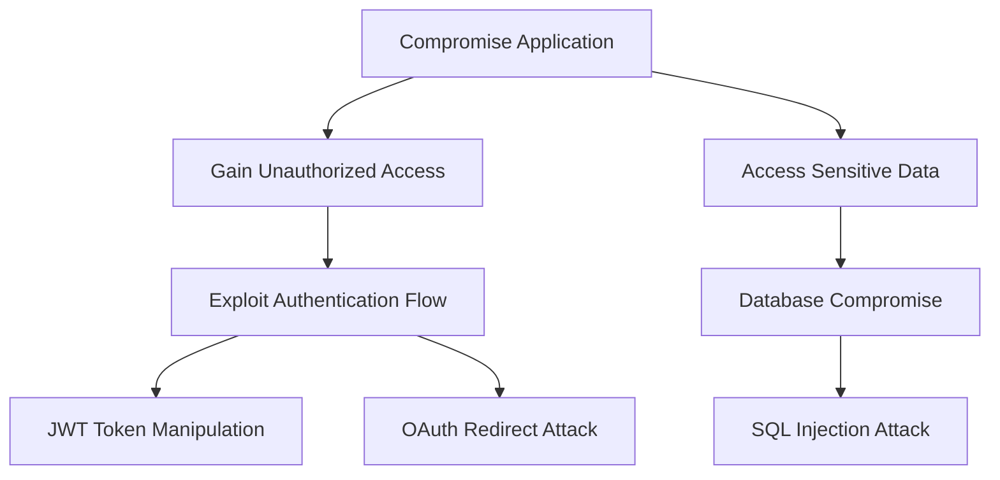

# /threat-modeling Task

When this command is used, execute the following task:

# Threat Modeling Task

## ⚠️ CRITICAL EXECUTION NOTICE ⚠️

**THIS IS AN EXECUTABLE WORKFLOW - NOT REFERENCE MATERIAL**

When this task is invoked:

1. **FOLLOW BMad INTERACTIVE PATTERNS** - Use the standard 1-9 elicitation format when needed
2. **INTEGRATE WITH DOCUMENTATION** - Reference and build upon existing architecture/PRD documents
3. **STRUCTURED METHODOLOGY** - Apply STRIDE methodology systematically 
4. **USER COLLABORATION** - Engage stakeholders for validation and refinement

## Purpose

Execute a comprehensive threat modeling process using industry-standard methodologies to identify, analyze, and prioritize security threats against the system. This task creates the foundation for security architecture, risk assessment, and mitigation planning.

**Key Reference Materials:**
- **Security Methodologies**: References `.bmad-core/data/security-methodologies.md` for STRIDE, PASTA, LINDDUN frameworks
- **Threat Intelligence**: Leverages `.bmad-core/data/threat-intelligence.md` for current threat landscape and actor profiles  
- **Analysis Framework**: Uses `.bmad-core/utils/security-analysis.md` for risk assessment models and threat analysis templates

## Critical: Template and Documentation Integration

This task can operate in two modes:

**Mode 1: Create New Threat Model Document**
- Use `create-doc` task with `threat-model-tmpl.yaml` template
- Full interactive document creation with stakeholder engagement
- Comprehensive STRIDE analysis with user validation

**Mode 2: Focused Threat Analysis**
- Direct threat identification and analysis without full document creation
- Quick threat assessment for specific components or scenarios
- Integration with existing threat model documents

## Methodology Selection Guide

Before beginning threat modeling, select the appropriate methodology based on your system context (**Default: STRIDE Framework for most systems**). Reference `.bmad-core/data/security-methodologies.md` for detailed framework descriptions:

### **STRIDE Framework** (Default - Recommended for most systems)
- **Best for**: Software applications, web services, APIs
- **Focus**: Technical threat identification across six categories
- **Output**: Comprehensive threat catalog with technical mitigations

### **PASTA Framework** (For business-risk focused analysis)  
- **Best for**: Business-critical systems requiring risk quantification
- **Focus**: Seven-stage process linking business impact to technical threats
- **Output**: Business-risk aligned threat model with prioritized mitigations

### **LINDDUN Framework** (For privacy-sensitive systems)
- **Best for**: Systems processing personal data, GDPR compliance
- **Focus**: Privacy threat identification and mitigation
- **Output**: Privacy-by-design threat model

**For this task, we'll primarily use STRIDE with elements from other frameworks as needed.**

## Instructions

### Phase 1: Preparation and Scoping

**System Understanding:**
1. **Review existing documentation**:
   - Architecture documents for system design and data flows
   - PRD documents for business context and requirements
   - Previous security assessments or threat models
   - Network diagrams and infrastructure documentation

2. **Establish threat landscape context** (Reference: `.bmad-core/data/threat-intelligence.md`):
   - **Industry-specific threats**: Review sector-specific threat profiles (financial, healthcare, technology, etc.)
   - **Current threat actors**: Consider relevant APTs, cybercriminals, insider threats based on your industry
   - **Attack trends**: Incorporate current attack vectors and techniques from MITRE ATT&CK framework
   - **Vulnerability landscape**: Consider recent vulnerability patterns relevant to your technology stack

3. **Define scope and boundaries**:
   - Identify system components to be analyzed
   - Define trust boundaries and security perimeters
   - Establish data flow boundaries and external interfaces
   - Document assumptions and limitations

4. **Stakeholder identification**:
   - Identify domain experts for each system component
   - Engage architects, developers, and security professionals
   - Include business stakeholders for context and priorities
   - Coordinate with compliance and risk management teams

### Phase 2: Asset and Data Flow Analysis

**Asset Identification:**
1. **Catalog critical assets**:
   - Data assets (databases, files, configuration data)
   - System assets (applications, services, infrastructure)
   - Process assets (business processes, workflows)
   - Human assets (users, administrators, stakeholders)

2. **Multi-Phase Data Flow Analysis Framework**:

**Phase 2A: Primary Data Flow Identification**
- **Operational Flows**: Core business process data movements
- **Authentication Flows**: Identity verification and session management data
- **Authorization Flows**: Permission and access control data paths
- **Configuration Flows**: System configuration and management data movement
- **Monitoring Flows**: Logging, telemetry, and audit data collection

**Phase 2B: Data Flow Classification and Prioritization**
For each identified data flow, document:

| Flow Attribute | Description | Values |
|----------------|-------------|---------|
| **Flow ID** | Unique identifier | DF-001, DF-002, etc. |
| **Flow Type** | Data movement category | Operational/Auth/Config/Monitor/Emergency |
| **Source Entity** | Data origin component | [From asset inventory] |
| **Target Entity** | Data destination component | [From asset inventory] |
| **Data Classification** | Sensitivity level | Public/Internal/Confidential/Restricted |
| **Flow Direction** | Data movement pattern | Unidirectional/Bidirectional/Multicast |
| **Trust Boundary Crossing** | Security context change | Internal/External/Cross-boundary |
| **Business Criticality** | Impact on operations | Critical/High/Medium/Low |
| **Data Volume** | Expected throughput | High/Medium/Low/Batch |
| **Real-time Requirements** | Latency sensitivity | Real-time/Near-real-time/Batch/Asynchronous |

**Phase 2C: Data Flow Security Analysis**
For each critical and high-criticality flow:

**Data in Transit Analysis:**
- **Transport Security**: Encryption protocols, certificate validation, perfect forward secrecy
- **Message Integrity**: HMAC, digital signatures, checksum validation
- **Authentication**: Mutual TLS, API keys, bearer tokens, certificate-based auth
- **Network Security**: Network segmentation, firewalls, VPN tunnels, zero-trust networking

**Data Processing Analysis:**
- **Input Validation**: Schema validation, sanitization, type checking, bounds checking
- **Transformation Security**: Data masking, tokenization, format preservation encryption
- **Temporary Storage**: Memory security, temporary file handling, cache security
- **Error Handling**: Information leakage, exception handling, graceful degradation

**Data at Rest Analysis:**
- **Storage Encryption**: Encryption at rest, key management, hardware security modules
- **Access Controls**: Database permissions, file system ACLs, object storage policies
- **Backup Security**: Backup encryption, retention policies, recovery testing
- **Audit Logging**: Data access logging, change tracking, integrity monitoring

**Phase 2D: Cross-Flow Dependencies and Interactions**
Analyze how data flows interact and create compound risks:

**Flow Orchestration Patterns:**
- **Sequential Dependencies**: Flow A must complete before Flow B begins
- **Parallel Processing**: Multiple flows processing related data simultaneously  
- **Branching Logic**: Conditional flows based on data content or business rules
- **Error Recovery**: Rollback and compensation flows for transaction failures

**Data Consistency Requirements:**
- **ACID Properties**: Transaction atomicity, consistency, isolation, durability requirements
- **Eventual Consistency**: Acceptable delay and conflict resolution mechanisms
- **Cross-Service Consistency**: Distributed transaction handling, saga patterns
- **Data Synchronization**: Master-slave replication, multi-master conflicts, sync failures

**Phase 2E: Data Flow Threat Surface Mapping**
For each flow, identify specific attack surfaces:

**Interception Points:**
- Network traffic capture opportunities
- Memory dump access during processing
- Log file access containing sensitive data
- Backup and archive access points

**Manipulation Points:**
- Request parameter tampering opportunities
- Man-in-the-middle attack positions
- Database injection possibilities
- Configuration override capabilities

**Disruption Points:**
- Single points of failure in critical flows
- Resource exhaustion attack vectors
- Timing-based denial of service opportunities
- Cascade failure trigger points

3. **Trust Boundary Identification and Analysis Framework**:

**Definition**: Trust boundaries are logical or physical barriers where the level of trust changes, representing transitions between different security domains, ownership, or control levels.

**Phase 3A: Trust Boundary Categorization**

**Network Trust Boundaries:**
- **Perimeter Boundaries**: Internet-facing to internal network transitions
- **DMZ Boundaries**: Public-facing services to internal network segments  
- **VLAN Boundaries**: Network segmentation and microsegmentation zones
- **VPN Boundaries**: Remote access and site-to-site connections
- **Cloud Boundaries**: On-premises to cloud service transitions

**Process Trust Boundaries:**
- **Application Boundaries**: Different applications with distinct security contexts
- **Service Boundaries**: Microservice-to-microservice communication points
- **Container Boundaries**: Containerized application isolation boundaries
- **Virtual Machine Boundaries**: VM-to-VM and VM-to-host communications
- **Function Boundaries**: Serverless function execution contexts

**Administrative Trust Boundaries:**
- **Privilege Boundaries**: Different authorization and permission levels
- **Management Boundaries**: Administrative vs. operational access domains
- **Tenant Boundaries**: Multi-tenant environment isolation points
- **Organizational Boundaries**: Different business units or subsidiaries
- **Third-Party Boundaries**: External vendor and partner access points

**Data Trust Boundaries:**
- **Classification Boundaries**: Different data sensitivity levels
- **Processing Boundaries**: Data transformation and handling contexts
- **Storage Boundaries**: Different data repositories and systems
- **Encryption Boundaries**: Encrypted vs. unencrypted data domains
- **Backup Boundaries**: Production vs. backup and archive systems

**Phase 3B: Trust Boundary Analysis Matrix**

For each identified trust boundary, document:

| Boundary Attribute | Description | Analysis Questions |
|-------------------|-------------|-------------------|
| **Boundary ID** | Unique identifier | TB-001, TB-002, etc. |
| **Boundary Type** | Category classification | Network/Process/Admin/Data/Physical |
| **Trust Transition** | Change in trust level | High-to-Low, Internal-to-External, Privileged-to-Standard |
| **Security Purpose** | Boundary function | Isolation, Access Control, Data Protection, Compliance |
| **Crossing Mechanism** | How boundary is traversed | Authentication, Authorization, Network routing, API calls |
| **Trust Validation** | Verification method | Certificates, Tokens, Credentials, Network ACLs |
| **Failure Mode** | Boundary bypass risks | Authentication bypass, Authorization escalation, Network pivot |
| **Monitoring Coverage** | Observability scope | Full/Partial/Limited/None |

**Phase 3C: Trust Boundary Security Controls Assessment**

**Authentication Controls Analysis:**
- **Identity Verification**: How identity is established across the boundary
- **Credential Validation**: Strength and verification of authentication mechanisms
- **Multi-Factor Requirements**: Additional authentication factors required
- **Session Management**: How sessions are established and maintained across boundaries

**Authorization Controls Analysis:**
- **Access Decision Points**: Where and how authorization decisions are made
- **Policy Enforcement**: How access policies are implemented and enforced
- **Privilege Verification**: Methods for validating sufficient permissions
- **Dynamic Authorization**: Real-time permission evaluation and adjustment

**Data Protection Controls Analysis:**
- **Encryption Requirements**: Data protection standards at boundary crossings
- **Data Loss Prevention**: Controls preventing unauthorized data exfiltration
- **Data Transformation**: Sanitization, masking, or tokenization at boundaries
- **Audit Requirements**: Logging and monitoring of boundary crossings

**Network Security Controls Analysis:**
- **Firewall Rules**: Network-level access controls and traffic filtering
- **Network Segmentation**: Logical separation and traffic isolation
- **Intrusion Detection**: Monitoring for unauthorized boundary traversal
- **Traffic Analysis**: Deep packet inspection and behavioral analysis

**Phase 3D: Trust Boundary Risk Assessment**

**Boundary Strength Evaluation:**
Rate each boundary's security posture on a scale:
- **Strong (3)**: Multiple overlapping controls, continuous monitoring, fail-secure defaults
- **Moderate (2)**: Some controls in place, periodic monitoring, mostly secure defaults
- **Weak (1)**: Minimal controls, limited monitoring, insecure or unknown defaults

**Attack Surface Analysis:**
For each boundary, identify:
- **Authorized Crossing Points**: Legitimate methods for boundary traversal
- **Potential Bypass Methods**: Ways attackers might circumvent boundary controls
- **Lateral Movement Opportunities**: How compromise at boundary enables further access
- **Escalation Potential**: Whether boundary crossing enables privilege escalation

**Business Impact Assessment:**
- **Confidentiality Impact**: Data exposure risks from boundary compromise
- **Integrity Impact**: Data modification risks from unauthorized boundary access  
- **Availability Impact**: Service disruption risks from boundary attacks
- **Compliance Impact**: Regulatory violations from boundary control failures

**Phase 3E: Trust Boundary Threat Modeling**

**Boundary-Specific Threat Patterns:**

**Authentication Bypass Threats:**
- Credential stuffing and password attacks at authentication boundaries
- Token manipulation and session hijacking across session boundaries
- Certificate validation bypass in TLS/PKI boundaries
- Multi-factor authentication bypass and enrollment attacks

**Authorization Escalation Threats:**
- Privilege escalation across administrative boundaries
- Role-based access control bypass in application boundaries
- Tenant isolation bypass in multi-tenant boundaries
- API authorization bypass in service boundaries

**Data Exfiltration Threats:**
- Data loss across network boundaries via covert channels
- Database access control bypass across data boundaries
- Backup and archive access across storage boundaries
- Log manipulation across monitoring boundaries

**Network Pivoting Threats:**
- Lateral movement across network segments and VLANs
- Container escape and host access across containerization boundaries
- Cloud service abuse across cloud boundaries
- VPN tunnel abuse and traffic manipulation

### Phase 3: STRIDE Threat Analysis with Intelligence Integration

**Enhanced STRIDE Application:**

Apply STRIDE methodology systematically, enhanced with current threat intelligence and risk analysis frameworks. Reference materials:
- **Threat Actor Context**: `.bmad-core/data/threat-intelligence.md` for current threat landscape
- **Analysis Framework**: `.bmad-core/utils/security-analysis.md` for risk assessment models

**Step 1: Threat Actor Profiling**
Before applying STRIDE, establish relevant threat actor context for your system:

**Primary Threat Actors** (Select applicable from threat intelligence data - **Default: Include Cybercriminal Groups and Opportunistic Attackers for most systems**):
- [ ] **Nation-State APTs**: High sophistication, persistent, espionage/disruption motivated
- [x] **Cybercriminal Groups**: Financial motivation, ransomware, data theft, fraud *(Default - most common threat)*
- [ ] **Insider Threats**: Privileged access, varied motivation, lower detection probability  
- [ ] **Hacktivists**: Ideological motivation, public campaigns, DDoS/defacement
- [x] **Opportunistic Attackers**: Low sophistication, broad targeting, known exploits *(Default - baseline threat)*

**Step 2: Attack Vector Assessment**
Map current attack techniques to your system using MITRE ATT&CK framework:

**Initial Access Vectors** (Reference threat intelligence for current trends):
- Phishing and social engineering campaigns
- Exploitation of public-facing applications
- Supply chain compromise
- Valid account compromise
- External remote services exploitation

**Step 3: Systematic STRIDE Application**

Apply STRIDE methodology to each system component and data flow, considering identified threat actors and attack vectors. Document findings using the structured threat table format:

**Quality Control Checklist for Each Threat:**

Before documenting any threat, validate it meets these criteria:

**Threat Realism and Feasibility:**
- [ ] Is the threat grounded in the described architecture and technology stack?
- [ ] Is the threat actor capable of performing the attack under realistic conditions?
- [ ] Are the required prerequisites and conditions achievable in the system context?
- [ ] Does the threat respect stated assumptions and security boundaries?
- [ ] Is the attack complexity proportionate to likely attacker motivation and resources?

**Threat Description Quality:**
- [ ] Does the threat description follow the enhanced grammar template structure?
- [ ] Is the STRIDE category assignment correct and justified?
- [ ] Are the impact descriptions specific and measurable?
- [ ] Is the likelihood assessment based on architectural factors, not generic assumptions?
- [ ] Does the description include sufficient technical detail for implementation teams?

**Attack Path Validation:**
- [ ] Are all attack steps technically feasible given system constraints?
- [ ] Are attack prerequisites clearly identified and realistic?
- [ ] Do attack chains respect trust boundaries and access controls?
- [ ] Are escalation paths and lateral movement opportunities considered?
- [ ] Have defensive mechanisms been properly accounted for in the attack scenario?

**Mitigation Alignment:**
- [ ] Are mitigations specific to the actual threat vector described?
- [ ] Are mitigations categorized correctly as Preventive, Detective, or Corrective?
- [ ] Are mitigations implementable given the described architecture?
- [ ] Do mitigations address the root cause, not just symptoms?
- [ ] Are multiple mitigation strategies considered for defense-in-depth?

**Business and Technical Relevance:**
- [ ] Does the threat impact business-critical assets or processes?
- [ ] Is the threat scenario relevant to the organization's threat landscape?
- [ ] Are compliance and regulatory implications properly considered?
- [ ] Does the threat analysis support actionable security decisions?
- [ ] Is the threat description clear enough for non-security stakeholders?

**Enhanced Threat Grammar Template:**

For each threat, use this structured format to ensure specific, actionable descriptions:

```
[Actor with specific access/capability] can [specific attack method] by [attack vector/technique], leading to [specific impact], affecting [asset/stakeholder].
```

**Grammar Template Examples:**
- ✅ **Good**: "An external attacker can intercept authentication tokens by performing man-in-the-middle attacks on unencrypted connections, leading to unauthorized account access, affecting user data and system integrity."
- ❌ **Avoid**: "Bad actors might hack the system somehow and cause problems."

**Threat Documentation Table Format:**

| THREAT ID | COMPONENT | THREAT NAME | STRIDE CATEGORY | THREAT DESCRIPTION | WHY APPLICABLE | HOW MITIGATED | MITIGATION | LIKELIHOOD | IMPACT | RISK SEVERITY |
|-----------|-----------|-------------|-----------------|-------------------|----------------|---------------|------------|-------------|---------|---------------|
| [T001]    | [Component] | [Clear descriptive title] | [S/T/R/I/D/E] | [Use grammar template above - be specific about actor, method, vector, impact, and affected assets] | [Why this threat applies to your system] | [Current mitigations in place] | [Required additional mitigations - categorize as P/D/C] | [Low/Medium/High with reasoning] | [Low/Medium/High with reasoning] | [Low/Medium/High/Critical] |

**Enhanced Risk Assessment Framework** (Reference: `.bmad-core/utils/security-analysis.md`):

**Likelihood Assessment Criteria:**
- **High (3)**: Current known exploits, accessible attack surface, minimal skill required
- **Medium (2)**: Some technical barriers, moderate skill required, attack surface exists
- **Low (1)**: Significant technical barriers, high skill required, limited attack surface

**Impact Assessment Criteria:**
- **Critical (4)**: Complete system compromise, data breach, business disruption
- **High (3)**: Significant data exposure, partial system compromise, major service disruption  
- **Medium (2)**: Limited data access, service degradation, isolated system impact
- **Low (1)**: Minimal impact, non-sensitive data, limited functionality affected

**Risk Calculation**: `Risk Score = Likelihood × Impact`
- **Critical (9-12)**: Immediate action required, emergency response
- **High (6-8)**: High priority, near-term remediation required
- **Medium (3-4)**: Moderate priority, planned remediation
- **Low (1-2)**: Monitor, accept, or long-term remediation

**Mitigation Categories:**
- **P (Preventive)**: Controls that block or prevent the threat from occurring
- **D (Detective)**: Controls that identify when the threat occurs or has occurred  
- **C (Corrective)**: Controls that respond to and recover from realized threats

**Mitigation Examples:**
- **Preventive**: Input validation, access controls, encryption, network segmentation
- **Detective**: Monitoring, logging, intrusion detection, anomaly detection
- **Corrective**: Incident response, backup restoration, account lockout, system isolation

**STRIDE Categories Analysis:**

**Spoofing (Identity Threats) - Impersonating users, systems, or services:**

*Core Definition:* Attacks where an attacker impersonates a legitimate entity to gain unauthorized access or perform malicious actions.

*Analysis Areas:*
- Authentication mechanism vulnerabilities and bypass techniques
- Identity verification processes and their failure modes
- Session management weaknesses and token manipulation
- Certificate validation issues and trust chain attacks
- Multi-factor authentication bypass scenarios

*Specific Threat Patterns to Examine:*
- **JWT Token Manipulation**: Weak signing algorithms, key confusion attacks, algorithm switching
- **OAuth/OIDC Vulnerabilities**: Redirect URI manipulation, state parameter bypass, implicit flow attacks
- **Session Management Flaws**: Session fixation, session hijacking, concurrent session abuse
- **Certificate Attacks**: CA compromise, certificate pinning bypass, self-signed certificate acceptance
- **Biometric Spoofing**: Template injection, replay attacks, sensor manipulation

*Architecture-Specific Considerations:*
- API authentication flows and their authentication bypass potential
- Service-to-service authentication in microservices architectures
- Federation and single sign-on trust relationships
- Mobile app certificate pinning and root certificate validation

**Tampering (Integrity Threats) - Unauthorized modification of data, systems, or communications:**

*Core Definition:* Attacks that compromise the integrity of data, code, configuration, or communication channels.

*Analysis Areas:*
- Input validation gaps and injection attack vectors
- Data storage integrity protection mechanisms
- Communication channel security and man-in-the-middle risks
- Code and configuration integrity verification processes
- File system and database modification protections

*Specific Threat Patterns to Examine:*
- **Injection Attacks**: SQL injection, NoSQL injection, LDAP injection, command injection, XXE
- **Cross-Site Scripting (XSS)**: Stored XSS, reflected XSS, DOM-based XSS, CSP bypass
- **Configuration Tampering**: Environment variable manipulation, config file modification, parameter pollution
- **Data Manipulation**: Database direct access, backup tampering, cache poisoning
- **Protocol Manipulation**: Request smuggling, response splitting, header injection

*Architecture-Specific Considerations:*
- API parameter tampering and request manipulation possibilities
- Database connection security and query parameterization effectiveness
- File upload security and content validation mechanisms
- Configuration management security and change control processes

**Repudiation (Accountability Threats) - Denying actions, transactions, or events without proof:**

*Core Definition:* Attacks that prevent the system from maintaining reliable audit trails or proving that specific actions occurred.

*Analysis Areas:*
- Audit logging completeness and tamper-resistance
- Transaction tracking and correlation mechanisms
- Digital signature and non-repudiation capabilities
- Evidence collection and preservation processes
- Time synchronization and timestamping accuracy

*Specific Threat Patterns to Examine:*
- **Audit Log Evasion**: Log injection, log overflow, selective log deletion
- **Transaction Ambiguity**: Missing correlation IDs, incomplete transaction records, timing attacks
- **Identity Confusion**: Shared accounts, role impersonation, attribution gaps
- **Evidence Tampering**: Log modification, backup manipulation, clock skewing
- **Cryptographic Repudiation**: Weak digital signatures, key compromise, signature stripping

*Architecture-Specific Considerations:*
- Distributed system logging correlation and centralized audit trail integrity
- Multi-tenant environments and user action attribution
- API call tracking and request-response correlation mechanisms
- Blockchain or immutable ledger requirements for critical transactions

**Information Disclosure (Confidentiality Threats) - Unauthorized access to confidential information:**

*Core Definition:* Attacks that result in unauthorized exposure of sensitive data, credentials, or system information.

*Analysis Areas:*
- Data encryption effectiveness and key management security
- Access control implementation and authorization bypass potential
- Information leakage through error messages, logs, and metadata
- Side-channel attacks and timing-based information disclosure
- Privilege escalation leading to data access

*Specific Threat Patterns to Examine:*
- **Direct Data Access**: Database exposure, file system traversal, backup access
- **Indirect Information Leakage**: Error message disclosure, timing attacks, cache timing
- **Privilege Escalation**: Vertical privilege escalation, horizontal privilege escalation
- **API Information Disclosure**: Over-privileged responses, debug information exposure, IDOR
- **Cryptographic Vulnerabilities**: Weak encryption, key exposure, plaintext recovery

*Architecture-Specific Considerations:*
- Multi-tenant data isolation and cross-tenant data leakage risks
- API response filtering and data minimization effectiveness
- Cloud storage security and misconfiguration risks
- Memory dump analysis and process memory protection

**Denial of Service (Availability Threats) - Preventing legitimate access to resources or services:**

*Core Definition:* Attacks that disrupt system availability, making services unavailable to legitimate users.

*Analysis Areas:*
- Resource exhaustion attack vectors and consumption limits
- Rate limiting effectiveness and bypass techniques
- System capacity planning and scaling mechanisms
- Single points of failure and cascade failure potential
- Recovery and resilience capabilities

*Specific Threat Patterns to Examine:*
- **Resource Consumption**: CPU exhaustion, memory exhaustion, disk space attacks
- **Network-Based DoS**: Volumetric attacks, protocol attacks, application-layer attacks
- **Logic-Based DoS**: Algorithmic complexity attacks, infinite loops, deadlock conditions
- **Distributed Attacks**: Botnet coordination, amplification attacks, reflection attacks
- **Application-Specific DoS**: Database connection exhaustion, session exhaustion, queue flooding

*Architecture-Specific Considerations:*
- Cloud auto-scaling effectiveness and cost implications
- CDN and load balancer configuration and bypass potential
- Database connection pooling and query optimization effectiveness
- Microservices resilience patterns and circuit breaker implementation

**Elevation of Privilege (Authorization Threats) - Gaining unauthorized access levels or permissions:**

*Core Definition:* Attacks that allow an attacker to gain higher privileges than originally granted or intended.

*Analysis Areas:*
- Role-based access control implementation gaps
- Administrative interface security and access controls
- Privilege inheritance and delegation mechanisms
- Separation of duties enforcement effectiveness
- Least privilege principle adherence

*Specific Threat Patterns to Examine:*
- **Vertical Privilege Escalation**: User-to-admin escalation, service account compromise
- **Horizontal Privilege Escalation**: Cross-user access, cross-tenant privilege abuse
- **Role Manipulation**: Role self-assignment, role inheritance abuse, group membership manipulation
- **Administrative Bypass**: Direct database access, configuration file manipulation, debug mode abuse
- **Service Account Abuse**: Over-privileged service accounts, credential harvesting, token theft

*Architecture-Specific Considerations:*
- Microservices inter-service authorization and service mesh security
- Container security and orchestration platform privilege management
- Cloud IAM policy effectiveness and principle of least privilege implementation
- API gateway authorization enforcement and policy bypass potential

### Phase 4: Attack Chain Analysis and Threat Escalation

**Attack Chain Analysis and Threat Escalation Framework:**

**Attack Chain Modeling:**
Analyze how individual threats can be chained together to achieve more complex attack objectives:

**Primary Attack Enablers:**
- **Initial Access Threats**: Threats that provide attackers with their first foothold in the system
- **Persistence Threats**: Threats that allow attackers to maintain access over time
- **Privilege Escalation Threats**: Threats that enable vertical or horizontal privilege escalation
- **Lateral Movement Threats**: Threats that facilitate movement between system components
- **Data Exfiltration Threats**: Threats that enable the final objective of unauthorized data access

**Attack Chain Dependencies:**
For each threat, identify:
- **Prerequisites**: What conditions or previous compromises must be in place
- **Enables**: What additional threats become feasible after this threat succeeds
- **Amplifies**: What threats become more likely or impactful when combined
- **Cascades**: What system-wide failures might result from this threat

**Threat Escalation Path Analysis:**

**Escalation Categories:**

**Technical Escalation:**
- **Vulnerability Chaining**: Combining multiple technical vulnerabilities for greater impact
- **Privilege Accumulation**: Progressively gaining higher system privileges
- **Access Boundary Crossing**: Moving between different security domains or trust zones
- **Control System Compromise**: Escalating from user systems to administrative or control systems

**Operational Escalation:**
- **Process Abuse**: Exploiting business processes to amplify attack impact
- **Social Engineering Chains**: Combining technical and human manipulation techniques
- **Supply Chain Compromise**: Escalating from third-party systems to primary targets
- **Insider Threat Activation**: Converting external attacks into insider threat scenarios

**Business Impact Escalation:**
- **Data Sensitivity Escalation**: Progressing from public to confidential to restricted data access
- **System Criticality Escalation**: Moving from non-critical to business-critical system compromise
- **Compliance Impact Escalation**: Escalating to regulatory or compliance violation scenarios
- **Reputational Impact Escalation**: Attacks that could cause public relations or brand damage

**Attack Chain Documentation Format:**

```markdown
## Attack Chain Analysis

### Chain ID: AC-001
**Chain Name**: [Descriptive name for the attack chain]
**Objective**: [Ultimate goal of the attack chain]
**Threat Actor**: [Most likely actor to execute this chain]

**Attack Steps:**
1. **Initial Threat**: [T-001] - [Threat name and description]
   - **Prerequisites**: [What conditions enable this threat]
   - **Success Criteria**: [What constitutes successful exploitation]
   - **Enables**: [What subsequent attacks become possible]

2. **Escalation Threat**: [T-005] - [Threat name and description]
   - **Dependencies**: [Previous step requirements]
   - **Escalation Method**: [How attack capability is enhanced]
   - **New Capabilities**: [Additional access or privileges gained]

3. **Objective Threat**: [T-012] - [Threat name and description]
   - **Final Prerequisites**: [All conditions needed for ultimate goal]
   - **Impact Realization**: [How business impact is achieved]
   - **Detection Points**: [Where the chain might be detected]

**Chain Mitigation Strategy:**
- **Break Points**: [Critical points where the chain can be broken]
- **Detection Opportunities**: [Monitoring points for early detection]
- **Preventive Controls**: [Controls that prevent chain initiation]
- **Detective Controls**: [Controls that identify chain progression]
- **Corrective Controls**: [Response actions to limit chain impact]

**Chain Risk Assessment:**
- **Likelihood**: [Probability of successful chain execution]
- **Impact**: [Combined impact of all chain steps]
- **Risk Score**: [Overall chain risk rating]
```

**Multi-Vector Attack Analysis:**

**Parallel Attack Vectors:**
Identify threats that could occur simultaneously to amplify impact:
- **Coordinated Attacks**: Multiple attack vectors executed in parallel
- **Distraction Attacks**: Secondary attacks designed to divert security attention
- **Redundant Paths**: Multiple routes to the same objective for reliability
- **Resource Saturation**: Attacks designed to overwhelm defensive capabilities

**Cross-Domain Attack Chains:**
Analyze how attacks can cross different system domains:
- **Network to Application**: Starting with network compromise and escalating to application level
- **Application to Infrastructure**: Escalating from application vulnerabilities to infrastructure compromise
- **Physical to Logical**: Combining physical access with logical system attacks
- **Supply Chain to Operations**: Escalating from supply chain compromise to operational systems

**Threat Interdependency Mapping:**

**High-Priority Chain Patterns:**
Focus analysis on these common escalation patterns:

**Pattern 1: External → Internal → Administrative**
- External threat → Internal system access → Administrative privilege escalation
- Example: Phishing → VPN access → Domain admin compromise

**Pattern 2: Low Privilege → High Privilege → System Control**
- Initial low-privilege access → Privilege escalation → System administrative control
- Example: User account compromise → Service account abuse → Infrastructure access

**Pattern 3: Data Access → Data Manipulation → Data Exfiltration**
- Unauthorized read access → Write/modify capabilities → Large-scale data theft
- Example: SQL injection → Database administrative access → Full database dump

**Pattern 4: Single Service → Service Mesh → Infrastructure**
- Individual service compromise → Inter-service attack → Infrastructure compromise
- Example: Microservice vulnerability → Service mesh abuse → Container orchestration compromise

**Attack Chain Risk Prioritization:**
Prioritize attack chains based on:
- **Chain Feasibility**: How realistic is successful chain execution?
- **Impact Magnitude**: What is the combined business impact?
- **Detection Difficulty**: How hard is it to detect the chain in progress?
- **Mitigation Complexity**: How difficult are the required mitigations to implement?
- **Business Criticality**: How critical are the targeted assets or processes?

### Phase 5: Attack Surface Analysis

**Comprehensive Attack Surface Mapping:**

Identify and analyze specific attack surfaces in the system:

1. **Attack Surface Documentation**:
   - Map entry points and interfaces exposed to attackers
   - Identify user input channels and external integrations
   - Catalog network services and API endpoints
   - Document file upload and processing capabilities

2. **Attack Surface Analysis Format**:
   For each significant attack surface, document:
   - **Description**: What the attack surface is and how it's exposed
   - **How System Contributes**: Specific ways your system creates this exposure
   - **Example Attack**: Concrete example of how this could be exploited
   - **Impact**: Potential consequences if successfully exploited
   - **Risk Severity**: Critical/High/Medium/Low based on likelihood and impact
   - **Current Mitigations**: Existing controls that reduce risk
   - **Missing Mitigations**: Additional controls needed

**Example Attack Surfaces to Consider**:
- Prompt injection (for AI systems)
- OAuth/OpenID Connect misconfigurations
- JWT validation weaknesses
- User-controlled endpoints (BYO integrations)
- Role assignment and privilege escalation
- Cross-site scripting (XSS) in UI
- SQL/NoSQL injection possibilities
- File upload and processing risks
- CORS/CSRF vulnerabilities

### Phase 5: Attack Tree Visualization

**Hierarchical Attack Path Modeling:**

Create visual representations of attack paths using attack tree methodology:

1. **Attack Tree Structure**:
   - Define root goal (e.g., "Compromise System X")
   - Break down into sub-goals and attack methods
   - Use logical operators (AND/OR) to show relationships
   - Represent as text-based tree or Mermaid diagram

2. **Attack Tree Format**:
```
Root Goal: [Primary attacker objective]
[OR] - Any of these attack paths can achieve the goal
+-- Sub-Goal 1: [Major attack category]
    [OR] - Any of these methods can achieve Sub-Goal 1
    +-- Attack Method 1.1: [Specific attack technique]
        [AND] - All of these conditions must be met
        +-- Condition A: [Required prerequisite]
        +-- Condition B: [Required prerequisite]
    +-- Attack Method 1.2: [Alternative attack technique]
        [OR] - Any of these conditions is sufficient
        +-- Condition C: [Alternative prerequisite]
        +-- Condition D: [Alternative prerequisite]
+-- Sub-Goal 2: [Alternative attack category]
    +-- Attack Method 2.1: [Different attack technique]
```

3. **Mermaid Diagram Option**:

**⚠️ IMPORTANT**: Before creating any Mermaid diagrams, review the complete Mermaid Syntax Guide at `.bmad-core/utils/mermaid-syntax-guide.md` to avoid common syntax errors that break diagram rendering.

**CRITICAL MERMAID SYNTAX RULES:**
- **NO double quotes (") in node labels** - These break diagram rendering
- **NO parentheses () in node labels** - Replace with dashes or remove  
- **NO special characters** in node labels - Use only letters, numbers, spaces, dashes
- **Always use square brackets []** for node labels with spaces
- **Example of CORRECT syntax:**



**INVALID Examples to AVOID:**
```mermaid
// WRONG - Contains quotes and parentheses
root["Compromise Application (Critical)"]
auth["Gain "Admin" Access"]
attack["SQL Injection (OWASP #3)"]

// CORRECT - Clean labels
root[Compromise Application - Critical]
auth[Gain Admin Access]
attack[SQL Injection Attack - OWASP Top 3]
```

### Phase 6: Threat Scenario Development

**Realism Constraints and Plausibility Guidelines:**

Before developing detailed threat scenarios, apply these constraints to ensure practical, actionable threat analysis:

**Architectural Realism Requirements:**
- **Technology Stack Alignment**: Only include threats that are plausible given the described architecture, technologies, and trust boundaries
- **Access Vector Validation**: Ensure attack vectors are achievable within the system's actual exposure and access control model
- **Capability Boundaries**: Consider realistic attacker capabilities based on threat actor categories (internal, external, supply chain, physical)
- **Resource Proportionality**: Assess whether attack complexity is proportionate to likely attacker motivation and available resources

**Threat Actor Plausibility Assessment:**

Apply the **Intent-Capability-Opportunity (ICO) Framework** for each threat:

**Intent Assessment:**
- Does the threat actor have realistic motivation to target this specific system or organization?
- Is the potential gain (financial, competitive, ideological) proportionate to attack effort?
- Are there simpler, more attractive targets available to the attacker?

**Capability Assessment:**
- Does the threat actor possess the technical skills required for the attack?
- Are the necessary tools, resources, and knowledge accessible to this actor type?
- Is the attack complexity within reasonable bounds for the actor's skill level?

**Opportunity Assessment:**
- Does the threat actor have realistic access to the required attack surfaces?
- Are the necessary prerequisites and conditions achievable within the system context?
- Do existing security controls present realistic barriers or complete prevention?

**Plausibility Guidelines:**

**Include These Threat Types:**
- ✅ **Common Attack Patterns**: Well-documented attacks with proven techniques (OWASP Top 10, MITRE ATT&CK)
- ✅ **Architecture-Specific Vulnerabilities**: Threats that exploit specific technology choices or configurations
- ✅ **Configuration Weaknesses**: Attacks that exploit likely misconfigurations or default settings
- ✅ **Process Failures**: Threats that exploit probable human error or process gaps
- ✅ **Supply Chain Risks**: Realistic third-party and dependency-related threats

**Avoid These Threat Types:**
- ❌ **Zero-Day Dependencies**: Threats that require unknown/unpatched vulnerabilities unless justified by threat landscape
- ❌ **Nation-State Capabilities**: Advanced persistent threats unless the organization profile warrants such attention
- ❌ **Theoretical Vulnerabilities**: Academic attacks without practical exploitation methods
- ❌ **Disproportionate Effort**: Complex attacks where simpler alternatives achieve the same objective
- ❌ **Impossible Prerequisites**: Attacks requiring conditions that contradict stated assumptions or architectural constraints

**Contextual Validation Framework:**

For each threat, validate against these contextual factors:

**Organizational Context:**
- Industry sector and typical threat landscape
- Organization size and security maturity level
- Regulatory environment and compliance requirements
- Business criticality and asset value

**Technical Context:**
- Deployment model (cloud, on-premises, hybrid)
- Network architecture and security boundaries
- Technology stack and version currency
- Existing security controls and monitoring capabilities

**Operational Context:**
- User behavior patterns and access requirements
- Development and deployment processes
- Incident response and recovery capabilities
- Third-party dependencies and integration points

**Detailed Threat Analysis:**

For each validated threat:

1. **Threat description and attack scenario**:
   - Describe the specific attack method and technique
   - Outline the step-by-step attack progression
   - Identify required attacker capabilities and resources
   - Document attack prerequisites and conditions

2. **Impact assessment**:
   - Evaluate business impact and consequences
   - Assess technical impact on system functionality
   - Consider cascading effects and secondary impacts
   - Quantify potential damages and losses

3. **Likelihood evaluation**:
   - Assess threat actor motivation and capability
   - Evaluate attack complexity and feasibility
   - Consider existing controls and barriers
   - Factor in industry trends and threat intelligence

4. **Risk prioritization**:
   - Calculate risk scores based on likelihood and impact
   - Prioritize threats for remediation attention
   - Consider business context and risk tolerance
   - Account for regulatory and compliance implications

### Phase 7: Security Requirements Definition

**Requirements Derivation:**

Based on identified threats, define specific security requirements:

1. **Authentication requirements**:
   - Multi-factor authentication specifications
   - Session management and timeout requirements
   - Identity verification and validation standards
   - Password policy and credential management requirements

2. **Authorization requirements**:
   - Role-based access control specifications
   - Privilege management and escalation controls
   - Resource-level access control requirements
   - Separation of duties and least privilege implementation

3. **Data protection requirements**:
   - Encryption at rest and in transit specifications
   - Data classification and handling requirements
   - Key management and cryptographic standards
   - Data loss prevention and monitoring requirements

4. **Monitoring and detection requirements**:
   - Security event logging and monitoring specifications
   - Intrusion detection and prevention requirements
   - Anomaly detection and behavioral analysis
   - Incident response and alerting requirements

### Phase 8: Documentation and Validation

**Threat Model Documentation:**

1. **Executive summary creation**:
   - Summarize key threats and risk exposure
   - Highlight critical security requirements
   - Provide business impact assessment
   - Include recommendations and next steps

2. **Technical documentation**:
   - Document detailed STRIDE analysis results
   - Include threat scenarios and attack trees
   - Map threats to system components and data flows
   - Provide traceability to security requirements

3. **Validation and review**:
   - Conduct stakeholder review and validation sessions
   - Verify threat scenarios with technical experts
   - Validate risk assessments with business stakeholders
   - Obtain formal approval and sign-off

### Phase 9: Multi-Environment Threat Analysis

**Environment-Specific Threat Modeling:**

Consider creating separate threat models for different environments and phases:

1. **Application/Runtime Threat Model**:
   - Focus on application logic and user interactions
   - Analyze API endpoints, authentication flows, and data processing
   - Include third-party integrations and external dependencies
   - Document STRIDE threats specific to application functionality

2. **Deployment Threat Model**:
   - Focus on infrastructure and deployment security
   - Analyze cloud services, container security, and network configurations
   - Include CI/CD pipelines and deployment processes
   - Document infrastructure-specific security risks

3. **Build/Supply Chain Threat Model**:
   - Focus on development and build process security
   - Analyze dependency management, code repositories, and build pipelines
   - Include developer workstation and CI/CD security
   - Document supply chain and build-time security risks

### Phase 10: Enhanced Gap Analysis with Stop/Continue Decision Framework

**Threat Model Completeness Assessment and Decision Framework:**

This phase implements a systematic approach to determine whether threat modeling is complete or requires additional iterations.

**Step 1: Systematic Coverage Review**

**Coverage Assessment Checklist:**

**Asset Coverage Validation:**
- [ ] All critical assets from Phase 2 have been analyzed with relevant STRIDE categories
- [ ] High-value data assets have comprehensive confidentiality threat coverage
- [ ] Critical business processes have availability threat coverage
- [ ] Administrative interfaces have elevation of privilege threat coverage
- [ ] External integrations have tampering and information disclosure coverage

**Data Flow Coverage Validation:**
- [ ] All critical and high-criticality data flows have been threat-modeled
- [ ] Cross-boundary data flows have appropriate spoofing and tampering analysis
- [ ] Authentication and authorization flows have comprehensive threat coverage
- [ ] Data-at-rest flows have confidentiality and integrity threat analysis
- [ ] Monitoring and audit flows have repudiation threat coverage

**Trust Boundary Coverage Validation:**
- [ ] All identified trust boundaries have associated threat scenarios
- [ ] High-to-low trust transitions have elevation of privilege analysis
- [ ] External-facing boundaries have comprehensive STRIDE coverage
- [ ] Service-to-service boundaries have authentication and authorization threats
- [ ] Administrative boundaries have privilege escalation threat analysis

**Threat Actor Coverage Validation:**
- [ ] All relevant threat actor categories have been considered
- [ ] Internal threat scenarios are realistic and proportionate
- [ ] External threat scenarios align with organizational threat landscape
- [ ] Supply chain threats account for third-party dependencies
- [ ] Physical access threats are appropriate for deployment model

**Step 2: Quality Assessment Framework**

**Threat Quality Evaluation:**
For each identified threat, verify:
- [ ] Threat description follows enhanced grammar template
- [ ] STRIDE category assignment is correct and justified
- [ ] Likelihood assessment is architecture-specific, not generic
- [ ] Impact assessment includes business and technical consequences
- [ ] Mitigations are specific, categorized (P/D/C), and implementable

**Realism and Feasibility Validation:**
- [ ] All threats pass the Intent-Capability-Opportunity (ICO) assessment
- [ ] Attack prerequisites are achievable within system constraints
- [ ] Threat scenarios respect stated assumptions and boundaries
- [ ] Attack complexity is proportionate to attacker motivation
- [ ] Defensive mechanisms have been properly considered

**Step 3: Gap Identification and Prioritization**

**Critical Gap Assessment:**
Identify gaps in these priority order:

**Priority 1 - Critical Coverage Gaps:**
- Missing threats against high-value assets
- Unanalyzed critical data flows
- Weak trust boundary threat analysis
- Incomplete STRIDE coverage for critical components

**Priority 2 - Quality Enhancement Gaps:**
- Generic or template-based threat descriptions
- Incorrect STRIDE category assignments
- Unrealistic threat scenarios or assessments
- Inadequate or missing mitigation strategies

**Priority 3 - Completeness Enhancement Gaps:**
- Minor asset or flow coverage omissions
- Potential threat scenarios for comprehensive coverage
- Additional threat actor perspectives
- Enhanced technical detail for implementation teams

**Step 4: Stop/Continue Decision Framework**

**Decision Criteria for Threat Model Completion:**

**STOP Criteria - Threat Model is Complete When:**
- ✅ **Full Critical Coverage**: All critical assets, flows, and boundaries have appropriate threat coverage
- ✅ **Quality Standards Met**: All threats meet enhanced grammar, realism, and technical quality standards
- ✅ **Stakeholder Validation**: Technical and business stakeholders have reviewed and approved the threat model
- ✅ **Actionable Output**: All threats have specific, implementable mitigations and clear risk priorities
- ✅ **Business Alignment**: Threat model supports security architecture and risk management decisions
- ✅ **No Critical Gaps**: No Priority 1 gaps remain unaddressed

**CONTINUE Criteria - Additional Iteration Required When:**
- ❌ **Coverage Gaps**: Critical assets, flows, or boundaries lack adequate threat analysis
- ❌ **Quality Issues**: Threats contain generic descriptions, incorrect categories, or unrealistic scenarios
- ❌ **Stakeholder Concerns**: Technical experts or business stakeholders identify significant omissions
- ❌ **Implementation Gaps**: Mitigations are vague, missing, or not implementable
- ❌ **Architecture Changes**: System design changes require threat model updates
- ❌ **Critical Gaps Present**: Any Priority 1 gaps have been identified

**Step 5: Gap Resolution Planning**

When CONTINUE criteria are met, create a gap resolution plan:

**Gap Resolution Format:**
```markdown
## Gap Resolution Plan

### Critical Gap 1: [Gap Description]
- **STRIDE Category**: [Affected category]
- **Affected Assets/Flows**: [Specific components]
- **Missing Threat Patterns**: [What threats are missing]
- **Resolution Actions**: [Specific steps to address gap]
- **Estimated Effort**: [Time/resource requirements]
- **Dependencies**: [Prerequisites for resolution]

### Quality Enhancement 1: [Enhancement Description]  
- **Current State**: [What exists now]
- **Quality Issue**: [Specific quality problem]
- **Target State**: [Desired improvement]
- **Enhancement Actions**: [Steps to improve quality]
- **Success Criteria**: [How to measure improvement]
```

**Step 6: Iterative Improvement Process**

**Iteration Planning:**
1. **Prioritize Gaps**: Focus on critical coverage gaps first
2. **Resource Planning**: Allocate appropriate time and expertise
3. **Stakeholder Engagement**: Involve domain experts for gap resolution
4. **Progress Tracking**: Monitor gap resolution progress
5. **Quality Assurance**: Re-apply quality framework after improvements

**Completion Validation:**
After each iteration:
- Re-run the Stop/Continue decision framework
- Update gap resolution plan with progress
- Obtain stakeholder confirmation on improvements
- Document lessons learned for future threat modeling efforts

**Final Approval Criteria:**
The threat model is complete and approved when:
- All STOP criteria are met
- Stakeholders have formally approved the threat model
- Implementation teams understand their security requirements
- Risk management has accepted the documented risk priorities
- The threat model supports ongoing security architecture decisions

### Phase 11: Questions and Assumptions

**Document Key Questions and Assumptions:**

Create a section to capture:

1. **Outstanding Questions**:
   - Security configuration questions requiring clarification
   - Architecture decisions that impact threat landscape
   - Integration details that affect security boundaries
   - Compliance requirements that may influence threats

2. **Key Assumptions**:
   - Technology choices and security defaults
   - Network security and access control assumptions
   - User behavior and threat actor assumptions
   - Environment and deployment assumptions

**Example Format:**
```markdown
## Questions & Assumptions

**Outstanding Questions:**
- Q1: Is [service] configured to disallow unauthenticated invocations?
- Q2: Are input validation schemas applied to all user inputs?
- Q3: Does the system verify checksums or signatures for external data?

**Key Assumptions:**
- All HTTP communications enforce HTTPS/TLS
- Database connections use encryption at rest by default
- Authentication system implements proper token validation
- Network traffic is restricted within security boundaries
```

### Phase 12: Integration and Maintenance

**Integration with Security Program:**

1. **Risk management integration**:
   - Update enterprise risk registers with identified threats
   - Align threat priorities with business risk appetite
   - Integrate with vulnerability management processes

2. **Security control implementation** (Reference: `.bmad-core/data/security-methodologies.md`):
   - Map threats to NIST Cybersecurity Framework controls (Identify, Protect, Detect, Respond, Recover)
   - Apply CIS Critical Security Controls for preventive measures
   - Implement ISO 27001/27002 controls for comprehensive coverage

3. **Compliance integration** (Reference: `.bmad-core/data/compliance-frameworks.md`):
   - Map threats to regulatory requirements (GDPR, HIPAA, PCI-DSS, SOX as applicable)
   - Ensure threat model supports compliance audit requirements
   - Document risk treatment decisions for regulatory reporting
   - Support compliance and audit activities

2. **Architecture integration**:
   - Inform security architecture design decisions
   - Guide security control selection and implementation
   - Support secure development lifecycle integration
   - Update design and architecture documentation

3. **Ongoing maintenance**:
   - Establish threat model review and update cycles
   - Monitor threat landscape for emerging risks
   - Update threat model based on system changes
   - Maintain traceability to implemented mitigations

## Interactive Decision Points

**Key stakeholder engagement points requiring input:**

1. **Scope validation**: Confirm system boundaries and analysis scope
2. **Asset prioritization**: Validate critical assets and their importance
3. **Threat scenario validation**: Confirm threat scenarios and attack paths
4. **Risk assessment validation**: Review and approve risk ratings and priorities
5. **Requirements approval**: Approve security requirements and implementation approach

## Success Criteria

- Comprehensive STRIDE analysis covering all in-scope system components
- Clear identification and documentation of significant threats
- Risk-based prioritization aligned with business objectives
- Specific, implementable security requirements derived from threats
- Stakeholder validation and approval of threat model results
- Integration with broader security architecture and risk management processes

## Integration Points

**Document Dependencies:**
- References architecture documents for system understanding
- Builds upon PRD documents for business context
- Integrates with existing security assessments and risk documentation
- Supports creation of attack trees, mitigations, and test cases

**Process Dependencies:**
- Inputs to security architecture design processes
- Foundation for DREAD risk assessment activities
- Baseline for security control selection and implementation
- Reference for security testing and validation activities