<!-- cSpell:words clickjacking asvs genai hashlib timedelta urlsafe hexdigest utcnow popen ASVS semtools sqli Semgrep adduser appuser cves jsonify nosniff isdigit frontmatter HTTPONLY MGMT Agentic semsearch thresholding tlsv dont pytest Daniella CISO Priya -->

# GenAI Security Agents - Policy-as-Code Engine

A comprehensive Policy-as-Code system that **creates** security knowledge from standards and **delivers** it through Claude Code CLI integration for **pre-code guidance** or **post-code checking**.

---

## 📋 **Executive Summary**

**Purpose**: Turn *any* complex documentation (internal standards, regulator rules, framework docs) into something engineers can actually use in design, coding, and review. OWASP Cheat Sheets and ASVS are our first examples, but the pattern works for any source.

### Core Idea

- Take large, hard-to-apply documents (e.g., OWASP Cheat Sheets, ASVS, internal security baselines)
- Break them into small, testable **"rule cards"**
- Compile those rules into reusable **knowledge packs**
- Expose them via **agents** and **interactive skills**, orchestrated by a central workflow (**CLAUDE.md**)
- **Result**: The system "remembers the standards" so humans don't have to

### Layered Architecture

1. **Source Documents** (`research/`)
   - Any official or internal documentation: security standards, policies, platform guides, patterns
   - Kept in normalized, searchable format for research and traceability
   - OWASP Cheat Sheets and ASVS chapters are current seed examples

2. **Atomic Rule Cards** (`app/rule_cards/`)
   - Each rule = one precise, testable requirement derived from the sources
   - Includes: priority, references (e.g., ASVS, CWE, policy IDs), implementation/validation notes
   - Domain-agnostic: can model auth, privacy, crypto, API standards, internal patterns, etc.

3. **Compiled Rule Sets** (`.claude/agents/json/`)
   - Machine-friendly bundles of related rules per domain or topic
   - Single source of truth shared by all agents and skills
   - Easy to extend when new docs or policies are added

4. **Agents & Skills**
   - **Agents** (`.claude/agents/`): "Deep specialists" for automation (CI/CD checks, bulk reviews, pre-commit hooks)
     - Load full rule sets for exhaustive analysis
   - **Skills** (`.claude/skills/`): "Interactive helpers" for humans (focused, progressive guidance while designing or coding)
     - Load only what's needed, on demand
   - Both read the same rule sets → consistent decisions across tools and teams

### Orchestration & Access Patterns

1. **CLAUDE.md Workflow** (Orchestration Layer)
   - Pattern rules detect when a task touches a governed area (e.g., "build login", "store card data", "add audit log")
   - Orchestrates standard flow: Identify docs → Load agents/skills → Assist implementation → Validate changes

2. **How People & Systems Use It**
   - **Implicit**: Auto-trigger agents when prompts or code changes match known risk areas
   - **Explicit**: Named skills (`/authentication-security`, `/payment-data`) for predictable, repeatable guidance
   - **Search**: Semantic search over original documentation; direct queries over rules for precise checks

### Business Outcomes

- **Reusable Knowledge from Any Source**: One system to operationalize external standards (OWASP, ASVS) and internal policies
- **Lower Risk, Higher Consistency**: Decisions grounded in documented rules, not ad-hoc LLM answers
- **Developer Velocity with Guardrails**: Engineers get contextual, actionable direction instead of long PDFs
- **Compliance & Auditability**: Every recommendation traceable back to specific documents and clauses
- **Scales with New Requirements**: Adding new standards/policies is ingestion + refactoring, not rebuilding

---

## 🔑 **How LLMs Access Security Knowledge**

**Given a body of security knowledge (OWASP, ASVS, CWE), how do LLMs access it?**

This repository implements **four complementary access patterns**, each optimized for different use cases:

### Access Patterns

| Pattern | Activation | Token Cost | Use Case | Context |
|---------|-----------|------------|----------|---------|
| **Skills** | Deterministic (slash) or probabilistic | 2k-12k | User-facing guidance, progressive disclosure | Injected into session |
| **Agents** | Explicit (Task tool) | 15k+ | Parallel analysis, deep validation | Separate execution |
| **Semantic Search** | Explicit (tool) | Variable | Standards research, best practices lookup | Returns excerpts |
| **CLAUDE.md** | Automatic (patterns) | 0 | Workflow orchestration, security enforcement | Triggers others |

### Key Validation Findings

**What we learned from Phase 0 validation testing**:

1. **Skills are Probabilistic** ⚠️
   - Auto-activation via semantic matching: **0-85% success rate** (varies by domain)
   - Even the model itself uses slash commands (`/authentication-security`) for reliability
   - **CLAUDE.md patterns make a big difference** - skills rarely load without orchestration patterns
   - **Recommendation**: Use deterministic slash commands for critical security work

2. **Resilience Through Redundancy** ✅
   - Multiple access patterns provide **automatic fallback mechanisms**
   - If skills fail to load → Claude autonomously invokes semantic search or agents
   - If one pattern is unavailable → Alternative patterns compensate
   - This redundancy ensures security knowledge is always accessible

3. **Three-Component Architecture** 🏗️
   - Skills + CLAUDE.md + Agents work together (proven via isolation testing)
   - No single component works optimally alone
   - CLAUDE.md orchestration patterns significantly improve skill activation rates
   - Hybrid model provides both performance and resilience

### When to Use Each Pattern

- **Skills**: User-facing guidance, iterative queries, progressive disclosure for token savings
- **Agents**: Deep validation, parallel analysis, autonomous research, comprehensive reports
- **Semantic Search**: Research unfamiliar topics, standards lookup, best practices discovery
- **CLAUDE.md**: Pre-implementation guards, review workflows, automatic security enforcement

📖 **For detailed guidance**: See [.claude/skills/SKILLS_VS_AGENTS.md](.claude/skills/SKILLS_VS_AGENTS.md) and [.claude/skills/README.md](.claude/skills/README.md)

---

## 🎯 **What This System Does**

Transform security standards (OWASP, ASVS) into intelligent, real-time development assistance:

- **📝 Rule Card Creation**: Convert security standards into structured YAML rule cards
- **🤖 Agent Compilation**: Generate specialized JSON security agents for Claude Code
- **🎓 Skills Development**: Create 11 security domain skills with progressive disclosure (2k-12k tokens)
- **🔍 Semantic Search**: Query 119+ security documents (OWASP CheatSheets + ASVS standards)
- **⚡ Real-Time Analysis**: Provide immediate security guidance during coding
- **🛡️ Standards Compliance**: Automatic CWE/OWASP/ASVS reference validation

---

## 👥 **Who This Is For**

This system addresses real security challenges for development teams. See our [User Personas & Scenarios](docs/BMadSecurityAgent_Personas_Scenarios.md) to understand how different roles benefit:

- **🧑‍💻 Daniella (Developer)**: Get immediate, actionable security feedback while coding - fix vulnerabilities before they reach CI/CD
- **🛡️ Leo (AppSec Engineer)**: Codify security lessons learned into automated guardrails that scale across all teams
- **⚙️ Sara (SRE/Pipeline Architect)**: Enforce consistent security policies in CI/CD with clear, actionable feedback
- **📊 Charlotte (CISO)**: Demonstrate compliance with auditable trails mapping internal rules to industry standards (ASVS, NIST)
- **📋 Priya (Product Manager)**: Make security predictable - prevent last-minute vulnerabilities from derailing releases

**Problem**: Security guidance is often abstract, lives in wikis developers don't read, and catches issues too late in the development cycle.

**Solution**: Transform security standards into intelligent agents that provide just-in-time guidance during development and enforce consistent policy in CI/CD pipelines.

📊 **[View System Overview Slides](GenAI_SWE.pdf)** - High-level presentation of the architecture and key concepts

## 🏗️ **Two-Phase Architecture**

### **Phase 1: Content Creation & Compilation (Python)**
Python code that **creates** your security agents and knowledge base:

- **📥 Data Ingestion**: Fetch OWASP CheatSheets, ASVS standards, and other security sources
- **🤖 LLM Generation**: Convert raw security content into structured YAML Rule Cards
- **🔧 Compilation**: Transform 195+ YAML Rule Cards into 21 specialized JSON agents
- **🔍 Content Processing**: Build semantic search corpus from security standards

### **Phase 2: Runtime Usage (Claude Code CLI Only)**
Pure Claude Code integration with **no Python runtime**:

- **🎯 Agent Routing**: Claude Code routes security tasks to specialist agents
- **📚 Semantic Search**: Query OWASP/ASVS knowledge via `semantic-search` agent
- **🛡️ Security Analysis**: Apply 191+ security rules through domain specialists
- **⚡ Tool Integration**: Use Semgrep, CodeQL, TruffleHog via agent validation hooks

## 🎯 **Key Principle**
**Python code creates the knowledge. Claude Code CLI uses the knowledge.**

## 🚀 **Quick Start**

### **Phase 1: Create Security Knowledge (One-Time Setup)**

#### 1. **Ingest Security Standards** (Optional - Rule Cards already created)
```bash
# Fetch latest OWASP CheatSheets and generate rule cards
python3 app/ingestion/complete_owasp_migration.py

# Fetch ASVS standards and generate rule cards  
python3 app/ingestion/complete_asvs_integration.py
```

#### 2. **Compile Rule Cards into JSON Agents**
```bash
# Transform 195+ YAML rule cards → 21 JSON specialist agents
python3 app/tools/compile_agents.py --verbose

# Or use makefile
make compile
```

#### 3. **Build Semantic Search Corpus**
```bash
# Create OWASP & ASVS search corpus for semantic queries
make semsearch-build
```

### **Phase 2: Use Security Knowledge (Claude Code CLI)**

#### 4. **Security Analysis via Claude Code**
```bash
# Route to specialist agents (NO Python runtime needed)
claude-code → Task(subagent_type="authentication-specialist")
claude-code → Task(subagent_type="web-security-specialist") 
claude-code → Task(subagent_type="secrets-specialist")

# Semantic search for security knowledge
claude-code → Task(subagent_type="semantic-search", prompt="JWT security best practices")
```

#### 5. **Direct Tool Usage** (Advanced)
```bash
# Use security tools directly (integrated with agents)
semgrep --config=auto  # Uses rules from agent validation hooks
tools/semsearch.sh "input validation OWASP"  # Direct semantic search
```

### 6. Manual Security Analysis Commands (Story 2.3)
```bash
# Analyze a single file for security issues
python3 app/claude_code/manual_commands.py file --path /path/to/your/file.py

# Comprehensive analysis of a single file
python3 app/claude_code/manual_commands.py file --path /path/to/your/file.py --depth comprehensive

# Analyze entire workspace for security issues
python3 app/claude_code/manual_commands.py workspace

# Analyze specific directory with comprehensive depth
python3 app/claude_code/manual_commands.py workspace --path src/ --depth comprehensive

# JSON output for programmatic integration
python3 app/claude_code/manual_commands.py file --path file.py --format json
```

### 7. Semantic Search Enhancement (Story 2.4) ✅
```bash
# Enable semantic search for enhanced analysis (requires feature flag)
python3 app/claude_code/manual_commands.py file --path file.py --semantic

# Semantic search with custom filters
python3 app/claude_code/manual_commands.py workspace --semantic --semantic-filters '{"languages": ["python"], "severity_levels": ["high", "critical"]}'

# Explain mode for detailed security guidance
python3 app/claude_code/manual_commands.py explain --rule-id "SECRET-001" --code-context "api_key = 'hardcoded-secret'"

# Generate and validate semantic search corpus
python3 -c "from app.semantic import CorpusManager; cm = CorpusManager(); corpus = cm.render_corpus_from_packages([]); print('Corpus generated:', len(corpus.content), 'bytes')"

# Check semantic search availability and statistics
python3 -c "from app.semantic import SemanticSearchInterface; si = SemanticSearchInterface(); print('Available:', si.is_available()); print('Stats:', si.get_search_statistics())"
```

### 8. OWASP & ASVS Semantic Search (Story 2.6) ✅

#### Architecture Overview

**Mermaid Diagram (Interactive):**

```mermaid
graph TB
    subgraph "Source Repositories"
        A1[OWASP CheatSheets<br/>git submodule<br/>102 files]
        A2[OWASP ASVS<br/>git submodule<br/>17 standards V1-V17]
    end
    
    subgraph "Processing Layer"
        B[render_owasp_for_search.py<br/>• Content normalization<br/>• YAML front-matter generation<br/>• Security domain tagging<br/>• SHA256 checksums<br/>• Intelligent filtering<br/>• Orphaned file cleanup]
    end
    
    subgraph "Search Corpus"
        C1[research/search_corpus/owasp/<br/>102 processed .md files<br/>with YAML metadata]
        C2[research/search_corpus/asvs/<br/>17 processed .md files<br/>with YAML metadata]
    end
    
    subgraph "Makefile Automation"
        D1[make semsearch-build-owasp]
        D2[make semsearch-build-asvs] 
        D3[make semsearch-build]
    end
    
    subgraph "Search Interface"
        E1["make semsearch q=query"]
        E2["make semsearch-asvs q=query"]
    end
    
    subgraph "Search Layer"
        F[tools/semsearch.sh<br/>• Query validation<br/>• Input sanitization<br/>• Timeout controls<br/>• Path validation<br/>• Security logging]
        G[semtools Rust Engine<br/>• Fast semantic search<br/>• Vector similarity<br/>• Distance thresholding<br/>• Context extraction<br/>• Relevance ranking]
    end
    
    subgraph "Results"
        H[Structured Search Results<br/>• Distance scoring<br/>• Context highlighting<br/>• Relevance ranking<br/>• Security-focused output]
    end
    
    A1 --> B
    A2 --> B
    B --> C1
    B --> C2
    
    D1 --> B
    D2 --> B
    D3 --> B
    
    E1 --> F
    E2 --> F
    F --> G
    G --> C1
    G --> C2
    G --> H
    
    style A1 fill:#e1f5fe
    style A2 fill:#e1f5fe  
    style B fill:#f3e5f5
    style C1 fill:#e8f5e8
    style C2 fill:#e8f5e8
    style F fill:#fff3e0
    style G fill:#ffebee
    style H fill:#f1f8e9
```


**ASCII Diagram (Terminal-friendly):**
```
┌─────────────────────────────────────────────────────────────────────────────────────┐
│                          OWASP & ASVS Semantic Search Architecture                  │
└─────────────────────────────────────────────────────────────────────────────────────┘

┌─────────────────────┐    ┌──────────────────────┐    ┌─────────────────────┐
│   Source Repos      │    │   Processing Layer   │    │   Search Corpus     │
│                     │    │                      │    │                     │
│ ┌─────────────────┐ │    │ ┌──────────────────┐ │    │ ┌─────────────────┐ │
│ │ OWASP CheatSheets│ │───▶│ │render_owasp_for_ │ │───▶│ │research/search_ │ │
│ │ (git submodule) │ │    │ │search.py         │ │    │ │corpus/owasp/    │ │
│ │ 102 files       │ │    │ │                  │ │    │ │ 102 processed   │ │
│ └─────────────────┘ │    │ │• Normalization   │ │    │ │ .md files       │ │
│                     │    │ │• YAML front-matter│ │    │ └─────────────────┘ │
│ ┌─────────────────┐ │    │ │• Security tagging│ │    │                     │
│ │ OWASP ASVS      │ │───▶│ │• SHA256 checksums│ │───▶│ ┌─────────────────┐ │
│ │ (git submodule) │ │    │ │• Content cleanup │ │    │ │research/search_ │ │
│ │ 17 standards    │ │    │ │• Orphan removal  │ │    │ │corpus/asvs/     │ │
│ └─────────────────┘ │    │ └──────────────────┘ │    │ │ 17 processed    │ │
└─────────────────────┘    └──────────────────────┘    │ │ .md files       │ │
                                     │                 │ └─────────────────┘ │
                                     ▼                 └─────────────────────┘
┌─────────────────────────────────────────────────────────────────────────────────────┐
│                              Makefile Automation                                    │
│  make semsearch-build       make semsearch-build-owasp    make semsearch-build-asvs │
└─────────────────────────────────────────────────────────────────────────────────────┘
                                     │
                                     ▼
┌─────────────────────────────────────────────────────────────────────────────────────┐
│                               Search Layer                                          │
│                                                                                     │
│ ┌─────────────────┐    ┌──────────────────┐    ┌─────────────────────────────────┐ │
│ │ Makefile Targets│───▶│tools/semsearch.sh│───▶│        semtools (Rust)          │ │
│ │                 │    │                   │    │                                 │ │
│ │ • semsearch     │    │ • Query validation│    │ • Fast semantic search          │ │
│ │ • semsearch-asvs│    │ • Input sanitization│  │ • Vector similarity             │ │
│ └─────────────────┘    │ • Timeout controls│    │ • Distance thresholding         │ │
│                        │ • Path validation │    │ • Context extraction            │ │
│                        │ • Security logging│    │ • Relevance ranking             │ │
│                        └──────────────────┘    └─────────────────────────────────┘ │
└─────────────────────────────────────────────────────────────────────────────────────┘
                                     │
                                     ▼
┌─────────────────────────────────────────────────────────────────────────────────────┐
│                             Search Results                                          │
│                                                                                     │
│  Distance: 0.15 | File: JWT_Cheat_Sheet.md                                        │
│  ===== Context =====                                                               │
│  ## Token Validation                                                               │
│  1. **Always validate the JWT signature** using the appropriate algorithm         │
│  2. **Verify the token expiration (exp claim)** to prevent replay attacks         │
│  ...                                                                               │
└─────────────────────────────────────────────────────────────────────────────────────┘

```

#### Quick Start Commands
```bash
# Prerequisites: Install Rust and semtools
curl --proto '=https' --tlsv1.2 -sSf https://sh.rustup.rs | sh
source ~/.cargo/env
cargo install semtools

# Process source files for search (NO vector database created)
make semsearch-build-owasp   # Process OWASP CheatSheets (102 files)
make semsearch-build-asvs    # Process ASVS standards (17 files)  
make semsearch-build         # Process both corpora

# Search OWASP CheatSheets for security guidance
make semsearch q="JWT token validation"
make semsearch q="Docker security best practices"
make semsearch q="input sanitization XSS"

# Search ASVS standards
make semsearch-asvs q="authentication requirements"
make semsearch-asvs q="session management controls"
make semsearch-asvs q="cryptographic standards"

# Direct semtools usage with proper syntax
search "JWT security" research/search_corpus/owasp/*.md --top-k 5 --n-lines 3
search "access control" research/search_corpus/asvs/*.md --top-k 10 --max-distance 0.4
```

#### Architecture Components

**Source Layer:**
- **OWASP CheatSheets**: Git submodule with 102 security guidance documents
- **OWASP ASVS**: Git submodule with verification standards, filtered to 17 core requirements (V1-V17)

**Processing Layer:**
- **render_owasp_for_search.py**: Intelligent processing script that normalizes content, adds YAML front-matter with security domain tags, generates SHA256 checksums, and automatically removes orphaned files
- **Filtering Logic**: Excludes non-guidance files (prefaces, appendices) while preserving all verification standards
- **Cleanup System**: Tracks source files and removes processed files that no longer exist in source
- **No Vector Database**: Processing creates searchable markdown files, NOT a persistent vector database

**Search Layer:**
- **Makefile Integration**: Simple `make semsearch q="query"` interface with built-in security controls
- **Security Wrapper**: `tools/semsearch.sh` provides query validation, input sanitization, timeout protection, and path validation
- **Semtools Engine**: Rust-based semantic search that computes vector embeddings at query time directly from markdown files
- **Zero Persistence**: No database required - embeddings computed on-the-fly for each search

**Output Layer:**
- **Structured Results**: Distance scoring, context highlighting, and relevance ranking
- **Multiple Formats**: Interactive terminal output with highlighted matches and context

#### 🚀 **Lightweight Architecture - No Vector Database Required**

This semantic search implementation is **simpler than traditional vector database setups**:

**What `make semsearch-build` Actually Does:**
1. **File Processing Only**: Normalizes markdown files and adds YAML metadata
2. **No Vector Storage**: Does NOT create or populate any vector database
3. **No Embeddings Pre-computed**: Embeddings generated fresh at each query
4. **Direct File Access**: semtools reads processed markdown files directly

**How Search Works:**
```bash
# When you run this command:
make semsearch q="JWT security"

# Behind the scenes:
1. tools/semsearch.sh validates the query
2. semtools binary reads research/search_corpus/owasp/*.md files  
3. semtools computes vector embeddings on-the-fly
4. semtools performs similarity search in memory
5. Results returned with distance scoring
```

**Benefits of This Approach:**
- ✅ **Zero Database Overhead**: No vector DB installation or management
- ✅ **Always Fresh**: No stale embeddings or index synchronization issues  
- ✅ **Transparent**: Search operates directly on readable markdown files
- ✅ **Portable**: Entire system is just processed files + semtools binary
- ✅ **Fast Setup**: `make semsearch-build` takes seconds, not minutes

## Using the Security Corpus During Development

The OWASP & ASVS corpus serves three critical functions during development with Claude Code CLI, enabling intelligent security assistance throughout the coding process.

### 1. Rule Card Generation for Sub-Agents

The semantic corpus automatically enhances Claude Code's security sub-agents by converting OWASP and ASVS guidance into structured rule cards:

**How it works:**
```bash
# Corpus content is processed into rule cards for sub-agents
python3 app/claude_code/corpus_to_rules.py --source owasp --target JWT_security
# Generates: JWT-SIG-001, JWT-ALG-001, JWT-KEY-001 rule cards

# Sub-agent automatically uses these during analysis
claude-code analyze jwt_implementation.js
# Sub-agent references: OWASP JWT Cheat Sheet → JWT-SIG-001 rule card
```

**Development Workflow:**
```javascript
// You're writing JWT code
const token = jwt.sign(payload, secret, { algorithm: 'HS256' });

// Claude Code sub-agent automatically:
// 1. Detects JWT usage
// 2. Searches OWASP corpus for JWT guidance
// 3. Applies rule card JWT-ALG-001 (algorithm validation)
// 4. Suggests: "Consider RS256 instead of HS256 for production"
```

### 2. Real-Time Semantic Search Integration

During active development, Claude Code CLI integrates semantic search to provide contextual security guidance:

**Interactive Development Example:**
```bash
# You ask Claude Code about authentication
$ claude-code security --context "implementing user login with passwords"

# Claude Code internally executes:
$ make semsearch q="password authentication security requirements"
# Returns: Authentication_Cheat_Sheet.md with password guidelines

# Claude Code responds with contextualized guidance:
"Based on OWASP Authentication guidelines, implement these password requirements:
- Minimum 8 characters (preferably 12+)
- Support Unicode characters including spaces
- Check against common password lists
- Implement proper password hashing with bcrypt/Argon2"
```

**Code Review Integration:**
```python
# Your code under review
def login(username, password):
    user = User.query.filter_by(username=username).first()
    if user and user.password == password:  # ⚠️ Problematic
        return create_session(user)
    
# Claude Code automatically:
# 1. Detects password comparison
# 2. Searches: make semsearch q="password verification security"
# 3. References Password_Storage_Cheat_Sheet.md
# 4. Flags: "Password comparison should use secure hashing"
```

### 3. Lexical Search for Rapid Reference

For quick lookups and exact matches, Claude Code uses traditional grep-style search alongside semantic search:

**Fast Reference Lookups:**
```bash
# Quick command injection check
$ claude-code security --lookup "command injection"
# Internally uses: grep -r "command injection" research/search_corpus/

# Specific ASVS requirement lookup
$ claude-code security --asvs "V5.3.4"
# Internally uses: grep -r "V5.3.4" research/search_corpus/asvs/
# Returns: Exact ASVS requirement with verification details
```

**Combined Search Strategy:**
```bash
# Claude Code uses hybrid search approach:

# 1. Lexical search for exact terms
grep -r "SQL injection" research/search_corpus/owasp/
# → SQL_Injection_Prevention_Cheat_Sheet.md (exact match)

# 2. Semantic search for related concepts  
make semsearch q="database query security parameterization"
# → Additional context from Input_Validation_Cheat_Sheet.md

# 3. Rule card application
# → Applies SECRETS-DB-001 and INPUT-VALID-001 rules
```

## Development Workflow Examples

### Example 1: JWT Implementation Assistance

**Scenario:** Developer implementing JWT authentication

```bash
# Developer starts coding JWT handler
$ claude-code start jwt_auth.js

# Claude Code detects JWT context and automatically:
# 1. Searches corpus: make semsearch q="JWT security implementation"
# 2. Loads relevant rule cards: JWT-SIG-001, JWT-ALG-001, JWT-KEY-001
# 3. Provides proactive guidance

# Developer writes problematic code:
const jwt = require('jsonwebtoken');
const token = jwt.sign({userId: 123}, 'hardcoded-secret', {algorithm: 'none'});

# Claude Code immediately flags:
# - Rule violation: JWT-KEY-001 (hardcoded secret)
# - Security issue: JWT-ALG-001 (insecure algorithm 'none')
# - References: JWT_Cheat_Sheet.md sections on key management and algorithms
```

**Interactive Correction:**
```bash
$ claude-code fix jwt_auth.js --security

# Claude Code searches corpus and suggests:
Based on OWASP JWT Cheat Sheet, here's the secure implementation:

const jwt = require('jsonwebtoken');
const secret = process.env.JWT_SECRET; // From environment
const token = jwt.sign(
    {userId: 123}, 
    secret, 
    {
        algorithm: 'RS256',  // Asymmetric algorithm
        expiresIn: '15m',    // Short expiration
        issuer: 'your-app',
        audience: 'your-users'
    }
);

# References:
# - OWASP JWT Cheat Sheet: Algorithm security
# - ASVS V3.1.1: Cryptographic verification
# - Rule Card JWT-ALG-001: Algorithm validation
```

### Example 2: Database Security Review with Agent Integration

**Scenario:** Code review for database operations using security agents

```python
# Code under review
def get_user_data(user_id):
    query = f"SELECT * FROM users WHERE id = {user_id}"
    return db.execute(query)
```

```bash
# Reviewer uses Claude Code with input-validation-specialist agent
$ claude-code security --agent input-validation-specialist database_operations.py

# Claude Code process:
# 1. Routes to input-validation-specialist agent (4 rule cards)
# 2. Agent runs Semgrep rules: semgrep.dev/owasp.python.lang.security.audit.sqli
# 3. Agent queries semantic search: make semsearch q="database query parameterization"
# 4. Agent applies rule cards: SQL-INJECT-001, INPUT-VALID-001

# Agent-powered security report:
🚨 SQL Injection Vulnerability Detected (Agent: input-validation-specialist)

Issue: String formatting in SQL query construction
File: database_operations.py:2
Rule: SQL-INJECT-001 (SQL Injection Prevention)
Reference: OWASP SQL Injection Prevention Cheat Sheet

Detected by Agent Tools:
✓ Semgrep rule: owasp.python.lang.security.audit.sqli.python-sqli-string-concat
✓ TruffleHog scan: No hardcoded credentials found
✓ CodeQL analysis: Available for CI integration

Recommendation:
def get_user_data(user_id):
    query = "SELECT * FROM users WHERE id = %s"
    return db.execute(query, (user_id,))  # Parameterized query

ASVS Compliance: V5.3.4 - SQL injection prevention
CWE Reference: CWE-89 - Improper Neutralization of Special Elements
```

### Example 3: Container Security Analysis with Specialized Agent

**Scenario:** Dockerfile security hardening using container security agent

```dockerfile
# Dockerfile under analysis
FROM ubuntu:latest
RUN apt-get update && apt-get install -y python3
COPY . /app
USER root
CMD ["python3", "/app/main.py"]
```

```bash
# Security analysis with secure-coding-specialist agent
$ claude-code security --agent secure-coding-specialist Dockerfile

# Claude Code process:
# 1. Routes to secure-coding-specialist agent (12 rule cards)
# 2. Agent applies Dockerfile security rules: DOCKER-USER-001, DOCKER-IMAGE-001  
# 3. Agent runs container security tools: docker-bench-security (if available)
# 4. Agent queries semantic search: make semsearch q="container security hardening"

# Agent-powered security analysis:
🔒 Container Security Improvements (Agent: secure-coding-specialist)

Issues Found:
1. Root user execution (HIGH) - Rule: DOCKER-USER-001
2. Latest tag usage (MEDIUM) - Rule: DOCKER-IMAGE-001
3. Missing security updates (MEDIUM) - Best practice violation

Agent Tool Integration:
✓ Hadolint: Available for static Dockerfile analysis
✓ Docker Scout: Available for vulnerability scanning  
✓ Semgrep: Container security rules applied

Recommended Dockerfile:
FROM ubuntu:22.04  # Specific version
RUN apt-get update && apt-get install -y python3 && \
    apt-get clean && rm -rf /var/lib/apt/lists/*
COPY . /app
RUN adduser --disabled-password appuser  # Non-root user
USER appuser
CMD ["python3", "/app/main.py"]

References:
- OWASP Docker Security Cheat Sheet: User privileges
- ASVS V14.2.1: Container isolation
- CWE-250: Execution with unnecessary privileges

Available for CI Integration:
- docker run --rm -v $(pwd):/app hadolint/hadolint hadolint Dockerfile
- docker scout cves ./Dockerfile
```

### Example 4: API Security Development with Multi-Agent Support

**Scenario:** Building REST API with security-first approach using multiple specialist agents

```bash
# Starting new API development with web-security-specialist
$ claude-code init api_server.py --agent web-security-specialist

# Claude Code process:
# 1. Routes to web-security-specialist agent (9 rule cards)
# 2. Agent applies API security rules: API-AUTH-001, API-RATE-001, API-CORS-001
# 3. Agent integrates security tools: OWASP ZAP for API testing
# 4. Agent references: REST_Security_Cheat_Sheet.md via semantic search

# Agent-generated secure API template:
from flask import Flask, request, jsonify
from flask_limiter import Limiter
from flask_limiter.util import get_remote_address

app = Flask(__name__)
# Rate limiting (OWASP REST Security guideline)
limiter = Limiter(app, key_func=get_remote_address)

@app.before_request  
def security_headers():
    # OWASP security headers - Applied by web-security-specialist
    response.headers['X-Content-Type-Options'] = 'nosniff'
    response.headers['X-Frame-Options'] = 'DENY'
    response.headers['X-XSS-Protection'] = '1; mode=block'
    response.headers['Content-Security-Policy'] = "default-src 'self'"

@app.route('/api/users/<user_id>')
@limiter.limit("100 per hour")  # Rate limiting
def get_user(user_id):
    # Input validation (ASVS V5.1.1) - Validated by agent rule cards
    if not user_id.isdigit():
        return jsonify({'error': 'Invalid user ID'}), 400
    # Implementation continues...

# Agent-provided security testing integration:
# ✓ OWASP ZAP: zap-baseline.py -t http://localhost:5000/api
# ✓ Burp Suite: API security scanning available
# ✓ Security headers testing: curl -I http://localhost:5000/api
```

### Development Environment Integration

**CLAUDE.md Configuration for Security Corpus:**
```markdown
# Add to your project's CLAUDE.md file

## Security Knowledge Base
This project uses OWASP & ASVS semantic search for real-time security guidance:

### Available Commands:
- `make semsearch q="security topic"` - Search OWASP guidance
- `make semsearch-asvs q="requirement"` - Search ASVS standards  
- `claude-code security --agent [specialist] [files]` - Agent-powered security analysis

### Security Agent Integration:
1. **Rule Cards**: Automatic security rule application by specialized agents
2. **Agent Tools**: Semgrep, TruffleHog, CodeQL, OWASP ZAP integration via agents
3. **Semantic Search**: Contextual security guidance through agent knowledge
4. **CI/CD Integration**: Security tools available for both agent analysis AND pipeline automation
5. **Compliance**: ASVS/CWE/OWASP mapping through agent expertise

### Security Domains Covered:
- Authentication & Authorization
- Input Validation & Output Encoding
- Session Management
- Cryptography
- API Security
- Container Security
- Data Protection
```

This corpus-driven approach transforms Claude Code into a security-aware development assistant that provides:
- **Proactive Guidance**: Security advice before problems occur
- **Contextual Analysis**: Relevant security standards for your specific code
- **Standards Compliance**: Automatic ASVS/OWASP/CWE mapping
- **Comprehensive Coverage**: 119 OWASP CheatSheets + 17 ASVS standards
- **Fast Access**: Sub-second semantic search for immediate assistance

## Generated Agent Packages

The compilation process generates 5 specialized security agent packages from **197 comprehensive rule cards**:

| Agent | Description | Rules | Domains |
|-------|-------------|-------|---------|
| **secrets-specialist** | Hardcoded secrets detection and prevention | 4 | API keys, DB credentials, JWT secrets, Cloud credentials |
| **web-security-specialist** | Web application security (cookies, JWT) | 7 | Cookie security, JWT validation, Web authentication |
| **genai-security-specialist** | GenAI security controls | 3 | Prompt injection, Data protection, Model access |
| **container-security-specialist** | Container security | 1 | Docker security, Container privileges |
| **comprehensive-security-agent** | Multi-domain security agent | 197 | **All 20 security domains** - authentication (49), session_management (22), logging (18), configuration (16), data_protection (14), authorization (13), web_security (9), network_security (8), cryptography (8), secure_communication (6), input_validation (6), file_handling (4), jwt (4), secrets (4), cookies (3), genai (3), java (3), nodejs (3), php (3), docker (1) |

## Repository Structure
```
app/
├── rule_cards/              # YAML Rule Cards organized by security domain (197 total)
│   ├── authentication/    # Authentication security (49 cards)
│   ├── session_management/ # Session management (22 cards)
│   ├── logging/           # Security logging (18 cards)
│   ├── configuration/     # Security configuration (16 cards)
│   ├── data_protection/   # Data protection (14 cards)
│   ├── authorization/     # Access control (13 cards)
│   ├── web_security/      # Web application security (9 cards)
│   ├── network_security/  # Network security (8 cards)
│   ├── cryptography/      # Cryptographic controls (8 cards)
│   ├── secure_communication/ # Secure communication (6 cards)
│   ├── input_validation/  # Input validation (6 cards)
│   ├── file_handling/     # File security (4 cards)
│   ├── jwt/               # JWT security validation (4 cards)
│   ├── secrets/           # Hardcoded secrets prevention (4 cards)
│   ├── cookies/           # Secure cookie configuration (3 cards)
│   ├── genai/             # GenAI security controls (3 cards)
│   ├── java/              # Java security patterns (3 cards)
│   ├── nodejs/            # Node.js security patterns (3 cards)
│   ├── php/               # PHP security patterns (3 cards)
│   └── docker/            # Container security (1 card)
├── runtime/                 # AgenticRuntime core components (Story 2.1)
│   ├── core.py             # Main runtime engine for dynamic guidance
│   └── ...                 # Runtime supporting modules
├── claude_code/             # Claude Code Sub-Agent (Story 2.2) ✅
│   ├── initialize_security_runtime.py  # Performance-optimized runtime manager
│   ├── analyze_context.py  # Enhanced context analyzer with snippets
│   └── manual_commands.py  # Manual analysis with semantic search integration ✅
├── semantic/                # Semantic Search Integration (Story 2.4) ✅
│   ├── corpus_manager.py    # Rule card corpus rendering and management
│   ├── semantic_search.py   # Semtools interface with fallback search
│   ├── feature_flags.py     # Runtime retrieval feature flag management
│   ├── search_results.py    # Search result formatting and provenance
│   └── config/             # Corpus and search configuration files
├── tools/                   # Compilation and validation toolchain
│   ├── agents_manifest.yml # Agent configuration definitions
│   ├── compile_agents.py   # Main compiler script  
│   └── validate_cards.py   # Rule Card validator
└── dist/agents/            # Compiled JSON agent packages (generated)

.claude/agents/             # Claude Code Sub-Agent Configuration ✅
└── security-guidance.md    # Sub-agent definition with YAML frontmatter

research/search_corpus/     # Semantic Search Corpus Files (Story 2.6) ✅
├── owasp/                 # OWASP CheatSheets corpus (102 files)
│   ├── Access_Control_Cheat_Sheet.md   # Processed with YAML front-matter
│   ├── Authentication_Cheat_Sheet.md   # Security domain tags and checksums
│   └── ...                             # Complete OWASP CheatSheet collection
└── asvs/                  # ASVS standards corpus (335 files) 
    ├── V1.1_Architecture_Design_and_Threat_Modeling.md
    ├── V2.1_Password_Security.md
    └── ...                             # Complete ASVS verification requirements

tools/                      # Enhanced Processing Scripts
├── render_owasp_for_search.py  # OWASP & ASVS corpus normalization
└── semsearch.sh               # Semantic search wrapper script

docs/                       # Comprehensive project documentation
├── stories/               # User story definitions and completion tracking
├── plans/                 # Implementation plans and technical specifications
└── epics/                 # Epic definitions and requirements

tests/                      # Test suites with security validation
├── claude_code/           # Claude Code sub-agent tests (44 tests) ✅
├── semantic/              # Semantic search test suites (100+ tests) ✅
│   ├── test_corpus_manager.py           # Corpus management and security tests
│   ├── test_semantic_search.py          # Search interface and fallback tests
│   ├── test_feature_flags.py            # Feature flag and audit tests
│   ├── test_developer_tools_integration.py # Integration tests
│   ├── test_performance_reliability.py  # Performance and reliability tests
│   └── test_complete_integration.py     # End-to-end integration tests
└── runtime/               # Runtime engine test suites
```

## Claude Code Integration Features ✅

The **security-guidance** sub-agent provides real-time security analysis within Claude Code:

### Key Features
- **🚀 Sub-2-Second Response**: Performance-optimized with multi-level caching
- **🔍 Framework Detection**: Automatic detection of Flask, Django, JWT, Docker, SQLAlchemy, etc.
- **📊 Security Scoring**: Letter-grade security assessment with issue breakdown
- **💻 Secure Code Snippets**: Context-aware secure implementation examples
- **⚡ Smart Caching**: Package and analysis result caching for faster responses
- **🎯 Priority Alerts**: High/critical security issues highlighted prominently
- **🔧 Manual Analysis Commands**: On-demand security scans for files and workspaces (Story 2.3)
- **🎯 CI/CD Prediction**: Predict CI/CD pipeline outcomes before commit
- **🔍 Semantic Search**: Local semantic search for extended security knowledge access (Story 2.4) ✅

### Sub-Agent Output Example
```
🔍 **Security Analysis Results** - Score: 85/100 (B)
📁 File: /path/to/your/app.py
🤖 Agent: web-security-specialist
⚙️ Frameworks: flask, requests

🚨 **Priority Security Issues (2):**
⚠️ Insecure Cookie Configuration (COOKIES-HTTPONLY-001)
   └─ Session cookies must include HttpOnly attribute

💡 **Security Guidance:**
Configure Flask cookies with security attributes to prevent XSS attacks...

✅ **Recommended Actions (3):**
⚠️ Set HttpOnly attribute on all session cookies
⚠️ Apply Secure flag for HTTPS-only cookies  
📋 Configure SameSite attribute to prevent CSRF

💻 **Secure Code Examples (1 available):**

📝 **Secure Flask Cookie Configuration** (PYTHON/flask)
   Configure Flask cookies with security attributes
   ```python
   from flask import Flask, session
   
   app = Flask(__name__)
   app.config['SESSION_COOKIE_HTTPONLY'] = True
   app.config['SESSION_COOKIE_SECURE'] = True
   # ... (5 more lines)
   ```
   🔐 HttpOnly prevents XSS cookie theft
   🔐 Secure flag requires HTTPS

🔒 Analysis: Input sanitized, context enhanced, 5 agents loaded
```

### Manual Security Analysis Commands (Story 2.3)

The Claude Code sub-agent now supports manual on-demand security analysis:

**Available Commands:**
- `*security-scan-file [file_path] [--depth=standard|comprehensive]` - Analyze single file
- `*security-scan-workspace [--path=workspace_path] [--depth=standard|comprehensive]` - Analyze workspace

**Example Manual Analysis Output:**
```
🔒 Security Analysis Results
📁 Files Analyzed: 15
🔍 Total Issues: 8
📊 Severity Breakdown:
  🚨 Critical: 2
  ⚠️ High: 1
  📋 Medium: 3
  💡 Low: 2
🎯 CI/CD Prediction: FAIL (3 blocking issues)
⏱️ Analysis Time: 4.32s

🚨 **Blocking Issues for CI/CD:**
- HARDCODED-JWT-SECRET-001: Remove hardcoded JWT secrets (Critical)
- SSRF-VULNERABILITY-002: Validate URLs in proxy endpoint (High)
- INSECURE-COOKIE-CONFIG: Add HttpOnly flag to session cookies (High)

💡 **Remediation Priority:**
1. ✅ Store JWT secrets in environment variables
2. ✅ Implement URL whitelist for proxy requests  
3. ✅ Configure secure cookie attributes
```

**Security Features:**
- **🔐 Path Traversal Protection**: Prevents access outside project boundaries
- **⏱️ Resource Limits**: 30-second timeout, 1MB file size limit, 1000 file workspace limit
- **🛡️ Input Validation**: Comprehensive sanitization of all user inputs
- **📊 CI/CD Consistency**: Predictions match pipeline validation rules

### 🔍 **Semantic Search Integration (Story 2.4)**

**Hybrid Architecture**: Combines deterministic compiled rules with optional local semantic search for comprehensive coverage:

```
🔒 Security Analysis Results (Enhanced)
📁 Files Analyzed: 15
🔍 Total Issues: 8
📊 Severity Breakdown:
  🚨 Critical: 2
  ⚠️ High: 1  
  📋 Medium: 3
  💡 Low: 2
🎯 CI/CD Prediction: FAIL (3 blocking issues)
⏱️ Analysis Time: 4.32s
🔍 Semantic Search: ✅ Enhanced
   ⏱️ Semantic Processing: 245ms
   📊 Semantic Matches: 7

🎯 **High Confidence Semantic Matches:**
  • SECRET-MGMT-002 [0.89] (secrets)
    └─ Use environment variables or secure key management systems for API keys
  • AUTH-BYPASS-001 [0.83] (authentication)  
    └─ Implement proper session management and token validation

🔍 **Semantic Edge Case Detections:**
  • RACE-CONDITION-001 [0.81] (concurrency)
    └─ Potential race condition in multi-threaded authentication flow
  • TIMING-ATTACK-001 [0.76] (crypto)
    └─ String comparison vulnerable to timing attacks in password validation
```

**Semantic Search Features:**
- **🎯 Local-Only Operation**: No external API calls, complete offline capability
- **🔧 Feature Flag Control**: Runtime retrieval OFF by default (secure), can be enabled per-analysis
- **🔍 Explain Mode**: Detailed explanations for security rules with context-aware guidance  
- **📊 Edge Case Detection**: Finds vulnerabilities not covered by compiled rules
- **⚡ Performance Optimized**: <1s search requirement with intelligent caching
- **🛡️ Security-First**: Comprehensive input validation, audit logging, resource limits
- **🔄 Graceful Fallback**: Works completely offline when semtools unavailable

**OWASP & ASVS Integration (Story 2.6):**
- **📚 OWASP CheatSheets**: 102 processed security guidance documents with YAML front-matter
- **🔒 ASVS Standards**: 335 verification requirements covering all security domains  
- **🏷️ Smart Tagging**: Automatic security domain classification and metadata extraction
- **🔍 Fast Search**: Rust-based semtools providing sub-second search across 437 documents
- **⚙️ Makefile Automation**: Simple `make semsearch q="query"` interface for immediate access
- **📋 Corpus Integrity**: SHA256 checksums and Git submodule tracking for content validation

### 📋 **Want to See This in Action?**
Check out our **[Worked Example](docs/WORKED_EXAMPLE.md)** that demonstrates the sub-agent analyzing a vulnerable Flask application and shows:
- How Claude Code routes the security task to the sub-agent
- Which agents are loaded and why
- Expected vs actual security issue detection
- Complete validation of all acceptance criteria
- Performance measurements and caching behavior

## Advanced Usage

### Semantic Search Examples (Story 2.6)

#### OWASP CheatSheets Search Examples
```bash
# JWT Security
make semsearch q="JWT token validation best practices"
# Returns: JWT_Cheat_Sheet.md with token validation guidelines

# Input Validation
make semsearch q="SQL injection prevention techniques" 
# Returns: SQL_Injection_Prevention_Cheat_Sheet.md with parameterized queries

# Authentication
make semsearch q="multi-factor authentication implementation"
# Returns: Authentication_Cheat_Sheet.md with MFA guidance

# Container Security  
make semsearch q="Docker container hardening"
# Returns: Docker_Security_Cheat_Sheet.md with security configurations

# Cross-Site Scripting
make semsearch q="XSS prevention output encoding"
# Returns: Cross_Site_Scripting_Prevention_Cheat_Sheet.md with encoding techniques
```

#### ASVS Standards Search Examples
```bash
# Authentication Requirements
make semsearch-asvs q="password complexity requirements"
# Returns: V2.1_Password_Security.md with ASVS password standards

# Session Management
make semsearch-asvs q="session timeout controls"
# Returns: V3.2_Session_Binding.md with session management requirements

# Access Control
make semsearch-asvs q="authorization bypass prevention"
# Returns: V4.1_General_Access_Control_Design.md with access control principles

# Cryptography
make semsearch-asvs q="encryption algorithm recommendations"
# Returns: V6.2_Algorithms.md with approved cryptographic algorithms

# Input Validation
make semsearch-asvs q="input sanitization requirements"
# Returns: V5.1_Input_Validation.md with validation standards
```

#### Advanced Search Patterns
```bash
# Domain-specific searches
make semsearch q="API security headers" | head -20        # Focused results
make semsearch-asvs q="mobile application security"       # ASVS corpus search

# Direct semtools usage (the 'search' command installed via cargo install semtools)
search "authentication bypass" research/search_corpus/owasp/*.md --top-k 3 --max-distance 0.7

# Advanced semtools options
search "CSRF protection" research/search_corpus/owasp/*.md --top-k 5 --n-lines 3
search "access control" research/search_corpus/asvs/*.md --max-distance 0.5 --n-lines 2
```

#### Semtools CLI Reference
The semantic search uses the `search` command from semtools with this syntax:
```
Usage: search [OPTIONS] <QUERY> [FILES]...

Arguments:
  <QUERY>     Query to search for (positional argument)
  [FILES]...  Files or directories to search

Options:
  -n, --n-lines <N_LINES>            How many lines before/after to return as context [default: 3]
      --top-k <TOP_K>                The top-k files or texts to return [default: 3]
  -m, --max-distance <MAX_DISTANCE>  Return all results with distance below threshold (0.0+)
  -i, --ignore-case                  Perform case-insensitive search
  -h, --help                         Print help
  -V, --version                      Print version
```

#### Worked Example: JWT Security Search
```bash
# Search OWASP corpus for JWT security guidance
$ make semsearch q="JWT token validation best practices"

[semsearch] Query validation passed: 'JWT token validation best practices'
[semsearch] Using existing OWASP corpus
[semsearch] Corpus contains 102 files
[semsearch] Searching corpus at: /home/user/genai-sec-agents/research/search_corpus/owasp
[semsearch] Query: 'JWT token validation best practices'

Distance: 0.15 | File: JWT_Cheat_Sheet.md
===== Context =====
## Token Validation

1. **Always validate the JWT signature** using the appropriate algorithm
2. **Verify the token expiration (exp claim)** to prevent replay attacks
3. **Check the issuer (iss claim)** matches your expected authentication server
4. **Validate the audience (aud claim)** to ensure token is intended for your application
5. **Implement proper error handling** for invalid or expired tokens

Distance: 0.23 | File: Authentication_Cheat_Sheet.md  
===== Context =====
## JWT Implementation Guidelines

- Store JWT secrets securely using environment variables or secure key management
- Use strong cryptographic algorithms (RS256, ES256) instead of HS256 for production
- Set appropriate token expiration times (15-30 minutes for access tokens)

[semsearch] Search completed successfully

# Direct semtools command for more control
$ search "JWT signature validation" research/search_corpus/owasp/*.md --top-k 2 --n-lines 5

Distance: 0.12 | File: research/search_corpus/owasp/JWT_Cheat_Sheet.md
===== Context =====
## Signature Verification

Always verify JWT signatures before trusting any claims within the token:

```python
import jwt
from jwt.exceptions import InvalidTokenError

try:
    decoded_token = jwt.decode(
        token, 
        public_key, 
        algorithms=["RS256"],
        audience="your-app-id",
        issuer="trusted-auth-server"
    )
except InvalidTokenError:
    # Handle invalid token
    return False
```

Distance: 0.18 | File: research/search_corpus/owasp/Web_Service_Security_Cheat_Sheet.md
===== Context =====
## API Authentication

For JWT-based API authentication:
1. Validate signature using appropriate public key
2. Check token expiration and not-before claims
3. Verify issuer and audience match expected values
4. Implement proper token refresh mechanisms
5. Use secure transport (HTTPS) for all token exchanges
```

#### Troubleshooting Semantic Search

**Installation Issues:**
```bash
# Install Rust toolchain if not present
curl --proto '=https' --tlsv1.2 -sSf https://sh.rustup.rs | sh
source ~/.cargo/env

# Install semtools with search feature
cargo install semtools --no-default-features --features=search

# Verify installation
search --version
which search  # Should show ~/.cargo/bin/search or system path
```

**Common Errors:**
```bash
# Error: "search binary not found"
# Solution: Add ~/.cargo/bin to PATH or reinstall semtools

# Error: "Corpus not found or empty" 
# Solution: Build corpus first
make semsearch-build

# Error: "Query contains invalid characters"
# Solution: Use only letters, numbers, spaces, dots, hyphens, underscores
make semsearch q="valid query here"

# Error: "Search timeout after 10s"
# Solution: Simplify query or increase timeout
SEARCH_TIMEOUT=20 make semsearch q="simpler query"
```

**Performance Tuning:**
```bash
# Faster searches with stricter distance threshold
search "query" research/search_corpus/owasp/*.md --max-distance 0.3

# More context lines for better understanding
search "query" research/search_corpus/owasp/*.md --n-lines 7

# Return more/fewer results
search "query" research/search_corpus/owasp/*.md --top-k 10
```

### Claude Code Sub-Agent
```bash
# Test sub-agent functionality
cd /path/to/your/code
python3 /path/to/genai-sec-agents/app/claude_code/analyze_context.py $(pwd)/suspicious_file.py

# Performance testing (should complete under 2 seconds)
time python3 app/claude_code/analyze_context.py your_file.py

# Cache testing (second run should be much faster)
python3 app/claude_code/analyze_context.py your_file.py  # Populates cache
python3 app/claude_code/analyze_context.py your_file.py  # Uses cache
```

### Compiler Options
```bash
# Custom manifest and output directory
python3 app/tools/compile_agents.py --manifest custom_manifest.yml --output dist/custom/

# Force overwrite existing packages
python3 app/tools/compile_agents.py --force

# Verbose logging for debugging
python3 app/tools/compile_agents.py --verbose
```

### Creating New Rule Cards

1. **Choose Security Domain**: Add to existing directory or create new domain
2. **Follow Schema**: Use existing Rule Cards as templates
3. **Include Required Fields**: `id`, `title`, `severity`, `scope`, `requirement`, `do`, `dont`, `detect`, `verify`, `refs`
4. **Add Scanner Integration**: Include Semgrep, TruffleHog, CodeQL, or custom detection rules
5. **Validate**: `python3 app/tools/validate_cards.py app/rule_cards/your-card.yml`

### Example Rule Card Structure
```yaml
id: DOMAIN-TOPIC-001
title: "Security requirement description"
severity: critical|high|medium|low
scope: application-type
requirement: "Detailed security requirement"
do:
  - "Positive security practice"
dont:
  - "Anti-pattern to avoid"
detect:
  semgrep:
    - "scanner-rule-id"
  trufflehog:
    - "Secret Type"
verify:
  tests:
    - "Verification test description"
refs:
  cwe:
    - "CWE-XXX"
  asvs:
    - "V.X.X"
  owasp:
    - "AXX:YYYY"
```

## Security Features

The compiler toolchain implements comprehensive security controls:

- **YAML Security**: Uses `yaml.safe_load()` to prevent deserialization attacks
- **Path Validation**: Prevents directory traversal and path injection attacks  
- **Input Sanitization**: Validates all Rule Card inputs against schema requirements
- **Error Handling**: Secure error messages without information disclosure
- **Source Integrity**: SHA256 source digest and Git versioning for traceability

See [SECURITY_GUIDE.md](docs/SECURITY_GUIDE.md) for complete security practices.

## 📚 **Documentation Hub**

### 🎯 **Quick Start & Overview**
- **[Main Documentation](docs/README.md)** - 📋 **Complete documentation overview** with reading order and project context
- **[User Guide](docs/USER_GUIDE.md)** - 📖 **Comprehensive usage guide** with examples, workflows, and troubleshooting
- **[Worked Example](docs/WORKED_EXAMPLE.md)** - ⭐ **Hands-on demonstration** of Claude Code sub-agent analyzing vulnerable Flask app

### 🏗️ **Architecture & Implementation**  
- **[Project Overview](docs/BMadSecurityAgentProjectOverview.md)** - Strategic vision and scope
- **[Product Requirements](docs/PRD.md)** - Detailed epic breakdowns and user stories
- **[System Architecture](docs/architecture.md)** - Complete technical architecture and design patterns

### 🔐 **Security Analysis**
- **[Threat Model](docs/BMadSecurityAgentInitialThreatModel.md)** - STRIDE methodology threat identification
- **[Risk Assessment](docs/BMadSecurityAgentDREADRiskAssessment.md)** - DREAD methodology risk quantification  
- **[Security Controls](docs/BMadSecurityAgentSecurityMitigationsandControls.md)** - Comprehensive mitigation strategies

### 📊 **Implementation Tracking**
- **[Stories](docs/stories/)** - User story definitions and completion status
- **[Plans](docs/plans/)** - Technical implementation specifications

## Story Implementation Status

| Story | Description | Status | Features |
|-------|-------------|--------|----------|
| **Story 1.2** | Rule Card Creation | ✅ **Complete** | 15 security Rule Cards across 5 domains |
| **Story 1.3** | Agent Compiler Toolchain | ✅ **Complete** | 5 specialized agent packages, validation, CI/CD |
| **Story 2.1** | Agentic Runtime & Router | ✅ **Complete** | AgenticRuntime engine for dynamic guidance |
| **Story 2.2** | Claude Code Sub-Agent | ✅ **Complete** | Real-time IDE integration, <2s response, secure snippets |
| **Story 2.3** | Manual On-Demand Execution | ✅ **Complete** | Manual security scans, workspace analysis, CI/CD prediction |
| **Story 2.4** | Semtools Semantic Search | ✅ **Complete** | Local semantic search, feature flags, corpus management, explain mode |
| **Story 2.5** | OWASP Cheat Sheet Ingestion | 📋 **Planned** | Automated OWASP content ingestion, 100+ generated Rule Cards, hybrid knowledge base |
| **Story 2.6** | OWASP & ASVS Semantic Search | ✅ **Complete** | 102 OWASP CheatSheets, 335 ASVS standards, semantic search corpus, Makefile automation |

### Current Capabilities
- ✅ **197 Security Rule Cards** across 20 populated security domains (authenticated, session_management, logging, configuration, data_protection, authorization, web_security, network_security, cryptography, secure_communication, input_validation, file_handling, jwt, secrets, cookies, genai, java, nodejs, php, docker)
- ✅ **5 Specialized Agents** with domain expertise compiled from comprehensive rule card library
- ✅ **Secure Compiler Toolchain** with comprehensive validation and enhanced naming conventions
- ✅ **AgenticRuntime** for dynamic rule selection and guidance
- ✅ **Claude Code Sub-Agent** with real-time security analysis
- ✅ **Manual Security Analysis** with file and workspace scanning
- ✅ **Semantic Search Integration** with local corpus and feature flag control
- ✅ **CI/CD Pipeline Prediction** for pre-commit validation
- ✅ **Performance Optimization** with caching and timeout handling
- ✅ **150+ Comprehensive Tests** covering all components, semantic search, and security validation
- ✅ **OWASP & ASVS Integration** complete with 7 ASVS sections (V5-V8, V12-V14) successfully integrated into rule cards
- ✅ **Duplicate Consolidation** - 18 duplicate rule cards eliminated with enhanced system quality
- ✅ **Enhanced Naming Convention** - Descriptive rule card names implemented for better clarity

## Integration

### Claude Code Sub-Agent Integration
The security-guidance sub-agent can be used within Claude Code for real-time security analysis:

1. **Automatic Activation**: Claude Code automatically delegates security-related tasks to the sub-agent
2. **Context-Aware Analysis**: Detects frameworks (Flask, Django, etc.) and provides targeted guidance
3. **Performance Optimized**: Sub-2-second response requirement with intelligent caching
4. **Secure Code Generation**: Provides validated secure code snippets

### CI/CD Pipeline Integration
```bash
# Validation step
make validate || exit 1

# Compilation step  
make compile

# Testing step
make test || exit 1

# Build semantic search corpus (optional)
make semsearch-build
```

### Makefile Targets

#### Core Development
```bash
make validate         # Validate all Rule Cards
make compile         # Compile agent packages
make build           # Full validation and compilation
make test           # Run comprehensive test suite
```

#### Semantic Search (Story 2.6)
```bash
# Corpus Building
make semsearch-build       # Build both OWASP and ASVS corpora
make semsearch-build-owasp # Build OWASP CheatSheets corpus only
make semsearch-build-asvs  # Build ASVS standards corpus only

# Semantic Searching (via secure wrapper script)
make semsearch q="JWT token validation"           # Search OWASP corpus with security controls
make semsearch-asvs q="authentication controls"  # Search ASVS corpus with validation

# Example Searches (all include input sanitization, timeouts, and path validation)
make semsearch q="Docker security"               # Container security guidance
make semsearch q="XSS prevention"               # Cross-site scripting prevention  
make semsearch-asvs q="session management"      # ASVS session controls
make semsearch-asvs q="cryptographic requirements" # ASVS crypto standards

# Security features built into Makefile targets:
# - Query validation and sanitization
# - 10-second timeout protection
# - Path traversal prevention
# - Automatic corpus building if missing
# - Top-k limited to 5 results (prevents resource exhaustion)
```

### Scanner Tool Integration
Generated agent packages include `validation_hooks` mapping Rule Cards to scanner configurations:
- **Semgrep**: 57 unique rules across domains
- **TruffleHog**: 15 secret detection patterns
- **CodeQL**: 26 semantic analysis queries
- **Hadolint**: 1 Docker linting rule
- **Custom**: 3 domain-specific detection patterns

## Testing

### Comprehensive Test Suite (150+ Tests)
```bash
# Run complete test suite
python3 -m pytest tests/claude_code/test_sub_agent_framework.py -v

# Test Story 2.3 Manual Execution (NEW)
python3 -m pytest tests/claude_code/test_manual_execution.py -v

# Test Story 2.4 Semantic Search Integration (NEW)
python3 -m pytest tests/semantic/ -v

# Test specific components
python3 -m pytest tests/claude_code/test_sub_agent_framework.py::TestTask1 -v  # Sub-agent framework
python3 -m pytest tests/claude_code/test_sub_agent_framework.py::TestTask2 -v  # Real-time guidance  
python3 -m pytest tests/claude_code/test_sub_agent_framework.py::TestTask3 -v  # Secure snippets
python3 -m pytest tests/claude_code/test_sub_agent_framework.py::TestTask4 -v  # Performance optimization

# Test manual analysis features
python3 -m pytest tests/claude_code/test_manual_execution.py::TestManualCommandInterface -v
python3 -m pytest tests/claude_code/test_manual_execution.py::TestSecurityValidation -v
```

### Test Coverage
- **Sub-Agent Configuration**: 3 tests validating Claude Code integration
- **Runtime Management**: 5 tests covering initialization and package loading
- **Context Analysis**: 8 tests for code analysis and guidance generation
- **Security Validation**: 3 tests ensuring secure operation
- **Enhanced Features**: 5 tests for Task 2 improvements (scoring, frameworks)
- **Code Snippets**: 9 tests for Task 3 secure code generation
- **Performance**: 9 tests for Task 4 optimization (caching, timeout, metrics)
- **Manual Commands (NEW)**: 15+ tests for Story 2.3 manual analysis features
  - **Command Interface**: Path validation, parameter validation, security controls
  - **Analysis Engine**: File discovery, workspace traversal, rule aggregation
  - **Results Display**: Structured output, severity categorization, CI/CD prediction
  - **Security Validation**: Input sanitization, resource limits, authorization
  - **Integration**: End-to-end workflow testing and performance validation
- **Semantic Search (NEW)**: 100+ tests for Story 2.4 semantic search integration
  - **Corpus Management**: Rule card rendering, versioning, integrity validation, security features
  - **Search Interface**: Query processing, semtools integration, fallback mechanism, input validation
  - **Feature Flags**: Runtime retrieval control, audit logging, temporary enablement, configuration
  - **Developer Tools**: Manual command integration, explain mode, result formatting
  - **Performance & Reliability**: <1s search requirement, concurrent handling, resource limits
  - **Complete Integration**: End-to-end workflows, hybrid architecture validation, ADR compliance

## Contributing

1. **Create Rule Cards**: Follow schema in existing examples
2. **Validate Syntax**: `make validate`  
3. **Test Integration**: `make test`
4. **Build Packages**: `make build`
5. **Test Claude Code Sub-Agent**: `python3 -m pytest tests/claude_code/ -v`
6. **Submit Pull Request**: Include validation results

## Standards Compliance

**197 Rule Cards** implement security controls based on comprehensive standards integration:
- **CWE**: Common Weakness Enumeration (69 unique references) - Enhanced through duplicate consolidation
- **ASVS**: Application Security Verification Standard (146 unique references) - **Significantly enhanced** through V5-V8, V12-V14 integration  
- **OWASP**: Top 10 and security guidelines (25 unique references) - Comprehensive coverage
- **NIST**: Cybersecurity Framework and Privacy Framework
- **RFC**: Internet standards (JWT, cookies, etc.)

### ASVS Integration Highlights
- ✅ **V6 Authentication**: Complete integration with 49 authentication rule cards
- ✅ **V8 Session Management**: Full coverage with 22 session management rule cards
- ✅ **V13 Configuration**: Comprehensive integration with 16 configuration rule cards (**domain no longer empty**)
- ✅ **V7 Data Protection**: Complete coverage with 14 data protection rule cards
- ✅ **V12 Network Security**: Full integration with 8 network security rule cards
- ✅ **V5 Authorization**: Complete coverage with 13 authorization rule cards
- ✅ **V14 Secure Configuration**: Distributed across configuration and web_security domains

## 🔍 System Limitations & Future Scalability Considerations

While the current architecture is optimized for the implemented scale (219 documents, 15+ agents, 197 rule cards), several limitations become apparent when considering enterprise-scale deployment scenarios.

### 📊 **Knowledge Corpus Scale Limitations**

#### Current Architecture Strengths (219 Documents)
- ✅ **Sub-second Search**: semtools performs well on current corpus size
- ✅ **Memory Efficient**: On-the-fly embeddings work within reasonable bounds
- ✅ **High Signal-to-Noise**: Curated OWASP + ASVS content maintains quality

#### Scale Degradation Points (1000+ Documents)

**🐌 Semantic Search Performance Degradation:**
```
Current:  219 docs → <1s search time
Medium:   1,000 docs → 3-5s search time  
Large:    10,000 docs → 15-30s search time
Massive:  100,000 docs → Minutes per query
```

**📈 Memory Consumption Issues:**
- **On-the-fly Embeddings**: Linear memory growth with corpus size
- **Concurrent Searches**: Multiple simultaneous queries compound memory usage
- **Resource Exhaustion**: 10,000+ documents may exceed available RAM

**📉 Search Quality Deterioration:**
- **Signal Dilution**: Relevant results buried in massive result sets
- **Context Overload**: Too many matches reduce actionable guidance quality
- **Domain Confusion**: Generic queries return conflicting guidance from different domains

**🔄 Alternative Architecture for Large Scale:**
```bash
# Migration path for 1000+ document corpora
# Current: File-based semtools (good for <500 docs)
make semsearch q="query"  # Direct file processing

# Future: Vector database for enterprise scale
# Vector DB options: Chroma, Weaviate, Pinecone
# Pre-computed embeddings, indexed storage, faster retrieval
```

### 🤖 **Agent Proliferation Challenges**

#### Current Agent Design (15+ Specialized Agents)
- ✅ **Domain Expertise**: Each agent has 6-12 focused rules
- ✅ **Deterministic Routing**: Clear boundaries between agent responsibilities
- ✅ **Manageable Complexity**: 15 agents remain comprehensible

#### Scale Challenges (50+ Domain-Specific Agents)

**🔀 Agent Management Complexity:**
- **Routing Overhead**: Determining correct agent becomes complex decision tree
- **Overlap Resolution**: Multiple agents claiming jurisdiction over same code
- **Version Synchronization**: Keeping dozens of agents current with rule changes

**⚖️ Context Conflicts:**
```
Example Conflict Scenario:
- web-security-specialist: "Use Content Security Policy"
- performance-specialist: "CSP headers add latency overhead"  
- compliance-specialist: "CSP required for PCI-DSS Level 1"

Resolution Strategy Needed: Priority hierarchy or conflict mediation
```

**📈 Maintenance Burden:**
- **Rule Card Explosion**: 50 agents × 10 rules = 500+ rule cards to maintain
- **Domain Drift**: Specialized agents become too narrow, miss cross-cutting concerns
- **Testing Complexity**: Combinatorial explosion of agent interaction scenarios

**🎯 Recommended Agent Architecture for Large Scale:**
```
Hierarchical Agent Design:
├── meta-orchestrator-agent (routes to domains)
├── domain-coordinator-agents (manage sub-specialists)  
└── micro-specialist-agents (highly focused rules)

Benefits: Better organization, conflict resolution, maintainable growth
```

### 🏢 **Large Codebase Operation Concerns**

#### Current Scope (Small-Medium Projects)
- ✅ **File-Level Analysis**: Individual files analyzed efficiently
- ✅ **Workspace Scanning**: Projects with <1000 files work well
- ✅ **Context Windows**: Agent guidance fits within LLM context limits

#### Enterprise Codebase Challenges (Millions of Lines of Code)

**⚡ Performance Implications:**
```
Codebase Size → Analysis Time → Resource Usage
Small:    1,000 files → 30s analysis → 500MB RAM
Medium:   10,000 files → 5min analysis → 2GB RAM
Large:    100,000 files → 45min analysis → 8GB RAM
Massive:  1,000,000 files → Hours → Resource exhaustion
```

**🧠 Context Window Limitations:**
- **Agent Effectiveness**: Security guidance quality degrades with massive context
- **Rule Application**: Agents struggle with whole-system architectural decisions
- **Cross-Reference Complexity**: Dependencies between distant code sections missed

**🔥 Resource Exhaustion Scenarios:**
- **Memory Pressure**: Loading entire repositories exceeds available RAM
- **CPU Throttling**: Concurrent agent analysis overwhelms system resources  
- **Time Boundaries**: Enterprise CI/CD pipelines have strict time limits (5-15 minutes)

**🎯 Alternative Approaches for Large Codebases:**

```bash
# Current: Whole-repository analysis
python3 app/claude_code/manual_commands.py workspace  # Analyzes everything

# Scalable: Incremental analysis strategies
# Strategy 1: Diff-based analysis (analyze only changes)
git diff --name-only HEAD~1 | xargs python3 app/claude_code/manual_commands.py

# Strategy 2: Risk-based sampling (analyze high-risk files first)
find . -name "*.py" -path "*/auth/*" -o -path "*/security/*" | head -100

# Strategy 3: Distributed analysis (parallel processing)
# Split repository into chunks, analyze in parallel, merge results
```

### 🚀 **Recommended Migration Paths**

#### For Knowledge Corpus Scaling (500+ Documents)
```
Phase 1: Optimize Current (500-1000 docs)
- Implement corpus pruning and relevance filtering
- Add result ranking and quality scoring
- Introduce search result caching

Phase 2: Hybrid Architecture (1000-5000 docs)  
- Pre-compute embeddings for frequently accessed content
- Implement tiered search (fast cache + comprehensive fallback)
- Add domain-specific corpus partitioning

Phase 3: Vector Database Migration (5000+ docs)
- Migrate to dedicated vector database (Chroma, Weaviate)
- Implement incremental indexing for content updates
- Add advanced search features (faceting, filtering, ranking)
```

#### For Agent Architecture Scaling (25+ Agents)
```
Phase 1: Agent Hierarchy (15-25 agents)
- Implement meta-orchestrator for routing decisions
- Add conflict resolution and priority systems
- Introduce agent performance monitoring

Phase 2: Micro-Services Pattern (25-50 agents)
- Decompose large agents into focused micro-specialists  
- Implement agent communication protocols
- Add dynamic agent loading/unloading

Phase 3: Distributed Agent System (50+ agents)
- Agent marketplace with pluggable architectures
- Organizational customization and private agent repositories
- Advanced orchestration with learning capabilities
```

#### For Large Codebase Support (100,000+ Files)
```
Phase 1: Smart Sampling (10,000-50,000 files)
- Risk-based file prioritization algorithms
- Incremental analysis with change detection
- Intelligent context window management

Phase 2: Distributed Processing (50,000-500,000 files)
- Parallel analysis with result aggregation
- Cloud-based processing for resource scaling  
- Caching and memoization for repeated analysis

Phase 3: Enterprise Architecture (500,000+ files)
- Integration with enterprise code analysis platforms
- Real-time streaming analysis for live codebases
- Advanced visualization and reporting dashboards
```

### 🎯 **Current Sweet Spot**

The implemented architecture is **optimal for the target use case**:
- **📚 Knowledge Base**: 100-500 curated security documents  
- **🤖 Agent Count**: 10-20 specialized domain experts
- **💻 Codebase Size**: Projects with <10,000 files
- **👥 Team Size**: Development teams of 5-50 engineers

**This design prioritizes:**
- ✅ **Developer Experience**: Sub-second feedback, clear guidance
- ✅ **Operational Simplicity**: No database dependencies, transparent operation
- ✅ **Security Focus**: Curated, high-quality security guidance over comprehensive coverage

For organizations operating beyond these parameters, the migration paths above provide structured approaches to maintaining effectiveness while scaling to enterprise requirements.

## License

This project is licensed under the **Creative Commons Attribution-ShareAlike 4.0 International License (CC BY-SA 4.0)**.

See [LICENSE.md](LICENSE.md) for the full license text.


## References
1. https://www.reddit.com/r/ClaudeAI/comments/1oivjvm/claude_code_is_a_beast_tips_from_6_months_of/
2. https://leehanchung.github.io/blogs/2025/10/26/claude-skills-deep-dive/
3. https://agiflow.io/blog/claude-code-internals-reverse-engineering-prompt-augmentation/ and https://github.com/AgiFlow/claude-code-prompt-analysis Analysis of Claude Code's five prompt augmentation mechanisms through network traffic instrumentation.
4. https://github.com/obra/superpowers/blob/main/skills/ test-driven-development/SKILL.md including hooks https://github.com/obra/superpowers/blob/main/hooks/session-start.sh
5. https://www.anthropic.com/engineering/equipping-agents-for-the-real-world-with-agent-skills
6. https://github.com/diet103/claude-code-infrastructure-showcase/blob/main/.claude/commands/dev-docs-update.md
7. https://github.com/yusufkaraaslan/Skill_Seekers Automatically convert documentation websites, GitHub repositories, and PDFs into Claude AI skills in minutes.
8. https://medium.com/data-science-collective/claude-skills-a-technical-deep-dive-into-context-injection-architecture-ee6bf30cf514
9. https://github.com/Toowiredd/claude-skills-automation
10. https://github.com/obra/superpowers/blob/main/skills/testing-skills-with-subagents/examples/CLAUDE_MD_TESTING.md 
