# GenAI Security Agents - Policy-as-Code Engine

A comprehensive Policy-as-Code system that transforms human-readable security Rule Cards into machine-readable JSON agent packages for AI-powered security guidance systems, featuring **Claude Code integration for real-time security analysis**.

## Overview
This repository implements a complete security rule management and compilation toolchain with AI-powered runtime capabilities:

- **Rule Cards**: Human-readable YAML security policies with scanner integration
- **Compiler Toolchain**: Secure compilation system transforming YAML to JSON agent packages  
- **Specialized Agents**: 5 domain-specific security agents compiled from Rule Cards
- **AgenticRuntime**: AI-powered runtime for dynamic security guidance (Story 2.1)
- **Claude Code Sub-Agent**: Real-time security analysis within Claude Code IDE (Story 2.2) ✅
- **Manual Security Analysis**: On-demand security scans for files and workspaces (Story 2.3) ✅
- **Semtools Semantic Search**: Local semantic search for extended security knowledge (Story 2.4) ✅
- **OWASP & ASVS Integration**: Semantic search with OWASP CheatSheets and ASVS standards (Story 2.6) ✅
- **CI/CD Integration**: Makefile automation with validation and compilation workflows

## Quick Start

### 1. Validate Existing Rule Cards
```bash
make validate
# or: python3 app/tools/validate_cards.py app/rule_cards/
```

### 2. Compile Agent Packages
```bash
make compile
# or: python3 app/tools/compile_agents.py --verbose
```

### 3. Complete Build Workflow
```bash
make build  # Validates Rule Cards then compiles agent packages
```

### 4. Run Tests
```bash
make test   # Runs comprehensive test suite with security validation
```

### 5. Claude Code Sub-Agent (Real-Time Security Analysis)
```bash
# Initialize Claude Code security runtime
python3 app/claude_code/initialize_security_runtime.py

# Analyze code for security issues 
python3 app/claude_code/analyze_context.py /path/to/your/code.py --format=guidance

# JSON output for programmatic use
python3 app/claude_code/analyze_context.py /path/to/your/code.py --format=json
```

### 6. Manual Security Analysis Commands (Story 2.3)
```bash
# Analyze a single file for security issues
python3 app/claude_code/manual_commands.py file --path /path/to/your/file.py

# Comprehensive analysis of a single file
python3 app/claude_code/manual_commands.py file --path /path/to/your/file.py --depth comprehensive

# Analyze entire workspace for security issues
python3 app/claude_code/manual_commands.py workspace

# Analyze specific directory with comprehensive depth
python3 app/claude_code/manual_commands.py workspace --path src/ --depth comprehensive

# JSON output for programmatic integration
python3 app/claude_code/manual_commands.py file --path file.py --format json
```

### 7. Semantic Search Enhancement (Story 2.4) ✅
```bash
# Enable semantic search for enhanced analysis (requires feature flag)
python3 app/claude_code/manual_commands.py file --path file.py --semantic

# Semantic search with custom filters
python3 app/claude_code/manual_commands.py workspace --semantic --semantic-filters '{"languages": ["python"], "severity_levels": ["high", "critical"]}'

# Explain mode for detailed security guidance
python3 app/claude_code/manual_commands.py explain --rule-id "SECRET-001" --code-context "api_key = 'hardcoded-secret'"

# Generate and validate semantic search corpus
python3 -c "from app.semantic import CorpusManager; cm = CorpusManager(); corpus = cm.render_corpus_from_packages([]); print('Corpus generated:', len(corpus.content), 'bytes')"

# Check semantic search availability and statistics
python3 -c "from app.semantic import SemanticSearchInterface; si = SemanticSearchInterface(); print('Available:', si.is_available()); print('Stats:', si.get_search_statistics())"
```

### 8. OWASP & ASVS Semantic Search (Story 2.6) ✅

#### Architecture Overview

**Mermaid Diagram (Interactive):**

```mermaid
graph TB
    subgraph "Source Repositories"
        A1[OWASP CheatSheets<br/>git submodule<br/>102 files]
        A2[OWASP ASVS<br/>git submodule<br/>17 standards V1-V17]
    end
    
    subgraph "Processing Layer"
        B[render_owasp_for_search.py<br/>• Content normalization<br/>• YAML front-matter generation<br/>• Security domain tagging<br/>• SHA256 checksums<br/>• Intelligent filtering<br/>• Orphaned file cleanup]
    end
    
    subgraph "Search Corpus"
        C1[research/search_corpus/owasp/<br/>102 processed .md files<br/>with YAML metadata]
        C2[research/search_corpus/asvs/<br/>17 processed .md files<br/>with YAML metadata]
    end
    
    subgraph "Makefile Automation"
        D1[make semsearch-build-owasp]
        D2[make semsearch-build-asvs] 
        D3[make semsearch-build]
    end
    
    subgraph "Search Interface"
        E1["make semsearch q=query"]
        E2["make semsearch-asvs q=query"]
    end
    
    subgraph "Search Layer"
        F[tools/semsearch.sh<br/>• Query validation<br/>• Input sanitization<br/>• Timeout controls<br/>• Path validation<br/>• Security logging]
        G[semtools Rust Engine<br/>• Fast semantic search<br/>• Vector similarity<br/>• Distance thresholding<br/>• Context extraction<br/>• Relevance ranking]
    end
    
    subgraph "Results"
        H[Structured Search Results<br/>• Distance scoring<br/>• Context highlighting<br/>• Relevance ranking<br/>• Security-focused output]
    end
    
    A1 --> B
    A2 --> B
    B --> C1
    B --> C2
    
    D1 --> B
    D2 --> B
    D3 --> B
    
    E1 --> F
    E2 --> F
    F --> G
    G --> C1
    G --> C2
    G --> H
    
    style A1 fill:#e1f5fe
    style A2 fill:#e1f5fe  
    style B fill:#f3e5f5
    style C1 fill:#e8f5e8
    style C2 fill:#e8f5e8
    style F fill:#fff3e0
    style G fill:#ffebee
    style H fill:#f1f8e9
```


**ASCII Diagram (Terminal-friendly):**
```
┌─────────────────────────────────────────────────────────────────────────────────────┐
│                          OWASP & ASVS Semantic Search Architecture                  │
└─────────────────────────────────────────────────────────────────────────────────────┘

┌─────────────────────┐    ┌──────────────────────┐    ┌─────────────────────┐
│   Source Repos      │    │   Processing Layer   │    │   Search Corpus     │
│                     │    │                      │    │                     │
│ ┌─────────────────┐ │    │ ┌──────────────────┐ │    │ ┌─────────────────┐ │
│ │ OWASP CheatSheets│ │───▶│ │render_owasp_for_ │ │───▶│ │research/search_ │ │
│ │ (git submodule) │ │    │ │search.py         │ │    │ │corpus/owasp/    │ │
│ │ 102 files       │ │    │ │                  │ │    │ │ 102 processed   │ │
│ └─────────────────┘ │    │ │• Normalization   │ │    │ │ .md files       │ │
│                     │    │ │• YAML front-matter│ │    │ └─────────────────┘ │
│ ┌─────────────────┐ │    │ │• Security tagging│ │    │                     │
│ │ OWASP ASVS      │ │───▶│ │• SHA256 checksums│ │───▶│ ┌─────────────────┐ │
│ │ (git submodule) │ │    │ │• Content cleanup │ │    │ │research/search_ │ │
│ │ 17 standards    │ │    │ │• Orphan removal  │ │    │ │corpus/asvs/     │ │
│ └─────────────────┘ │    │ └──────────────────┘ │    │ │ 17 processed    │ │
└─────────────────────┘    └──────────────────────┘    │ │ .md files       │ │
                                     │                 │ └─────────────────┘ │
                                     ▼                 └─────────────────────┘
┌─────────────────────────────────────────────────────────────────────────────────────┐
│                              Makefile Automation                                    │
│  make semsearch-build       make semsearch-build-owasp    make semsearch-build-asvs │
└─────────────────────────────────────────────────────────────────────────────────────┘
                                     │
                                     ▼
┌─────────────────────────────────────────────────────────────────────────────────────┐
│                               Search Layer                                          │
│                                                                                     │
│ ┌─────────────────┐    ┌──────────────────┐    ┌─────────────────────────────────┐ │
│ │ Makefile Targets│───▶│tools/semsearch.sh│───▶│        semtools (Rust)          │ │
│ │                 │    │                   │    │                                 │ │
│ │ • semsearch     │    │ • Query validation│    │ • Fast semantic search          │ │
│ │ • semsearch-asvs│    │ • Input sanitization│  │ • Vector similarity             │ │
│ └─────────────────┘    │ • Timeout controls│    │ • Distance thresholding         │ │
│                        │ • Path validation │    │ • Context extraction            │ │
│                        │ • Security logging│    │ • Relevance ranking             │ │
│                        └──────────────────┘    └─────────────────────────────────┘ │
└─────────────────────────────────────────────────────────────────────────────────────┘
                                     │
                                     ▼
┌─────────────────────────────────────────────────────────────────────────────────────┐
│                             Search Results                                          │
│                                                                                     │
│  Distance: 0.15 | File: JWT_Cheat_Sheet.md                                        │
│  ===== Context =====                                                               │
│  ## Token Validation                                                               │
│  1. **Always validate the JWT signature** using the appropriate algorithm         │
│  2. **Verify the token expiration (exp claim)** to prevent replay attacks         │
│  ...                                                                               │
└─────────────────────────────────────────────────────────────────────────────────────┘

```

#### Quick Start Commands
```bash
# Prerequisites: Install Rust and semtools
curl --proto '=https' --tlsv1.2 -sSf https://sh.rustup.rs | sh
source ~/.cargo/env
cargo install semtools

# Build OWASP CheatSheets corpus (102 files)
make semsearch-build-owasp

# Build ASVS standards corpus (17 files)  
make semsearch-build-asvs

# Build both corpora
make semsearch-build

# Search OWASP CheatSheets for security guidance
make semsearch q="JWT token validation"
make semsearch q="Docker security best practices"
make semsearch q="input sanitization XSS"

# Search ASVS standards
make semsearch-asvs q="authentication requirements"
make semsearch-asvs q="session management controls"
make semsearch-asvs q="cryptographic standards"

# Direct semtools usage with proper syntax
search "JWT security" research/search_corpus/owasp/*.md --top-k 5 --n-lines 3
search "access control" research/search_corpus/asvs/*.md --top-k 10 --max-distance 0.4
```

#### Architecture Components

**Source Layer:**
- **OWASP CheatSheets**: Git submodule with 102 security guidance documents
- **OWASP ASVS**: Git submodule with verification standards, filtered to 17 core requirements (V1-V17)

**Processing Layer:**
- **render_owasp_for_search.py**: Intelligent processing script that normalizes content, adds YAML front-matter with security domain tags, generates SHA256 checksums, and automatically removes orphaned files
- **Filtering Logic**: Excludes non-guidance files (prefaces, appendices) while preserving all verification standards
- **Cleanup System**: Tracks source files and removes processed files that no longer exist in source

**Search Layer:**
- **Makefile Integration**: Simple `make semsearch q="query"` interface with built-in security controls
- **Security Wrapper**: `tools/semsearch.sh` provides query validation, input sanitization, timeout protection, and path validation
- **Semtools Engine**: Rust-based semantic search with vector similarity, distance thresholding, and context extraction

**Output Layer:**
- **Structured Results**: Distance scoring, context highlighting, and relevance ranking
- **Multiple Formats**: Interactive terminal output with highlighted matches and context

## Using the Security Corpus During Development

The OWASP & ASVS corpus serves three critical functions during development with Claude Code CLI, enabling intelligent security assistance throughout the coding process.

### 1. Rule Card Generation for Sub-Agents

The semantic corpus automatically enhances Claude Code's security sub-agents by converting OWASP and ASVS guidance into structured rule cards:

**How it works:**
```bash
# Corpus content is processed into rule cards for sub-agents
python3 app/claude_code/corpus_to_rules.py --source owasp --target JWT_security
# Generates: JWT-SIG-001, JWT-ALG-001, JWT-KEY-001 rule cards

# Sub-agent automatically uses these during analysis
claude-code analyze jwt_implementation.js
# Sub-agent references: OWASP JWT Cheat Sheet → JWT-SIG-001 rule card
```

**Development Workflow:**
```javascript
// You're writing JWT code
const token = jwt.sign(payload, secret, { algorithm: 'HS256' });

// Claude Code sub-agent automatically:
// 1. Detects JWT usage
// 2. Searches OWASP corpus for JWT guidance
// 3. Applies rule card JWT-ALG-001 (algorithm validation)
// 4. Suggests: "Consider RS256 instead of HS256 for production"
```

### 2. Real-Time Semantic Search Integration

During active development, Claude Code CLI integrates semantic search to provide contextual security guidance:

**Interactive Development Example:**
```bash
# You ask Claude Code about authentication
$ claude-code security --context "implementing user login with passwords"

# Claude Code internally executes:
$ make semsearch q="password authentication security requirements"
# Returns: Authentication_Cheat_Sheet.md with password guidelines

# Claude Code responds with contextualized guidance:
"Based on OWASP Authentication guidelines, implement these password requirements:
- Minimum 8 characters (preferably 12+)
- Support Unicode characters including spaces
- Check against common password lists
- Implement proper password hashing with bcrypt/Argon2"
```

**Code Review Integration:**
```python
# Your code under review
def login(username, password):
    user = User.query.filter_by(username=username).first()
    if user and user.password == password:  # ⚠️ Problematic
        return create_session(user)
    
# Claude Code automatically:
# 1. Detects password comparison
# 2. Searches: make semsearch q="password verification security"
# 3. References Password_Storage_Cheat_Sheet.md
# 4. Flags: "Password comparison should use secure hashing"
```

### 3. Lexical Search for Rapid Reference

For quick lookups and exact matches, Claude Code uses traditional grep-style search alongside semantic search:

**Fast Reference Lookups:**
```bash
# Quick command injection check
$ claude-code security --lookup "command injection"
# Internally uses: grep -r "command injection" research/search_corpus/

# Specific ASVS requirement lookup
$ claude-code security --asvs "V5.3.4"
# Internally uses: grep -r "V5.3.4" research/search_corpus/asvs/
# Returns: Exact ASVS requirement with verification details
```

**Combined Search Strategy:**
```bash
# Claude Code uses hybrid search approach:

# 1. Lexical search for exact terms
grep -r "SQL injection" research/search_corpus/owasp/
# → SQL_Injection_Prevention_Cheat_Sheet.md (exact match)

# 2. Semantic search for related concepts  
make semsearch q="database query security parameterization"
# → Additional context from Input_Validation_Cheat_Sheet.md

# 3. Rule card application
# → Applies SECRETS-DB-001 and INPUT-VALID-001 rules
```

## Development Workflow Examples

### Example 1: JWT Implementation Assistance

**Scenario:** Developer implementing JWT authentication

```bash
# Developer starts coding JWT handler
$ claude-code start jwt_auth.js

# Claude Code detects JWT context and automatically:
# 1. Searches corpus: make semsearch q="JWT security implementation"
# 2. Loads relevant rule cards: JWT-SIG-001, JWT-ALG-001, JWT-KEY-001
# 3. Provides proactive guidance

# Developer writes problematic code:
const jwt = require('jsonwebtoken');
const token = jwt.sign({userId: 123}, 'hardcoded-secret', {algorithm: 'none'});

# Claude Code immediately flags:
# - Rule violation: JWT-KEY-001 (hardcoded secret)
# - Security issue: JWT-ALG-001 (insecure algorithm 'none')
# - References: JWT_Cheat_Sheet.md sections on key management and algorithms
```

**Interactive Correction:**
```bash
$ claude-code fix jwt_auth.js --security

# Claude Code searches corpus and suggests:
Based on OWASP JWT Cheat Sheet, here's the secure implementation:

const jwt = require('jsonwebtoken');
const secret = process.env.JWT_SECRET; // From environment
const token = jwt.sign(
    {userId: 123}, 
    secret, 
    {
        algorithm: 'RS256',  // Asymmetric algorithm
        expiresIn: '15m',    // Short expiration
        issuer: 'your-app',
        audience: 'your-users'
    }
);

# References:
# - OWASP JWT Cheat Sheet: Algorithm security
# - ASVS V3.1.1: Cryptographic verification
# - Rule Card JWT-ALG-001: Algorithm validation
```

### Example 2: Database Security Review

**Scenario:** Code review for database operations

```python
# Code under review
def get_user_data(user_id):
    query = f"SELECT * FROM users WHERE id = {user_id}"
    return db.execute(query)
```

```bash
# Reviewer uses Claude Code for security analysis
$ claude-code review database_operations.py --security

# Claude Code process:
# 1. Detects SQL query construction
# 2. Lexical search: grep -r "SQL injection" research/search_corpus/
# 3. Semantic search: make semsearch q="database query parameterization"  
# 4. Applies rule cards: INPUT-VALID-001, DB-QUERY-001

# Claude Code report:
🚨 SQL Injection Vulnerability Detected

Issue: String formatting in SQL query construction
File: database_operations.py:2
Rule: INPUT-VALID-001 (Input Validation)
Reference: OWASP SQL Injection Prevention Cheat Sheet

Recommendation:
def get_user_data(user_id):
    query = "SELECT * FROM users WHERE id = %s"
    return db.execute(query, (user_id,))  # Parameterized query

ASVS Compliance: V5.3.4 - SQL injection prevention
CWE Reference: CWE-89 - Improper Neutralization of Special Elements
```

### Example 3: Container Security Analysis

**Scenario:** Dockerfile security hardening

```dockerfile
# Dockerfile under analysis
FROM ubuntu:latest
RUN apt-get update && apt-get install -y python3
COPY . /app
USER root
CMD ["python3", "/app/main.py"]
```

```bash
# Security analysis request
$ claude-code security --analyze Dockerfile

# Claude Code process:
# 1. Detects Docker context
# 2. Searches: make semsearch q="container security hardening"
# 3. References: Docker_Security_Cheat_Sheet.md
# 4. Applies: DOCKER-USER-001, DOCKER-IMAGE-001 rule cards

# Security recommendations:
🔒 Container Security Improvements

Issues Found:
1. Root user execution (HIGH)
2. Latest tag usage (MEDIUM)  
3. Missing security updates (MEDIUM)

Recommended Dockerfile:
FROM ubuntu:22.04  # Specific version
RUN apt-get update && apt-get install -y python3 && \
    apt-get clean && rm -rf /var/lib/apt/lists/*
COPY . /app
RUN adduser --disabled-password appuser  # Non-root user
USER appuser
CMD ["python3", "/app/main.py"]

References:
- OWASP Docker Security Cheat Sheet: User privileges
- ASVS V14.2.1: Container isolation
- CWE-250: Execution with unnecessary privileges
```

### Example 4: API Security Development

**Scenario:** Building REST API with security-first approach

```bash
# Starting new API development
$ claude-code start api_server.py --template secure-api

# Claude Code automatically:
# 1. Searches: make semsearch q="REST API security requirements"
# 2. Loads: REST_Security_Cheat_Sheet.md
# 3. Applies rule cards: API-AUTH-001, API-RATE-001, API-CORS-001
# 4. Generates secure boilerplate

# Generated secure API template:
from flask import Flask, request, jsonify
from flask_limiter import Limiter
from flask_limiter.util import get_remote_address

app = Flask(__name__)
# Rate limiting (OWASP REST Security guideline)
limiter = Limiter(app, key_func=get_remote_address)

@app.before_request  
def security_headers():
    # OWASP security headers
    response.headers['X-Content-Type-Options'] = 'nosniff'
    response.headers['X-Frame-Options'] = 'DENY'
    response.headers['X-XSS-Protection'] = '1; mode=block'

@app.route('/api/users/<user_id>')
@limiter.limit("100 per hour")  # Rate limiting
def get_user(user_id):
    # Input validation (ASVS V5.1.1)
    if not user_id.isdigit():
        return jsonify({'error': 'Invalid user ID'}), 400
    # Implementation continues...
```

### Development Environment Integration

**CLAUDE.md Configuration for Security Corpus:**
```markdown
# Add to your project's CLAUDE.md file

## Security Knowledge Base
This project uses OWASP & ASVS semantic search for real-time security guidance:

### Available Commands:
- `make semsearch q="security topic"` - Search OWASP guidance
- `make semsearch-asvs q="requirement"` - Search ASVS standards  
- `claude-code security --context "your context"` - Get contextual advice

### Integration Points:
1. **Rule Cards**: Automatic security rule application
2. **Semantic Search**: Contextual security guidance
3. **Lexical Search**: Exact requirement lookup
4. **Compliance**: ASVS/CWE/OWASP mapping

### Security Domains Covered:
- Authentication & Authorization
- Input Validation & Output Encoding
- Session Management
- Cryptography
- API Security
- Container Security
- Data Protection
```

This corpus-driven approach transforms Claude Code into a security-aware development assistant that provides:
- **Proactive Guidance**: Security advice before problems occur
- **Contextual Analysis**: Relevant security standards for your specific code
- **Standards Compliance**: Automatic ASVS/OWASP/CWE mapping
- **Comprehensive Coverage**: 119 OWASP CheatSheets + 17 ASVS standards
- **Fast Access**: Sub-second semantic search for immediate assistance

## Generated Agent Packages

The compilation process generates 5 specialized security agent packages:

| Agent | Description | Rules | Domains |
|-------|-------------|-------|---------|
| **secrets-specialist** | Hardcoded secrets detection and prevention | 4 | API keys, DB credentials, JWT secrets, Cloud credentials |
| **web-security-specialist** | Web application security (cookies, JWT) | 7 | Cookie security, JWT validation, Web authentication |
| **genai-security-specialist** | GenAI security controls | 3 | Prompt injection, Data protection, Model access |
| **container-security-specialist** | Container security | 1 | Docker security, Container privileges |
| **comprehensive-security-agent** | Multi-domain security agent | 15 | All security domains combined |

## Repository Structure
```
app/
├── rule_cards/              # YAML Rule Cards organized by security domain
│   ├── secrets/            # Hardcoded secrets prevention (4 cards)
│   ├── cookies/            # Secure cookie configuration (3 cards)  
│   ├── jwt/                # JWT security validation (4 cards)
│   ├── genai/              # GenAI security controls (3 cards)
│   └── docker/             # Container security (1 card)
├── runtime/                 # AgenticRuntime core components (Story 2.1)
│   ├── core.py             # Main runtime engine for dynamic guidance
│   └── ...                 # Runtime supporting modules
├── claude_code/             # Claude Code Sub-Agent (Story 2.2) ✅
│   ├── initialize_security_runtime.py  # Performance-optimized runtime manager
│   ├── analyze_context.py  # Enhanced context analyzer with snippets
│   └── manual_commands.py  # Manual analysis with semantic search integration ✅
├── semantic/                # Semantic Search Integration (Story 2.4) ✅
│   ├── corpus_manager.py    # Rule card corpus rendering and management
│   ├── semantic_search.py   # Semtools interface with fallback search
│   ├── feature_flags.py     # Runtime retrieval feature flag management
│   ├── search_results.py    # Search result formatting and provenance
│   └── config/             # Corpus and search configuration files
├── tools/                   # Compilation and validation toolchain
│   ├── agents_manifest.yml # Agent configuration definitions
│   ├── compile_agents.py   # Main compiler script  
│   └── validate_cards.py   # Rule Card validator
└── dist/agents/            # Compiled JSON agent packages (generated)

.claude/agents/             # Claude Code Sub-Agent Configuration ✅
└── security-guidance.md    # Sub-agent definition with YAML frontmatter

research/search_corpus/     # Semantic Search Corpus Files (Story 2.6) ✅
├── owasp/                 # OWASP CheatSheets corpus (102 files)
│   ├── Access_Control_Cheat_Sheet.md   # Processed with YAML front-matter
│   ├── Authentication_Cheat_Sheet.md   # Security domain tags and checksums
│   └── ...                             # Complete OWASP CheatSheet collection
└── asvs/                  # ASVS standards corpus (335 files) 
    ├── V1.1_Architecture_Design_and_Threat_Modeling.md
    ├── V2.1_Password_Security.md
    └── ...                             # Complete ASVS verification requirements

tools/                      # Enhanced Processing Scripts
├── render_owasp_for_search.py  # OWASP & ASVS corpus normalization
└── semsearch.sh               # Semantic search wrapper script

docs/                       # Comprehensive project documentation
├── stories/               # User story definitions and completion tracking
├── plans/                 # Implementation plans and technical specifications
└── epics/                 # Epic definitions and requirements

tests/                      # Test suites with security validation
├── claude_code/           # Claude Code sub-agent tests (44 tests) ✅
├── semantic/              # Semantic search test suites (100+ tests) ✅
│   ├── test_corpus_manager.py           # Corpus management and security tests
│   ├── test_semantic_search.py          # Search interface and fallback tests
│   ├── test_feature_flags.py            # Feature flag and audit tests
│   ├── test_developer_tools_integration.py # Integration tests
│   ├── test_performance_reliability.py  # Performance and reliability tests
│   └── test_complete_integration.py     # End-to-end integration tests
└── runtime/               # Runtime engine test suites
```

## Claude Code Integration Features ✅

The **security-guidance** sub-agent provides real-time security analysis within Claude Code:

### Key Features
- **🚀 Sub-2-Second Response**: Performance-optimized with multi-level caching
- **🔍 Framework Detection**: Automatic detection of Flask, Django, JWT, Docker, SQLAlchemy, etc.
- **📊 Security Scoring**: Letter-grade security assessment with issue breakdown
- **💻 Secure Code Snippets**: Context-aware secure implementation examples
- **⚡ Smart Caching**: Package and analysis result caching for faster responses
- **🎯 Priority Alerts**: High/critical security issues highlighted prominently
- **🔧 Manual Analysis Commands**: On-demand security scans for files and workspaces (Story 2.3)
- **🎯 CI/CD Prediction**: Predict CI/CD pipeline outcomes before commit
- **🔍 Semantic Search**: Local semantic search for extended security knowledge access (Story 2.4) ✅

### Sub-Agent Output Example
```
🔍 **Security Analysis Results** - Score: 85/100 (B)
📁 File: /path/to/your/app.py
🤖 Agent: web-security-specialist
⚙️ Frameworks: flask, requests

🚨 **Priority Security Issues (2):**
⚠️ Insecure Cookie Configuration (COOKIES-HTTPONLY-001)
   └─ Session cookies must include HttpOnly attribute

💡 **Security Guidance:**
Configure Flask cookies with security attributes to prevent XSS attacks...

✅ **Recommended Actions (3):**
⚠️ Set HttpOnly attribute on all session cookies
⚠️ Apply Secure flag for HTTPS-only cookies  
📋 Configure SameSite attribute to prevent CSRF

💻 **Secure Code Examples (1 available):**

📝 **Secure Flask Cookie Configuration** (PYTHON/flask)
   Configure Flask cookies with security attributes
   ```python
   from flask import Flask, session
   
   app = Flask(__name__)
   app.config['SESSION_COOKIE_HTTPONLY'] = True
   app.config['SESSION_COOKIE_SECURE'] = True
   # ... (5 more lines)
   ```
   🔐 HttpOnly prevents XSS cookie theft
   🔐 Secure flag requires HTTPS

🔒 Analysis: Input sanitized, context enhanced, 5 agents loaded
```

### Manual Security Analysis Commands (Story 2.3)

The Claude Code sub-agent now supports manual on-demand security analysis:

**Available Commands:**
- `*security-scan-file [file_path] [--depth=standard|comprehensive]` - Analyze single file
- `*security-scan-workspace [--path=workspace_path] [--depth=standard|comprehensive]` - Analyze workspace

**Example Manual Analysis Output:**
```
🔒 Security Analysis Results
📁 Files Analyzed: 15
🔍 Total Issues: 8
📊 Severity Breakdown:
  🚨 Critical: 2
  ⚠️ High: 1
  📋 Medium: 3
  💡 Low: 2
🎯 CI/CD Prediction: FAIL (3 blocking issues)
⏱️ Analysis Time: 4.32s

🚨 **Blocking Issues for CI/CD:**
- HARDCODED-JWT-SECRET-001: Remove hardcoded JWT secrets (Critical)
- SSRF-VULNERABILITY-002: Validate URLs in proxy endpoint (High)
- INSECURE-COOKIE-CONFIG: Add HttpOnly flag to session cookies (High)

💡 **Remediation Priority:**
1. ✅ Store JWT secrets in environment variables
2. ✅ Implement URL whitelist for proxy requests  
3. ✅ Configure secure cookie attributes
```

**Security Features:**
- **🔐 Path Traversal Protection**: Prevents access outside project boundaries
- **⏱️ Resource Limits**: 30-second timeout, 1MB file size limit, 1000 file workspace limit
- **🛡️ Input Validation**: Comprehensive sanitization of all user inputs
- **📊 CI/CD Consistency**: Predictions match pipeline validation rules

### 🔍 **Semantic Search Integration (Story 2.4)**

**Hybrid Architecture**: Combines deterministic compiled rules with optional local semantic search for comprehensive coverage:

```
🔒 Security Analysis Results (Enhanced)
📁 Files Analyzed: 15
🔍 Total Issues: 8
📊 Severity Breakdown:
  🚨 Critical: 2
  ⚠️ High: 1  
  📋 Medium: 3
  💡 Low: 2
🎯 CI/CD Prediction: FAIL (3 blocking issues)
⏱️ Analysis Time: 4.32s
🔍 Semantic Search: ✅ Enhanced
   ⏱️ Semantic Processing: 245ms
   📊 Semantic Matches: 7

🎯 **High Confidence Semantic Matches:**
  • SECRET-MGMT-002 [0.89] (secrets)
    └─ Use environment variables or secure key management systems for API keys
  • AUTH-BYPASS-001 [0.83] (authentication)  
    └─ Implement proper session management and token validation

🔍 **Semantic Edge Case Detections:**
  • RACE-CONDITION-001 [0.81] (concurrency)
    └─ Potential race condition in multi-threaded authentication flow
  • TIMING-ATTACK-001 [0.76] (crypto)
    └─ String comparison vulnerable to timing attacks in password validation
```

**Semantic Search Features:**
- **🎯 Local-Only Operation**: No external API calls, complete offline capability
- **🔧 Feature Flag Control**: Runtime retrieval OFF by default (secure), can be enabled per-analysis
- **🔍 Explain Mode**: Detailed explanations for security rules with context-aware guidance  
- **📊 Edge Case Detection**: Finds vulnerabilities not covered by compiled rules
- **⚡ Performance Optimized**: <1s search requirement with intelligent caching
- **🛡️ Security-First**: Comprehensive input validation, audit logging, resource limits
- **🔄 Graceful Fallback**: Works completely offline when semtools unavailable

**OWASP & ASVS Integration (Story 2.6):**
- **📚 OWASP CheatSheets**: 102 processed security guidance documents with YAML front-matter
- **🔒 ASVS Standards**: 335 verification requirements covering all security domains  
- **🏷️ Smart Tagging**: Automatic security domain classification and metadata extraction
- **🔍 Fast Search**: Rust-based semtools providing sub-second search across 437 documents
- **⚙️ Makefile Automation**: Simple `make semsearch q="query"` interface for immediate access
- **📋 Corpus Integrity**: SHA256 checksums and Git submodule tracking for content validation

### 📋 **Want to See This in Action?**
Check out our **[Worked Example](docs/WORKED_EXAMPLE.md)** that demonstrates the sub-agent analyzing a vulnerable Flask application and shows:
- How Claude Code routes the security task to the sub-agent
- Which agents are loaded and why
- Expected vs actual security issue detection
- Complete validation of all acceptance criteria
- Performance measurements and caching behavior

## Advanced Usage

### Semantic Search Examples (Story 2.6)

#### OWASP CheatSheets Search Examples
```bash
# JWT Security
make semsearch q="JWT token validation best practices"
# Returns: JWT_Cheat_Sheet.md with token validation guidelines

# Input Validation
make semsearch q="SQL injection prevention techniques" 
# Returns: SQL_Injection_Prevention_Cheat_Sheet.md with parameterized queries

# Authentication
make semsearch q="multi-factor authentication implementation"
# Returns: Authentication_Cheat_Sheet.md with MFA guidance

# Container Security  
make semsearch q="Docker container hardening"
# Returns: Docker_Security_Cheat_Sheet.md with security configurations

# Cross-Site Scripting
make semsearch q="XSS prevention output encoding"
# Returns: Cross_Site_Scripting_Prevention_Cheat_Sheet.md with encoding techniques
```

#### ASVS Standards Search Examples
```bash
# Authentication Requirements
make semsearch-asvs q="password complexity requirements"
# Returns: V2.1_Password_Security.md with ASVS password standards

# Session Management
make semsearch-asvs q="session timeout controls"
# Returns: V3.2_Session_Binding.md with session management requirements

# Access Control
make semsearch-asvs q="authorization bypass prevention"
# Returns: V4.1_General_Access_Control_Design.md with access control principles

# Cryptography
make semsearch-asvs q="encryption algorithm recommendations"
# Returns: V6.2_Algorithms.md with approved cryptographic algorithms

# Input Validation
make semsearch-asvs q="input sanitization requirements"
# Returns: V5.1_Input_Validation.md with validation standards
```

#### Advanced Search Patterns
```bash
# Domain-specific searches
make semsearch q="API security headers" | head -20        # Focused results
make semsearch-asvs q="mobile application security"       # ASVS corpus search

# Direct semtools usage (the 'search' command installed via cargo install semtools)
search "authentication bypass" research/search_corpus/owasp/*.md --top-k 3 --max-distance 0.7

# Advanced semtools options
search "CSRF protection" research/search_corpus/owasp/*.md --top-k 5 --n-lines 3
search "access control" research/search_corpus/asvs/*.md --max-distance 0.5 --n-lines 2
```

#### Semtools CLI Reference
The semantic search uses the `search` command from semtools with this syntax:
```
Usage: search [OPTIONS] <QUERY> [FILES]...

Arguments:
  <QUERY>     Query to search for (positional argument)
  [FILES]...  Files or directories to search

Options:
  -n, --n-lines <N_LINES>            How many lines before/after to return as context [default: 3]
      --top-k <TOP_K>                The top-k files or texts to return [default: 3]
  -m, --max-distance <MAX_DISTANCE>  Return all results with distance below threshold (0.0+)
  -i, --ignore-case                  Perform case-insensitive search
  -h, --help                         Print help
  -V, --version                      Print version
```

#### Worked Example: JWT Security Search
```bash
# Search OWASP corpus for JWT security guidance
$ make semsearch q="JWT token validation best practices"

[semsearch] Query validation passed: 'JWT token validation best practices'
[semsearch] Using existing OWASP corpus
[semsearch] Corpus contains 102 files
[semsearch] Searching corpus at: /home/user/genai-sec-agents/research/search_corpus/owasp
[semsearch] Query: 'JWT token validation best practices'

Distance: 0.15 | File: JWT_Cheat_Sheet.md
===== Context =====
## Token Validation

1. **Always validate the JWT signature** using the appropriate algorithm
2. **Verify the token expiration (exp claim)** to prevent replay attacks
3. **Check the issuer (iss claim)** matches your expected authentication server
4. **Validate the audience (aud claim)** to ensure token is intended for your application
5. **Implement proper error handling** for invalid or expired tokens

Distance: 0.23 | File: Authentication_Cheat_Sheet.md  
===== Context =====
## JWT Implementation Guidelines

- Store JWT secrets securely using environment variables or secure key management
- Use strong cryptographic algorithms (RS256, ES256) instead of HS256 for production
- Set appropriate token expiration times (15-30 minutes for access tokens)

[semsearch] Search completed successfully

# Direct semtools command for more control
$ search "JWT signature validation" research/search_corpus/owasp/*.md --top-k 2 --n-lines 5

Distance: 0.12 | File: research/search_corpus/owasp/JWT_Cheat_Sheet.md
===== Context =====
## Signature Verification

Always verify JWT signatures before trusting any claims within the token:

```python
import jwt
from jwt.exceptions import InvalidTokenError

try:
    decoded_token = jwt.decode(
        token, 
        public_key, 
        algorithms=["RS256"],
        audience="your-app-id",
        issuer="trusted-auth-server"
    )
except InvalidTokenError:
    # Handle invalid token
    return False
```

Distance: 0.18 | File: research/search_corpus/owasp/Web_Service_Security_Cheat_Sheet.md
===== Context =====
## API Authentication

For JWT-based API authentication:
1. Validate signature using appropriate public key
2. Check token expiration and not-before claims
3. Verify issuer and audience match expected values
4. Implement proper token refresh mechanisms
5. Use secure transport (HTTPS) for all token exchanges
```

#### Troubleshooting Semantic Search

**Installation Issues:**
```bash
# Install Rust toolchain if not present
curl --proto '=https' --tlsv1.2 -sSf https://sh.rustup.rs | sh
source ~/.cargo/env

# Install semtools with search feature
cargo install semtools --no-default-features --features=search

# Verify installation
search --version
which search  # Should show ~/.cargo/bin/search or system path
```

**Common Errors:**
```bash
# Error: "search binary not found"
# Solution: Add ~/.cargo/bin to PATH or reinstall semtools

# Error: "Corpus not found or empty" 
# Solution: Build corpus first
make semsearch-build

# Error: "Query contains invalid characters"
# Solution: Use only letters, numbers, spaces, dots, hyphens, underscores
make semsearch q="valid query here"

# Error: "Search timeout after 10s"
# Solution: Simplify query or increase timeout
SEARCH_TIMEOUT=20 make semsearch q="simpler query"
```

**Performance Tuning:**
```bash
# Faster searches with stricter distance threshold
search "query" research/search_corpus/owasp/*.md --max-distance 0.3

# More context lines for better understanding
search "query" research/search_corpus/owasp/*.md --n-lines 7

# Return more/fewer results
search "query" research/search_corpus/owasp/*.md --top-k 10
```

### Claude Code Sub-Agent
```bash
# Test sub-agent functionality
cd /path/to/your/code
python3 /path/to/genai-sec-agents/app/claude_code/analyze_context.py $(pwd)/suspicious_file.py

# Performance testing (should complete under 2 seconds)
time python3 app/claude_code/analyze_context.py your_file.py

# Cache testing (second run should be much faster)
python3 app/claude_code/analyze_context.py your_file.py  # Populates cache
python3 app/claude_code/analyze_context.py your_file.py  # Uses cache
```

### Compiler Options
```bash
# Custom manifest and output directory
python3 app/tools/compile_agents.py --manifest custom_manifest.yml --output dist/custom/

# Force overwrite existing packages
python3 app/tools/compile_agents.py --force

# Verbose logging for debugging
python3 app/tools/compile_agents.py --verbose
```

### Creating New Rule Cards

1. **Choose Security Domain**: Add to existing directory or create new domain
2. **Follow Schema**: Use existing Rule Cards as templates
3. **Include Required Fields**: `id`, `title`, `severity`, `scope`, `requirement`, `do`, `dont`, `detect`, `verify`, `refs`
4. **Add Scanner Integration**: Include Semgrep, TruffleHog, CodeQL, or custom detection rules
5. **Validate**: `python3 app/tools/validate_cards.py app/rule_cards/your-card.yml`

### Example Rule Card Structure
```yaml
id: DOMAIN-TOPIC-001
title: "Security requirement description"
severity: critical|high|medium|low
scope: application-type
requirement: "Detailed security requirement"
do:
  - "Positive security practice"
dont:
  - "Anti-pattern to avoid"
detect:
  semgrep:
    - "scanner-rule-id"
  trufflehog:
    - "Secret Type"
verify:
  tests:
    - "Verification test description"
refs:
  cwe:
    - "CWE-XXX"
  asvs:
    - "V.X.X"
  owasp:
    - "AXX:YYYY"
```

## Security Features

The compiler toolchain implements comprehensive security controls:

- **YAML Security**: Uses `yaml.safe_load()` to prevent deserialization attacks
- **Path Validation**: Prevents directory traversal and path injection attacks  
- **Input Sanitization**: Validates all Rule Card inputs against schema requirements
- **Error Handling**: Secure error messages without information disclosure
- **Source Integrity**: SHA256 source digest and Git versioning for traceability

See [SECURITY_GUIDE.md](docs/SECURITY_GUIDE.md) for complete security practices.

## Documentation

- **[User Guide](docs/USER_GUIDE.md)** - Complete usage guide with examples and troubleshooting
- **[Worked Example](docs/WORKED_EXAMPLE.md)** - ⭐ **Comprehensive demonstration** of Claude Code sub-agent analyzing vulnerable Flask app
- **[Semantic Search Guide](docs/SEMANTIC_SEARCH_GUIDE.md)** - ⭐ **Complete semantic search integration guide** with examples and best practices ✅
- **[Security Guide](docs/SECURITY_GUIDE.md)** - Security practices and guidelines  
- **[Stories](docs/stories/)** - User story definitions and implementation tracking
- **[Plans](docs/plans/)** - Technical implementation plans and specifications

## Story Implementation Status

| Story | Description | Status | Features |
|-------|-------------|--------|----------|
| **Story 1.2** | Rule Card Creation | ✅ **Complete** | 15 security Rule Cards across 5 domains |
| **Story 1.3** | Agent Compiler Toolchain | ✅ **Complete** | 5 specialized agent packages, validation, CI/CD |
| **Story 2.1** | Agentic Runtime & Router | ✅ **Complete** | AgenticRuntime engine for dynamic guidance |
| **Story 2.2** | Claude Code Sub-Agent | ✅ **Complete** | Real-time IDE integration, <2s response, secure snippets |
| **Story 2.3** | Manual On-Demand Execution | ✅ **Complete** | Manual security scans, workspace analysis, CI/CD prediction |
| **Story 2.4** | Semtools Semantic Search | ✅ **Complete** | Local semantic search, feature flags, corpus management, explain mode |
| **Story 2.5** | OWASP Cheat Sheet Ingestion | 📋 **Planned** | Automated OWASP content ingestion, 100+ generated Rule Cards, hybrid knowledge base |
| **Story 2.6** | OWASP & ASVS Semantic Search | ✅ **Complete** | 102 OWASP CheatSheets, 335 ASVS standards, semantic search corpus, Makefile automation |

### Current Capabilities
- ✅ **15 Security Rule Cards** covering secrets, web security, GenAI, containers
- ✅ **5 Specialized Agents** with domain expertise
- ✅ **Secure Compiler Toolchain** with comprehensive validation
- ✅ **AgenticRuntime** for dynamic rule selection and guidance
- ✅ **Claude Code Sub-Agent** with real-time security analysis
- ✅ **Manual Security Analysis** with file and workspace scanning
- ✅ **Semantic Search Integration** with local corpus and feature flag control
- ✅ **CI/CD Pipeline Prediction** for pre-commit validation
- ✅ **Performance Optimization** with caching and timeout handling
- ✅ **150+ Comprehensive Tests** covering all components, semantic search, and security validation
- ✅ **OWASP & ASVS Semantic Search** with 437 processed security documents and fast Rust-based search

## Integration

### Claude Code Sub-Agent Integration
The security-guidance sub-agent can be used within Claude Code for real-time security analysis:

1. **Automatic Activation**: Claude Code automatically delegates security-related tasks to the sub-agent
2. **Context-Aware Analysis**: Detects frameworks (Flask, Django, etc.) and provides targeted guidance
3. **Performance Optimized**: Sub-2-second response requirement with intelligent caching
4. **Secure Code Generation**: Provides validated secure code snippets

### CI/CD Pipeline Integration
```bash
# Validation step
make validate || exit 1

# Compilation step  
make compile

# Testing step
make test || exit 1

# Build semantic search corpus (optional)
make semsearch-build
```

### Makefile Targets

#### Core Development
```bash
make validate         # Validate all Rule Cards
make compile         # Compile agent packages
make build           # Full validation and compilation
make test           # Run comprehensive test suite
```

#### Semantic Search (Story 2.6)
```bash
# Corpus Building
make semsearch-build       # Build both OWASP and ASVS corpora
make semsearch-build-owasp # Build OWASP CheatSheets corpus only
make semsearch-build-asvs  # Build ASVS standards corpus only

# Semantic Searching (via secure wrapper script)
make semsearch q="JWT token validation"           # Search OWASP corpus with security controls
make semsearch-asvs q="authentication controls"  # Search ASVS corpus with validation

# Example Searches (all include input sanitization, timeouts, and path validation)
make semsearch q="Docker security"               # Container security guidance
make semsearch q="XSS prevention"               # Cross-site scripting prevention  
make semsearch-asvs q="session management"      # ASVS session controls
make semsearch-asvs q="cryptographic requirements" # ASVS crypto standards

# Security features built into Makefile targets:
# - Query validation and sanitization
# - 10-second timeout protection
# - Path traversal prevention
# - Automatic corpus building if missing
# - Top-k limited to 5 results (prevents resource exhaustion)
```

### Scanner Tool Integration
Generated agent packages include `validation_hooks` mapping Rule Cards to scanner configurations:
- **Semgrep**: 57 unique rules across domains
- **TruffleHog**: 15 secret detection patterns
- **CodeQL**: 26 semantic analysis queries
- **Hadolint**: 1 Docker linting rule
- **Custom**: 3 domain-specific detection patterns

## Testing

### Comprehensive Test Suite (150+ Tests)
```bash
# Run complete test suite
python3 -m pytest tests/claude_code/test_sub_agent_framework.py -v

# Test Story 2.3 Manual Execution (NEW)
python3 -m pytest tests/claude_code/test_manual_execution.py -v

# Test Story 2.4 Semantic Search Integration (NEW)
python3 -m pytest tests/semantic/ -v

# Test specific components
python3 -m pytest tests/claude_code/test_sub_agent_framework.py::TestTask1 -v  # Sub-agent framework
python3 -m pytest tests/claude_code/test_sub_agent_framework.py::TestTask2 -v  # Real-time guidance  
python3 -m pytest tests/claude_code/test_sub_agent_framework.py::TestTask3 -v  # Secure snippets
python3 -m pytest tests/claude_code/test_sub_agent_framework.py::TestTask4 -v  # Performance optimization

# Test manual analysis features
python3 -m pytest tests/claude_code/test_manual_execution.py::TestManualCommandInterface -v
python3 -m pytest tests/claude_code/test_manual_execution.py::TestSecurityValidation -v
```

### Test Coverage
- **Sub-Agent Configuration**: 3 tests validating Claude Code integration
- **Runtime Management**: 5 tests covering initialization and package loading
- **Context Analysis**: 8 tests for code analysis and guidance generation
- **Security Validation**: 3 tests ensuring secure operation
- **Enhanced Features**: 5 tests for Task 2 improvements (scoring, frameworks)
- **Code Snippets**: 9 tests for Task 3 secure code generation
- **Performance**: 9 tests for Task 4 optimization (caching, timeout, metrics)
- **Manual Commands (NEW)**: 15+ tests for Story 2.3 manual analysis features
  - **Command Interface**: Path validation, parameter validation, security controls
  - **Analysis Engine**: File discovery, workspace traversal, rule aggregation
  - **Results Display**: Structured output, severity categorization, CI/CD prediction
  - **Security Validation**: Input sanitization, resource limits, authorization
  - **Integration**: End-to-end workflow testing and performance validation
- **Semantic Search (NEW)**: 100+ tests for Story 2.4 semantic search integration
  - **Corpus Management**: Rule card rendering, versioning, integrity validation, security features
  - **Search Interface**: Query processing, semtools integration, fallback mechanism, input validation
  - **Feature Flags**: Runtime retrieval control, audit logging, temporary enablement, configuration
  - **Developer Tools**: Manual command integration, explain mode, result formatting
  - **Performance & Reliability**: <1s search requirement, concurrent handling, resource limits
  - **Complete Integration**: End-to-end workflows, hybrid architecture validation, ADR compliance

## Contributing

1. **Create Rule Cards**: Follow schema in existing examples
2. **Validate Syntax**: `make validate`  
3. **Test Integration**: `make test`
4. **Build Packages**: `make build`
5. **Test Claude Code Sub-Agent**: `python3 -m pytest tests/claude_code/ -v`
6. **Submit Pull Request**: Include validation results

## Standards Compliance

Rule Cards implement security controls based on:
- **CWE**: Common Weakness Enumeration (30 unique references)
- **ASVS**: Application Security Verification Standard (28 unique references)  
- **OWASP**: Top 10 and security guidelines
- **NIST**: Cybersecurity Framework and Privacy Framework
- **RFC**: Internet standards (JWT, cookies, etc.)

## License
[To be determined]