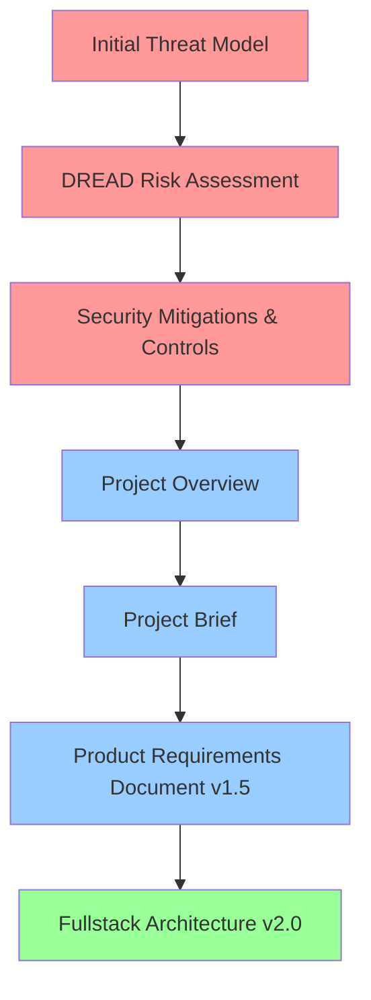

# GenAI Security Agents Documentation

This directory contains the complete documentation for the **GenAI Security Agents** project - a comprehensive Policy-as-Code system that creates security knowledge from standards and delivers it through Claude Code CLI integration for real-time security guidance.

## Document Reading Order

The documents in this directory should be read in the following order, which reflects their logical flow from security analysis through implementation planning:

### 1. Foundation & Security Analysis

| Order | Document | Purpose |
|-------|----------|---------|
| **1** | [BMadSecurityAgentInitialThreatModel.md](BMadSecurityAgentInitialThreatModel.md) | **Initial threat modeling** using STRIDE methodology identifying 16 distinct security threats across knowledge ingestion, agent orchestrator, and CI/CD validation components |
| **2** | [BMadSecurityAgentDREADRiskAssessment.md](BMadSecurityAgentDREADRiskAssessment.md) | **Quantitative risk assessment** using DREAD methodology, prioritizing threats from the initial threat model with risk scores and impact analysis |
| **3** | [BMadSecurityAgentSecurityMitigationsandControls.md](BMadSecurityAgentSecurityMitigationsandControls.md) | **Comprehensive mitigation strategies** and security controls to address identified threats, including implementation recommendations and validation approaches |

### 2. Project Definition & Requirements

| Order | Document | Purpose |
|-------|----------|---------|
| **4** | [BMadSecurityAgentProjectOverview.md](BMadSecurityAgentProjectOverview.md) | **High-level project overview** establishing vision, scope, and strategic context for the BMad Security Agent initiative |
| **5** | [ProjectBriefAIPoweredDevSecOpsAssistant.md](ProjectBriefAIPoweredDevSecOpsAssistant.md) | **Comprehensive project brief** detailing problem statement, solution approach, user personas (Daniella, Leo, Sara), and business justification |
| **6** | [PRD.md](PRD.md) | **Complete Product Requirements Document** (v1.5) with detailed epic breakdowns, user stories, acceptance criteria, and comprehensive implementation roadmap for all 3 development phases |

### 3. Implementation Architecture

| Order | Document | Purpose |
|-------|----------|---------|
| **7** | [architecture.md](architecture.md) | **Comprehensive fullstack architecture** (v2.0) defining system design, technology stack, data models, API specifications, core workflows, and implementation patterns for the complete DevSecOps assistant platform |

## Key Concepts & Architecture

### Core Problem
- **Delayed security feedback** causing expensive context switching for developers
- **Unscalable security policies** that become "shelf-ware" in wikis
- **Inconsistent CI/CD security gates** creating friction and eroding trust

### Solution Approach
- **Hybrid knowledge base** combining industry standards (OWASP) with codified internal security lessons
- **IDE-integrated guidance** providing immediate, actionable security feedback
- **Human-governed policy-as-code** ensuring consistency from IDE to CI/CD pipeline

### User Personas
- **Daniella the Deadline-Driven Developer**: Needs just-in-time security guidance in IDE workflow
- **Leo the Lead AppSec Engineer**: Needs to codify security policies and scale expertise
- **Sara the Senior Platform Engineer**: Needs consistent, reliable CI/CD security validation

## Security Analysis Summary

### Threat Landscape (16 identified threats)
- **Knowledge Base Poisoning**: Malicious data injection into training corpus
- **Agent Prompt Injection**: Manipulation of LLM reasoning and outputs
- **Tool Execution Vulnerabilities**: Risks from automated security scanner integration
- **CI/CD Pipeline Compromise**: Threats to build and deployment integrity

### Risk Priority (DREAD Scores)
1. **High Risk** (8.0-9.0): Knowledge base poisoning, prompt injection attacks
2. **Medium Risk** (6.0-7.0): Tool execution vulnerabilities, data leakage
3. **Lower Risk** (4.0-5.0): DoS attacks, configuration tampering

### Mitigation Strategy
- **Input validation and sanitization** for all knowledge sources
- **Sandboxed execution environments** for agent operations
- **Multi-layered authentication and authorization**
- **Comprehensive monitoring and incident response**

## Implementation Roadmap

The PRD (v1.5) outlines a comprehensive 3-phase implementation approach with detailed stories:

### **Epic 1: Policy-as-Code Engine** (3 Stories)
Foundation for AppSec Engineers to manage security policies:
- **Story 1.1**: Rule Card Repository & YAML Schema
- **Story 1.2**: Manual Ingestion of Initial Rule Cards (10-15 high-value rules)
- **Story 1.3**: Agent Compiler Toolchain & JSON Package Generation

### **Epic 2: IDE Agent Integration (Claude Code MVP)** (3 Stories) 
Real-time security guidance for developers:
- **Story 2.1**: Agentic Runtime Core & Package Loading
- **Story 2.2**: Claude Code Sub-Agent & Router Implementation
- **Story 2.3**: Manual On-Demand Security Scanning

### **Epic 3: CI/CD Advisory Integration** (4 Stories)
Non-blocking validation pipeline for consistent enforcement:
- **Story 3.1**: CI/CD Integration Scaffolding (GitHub Actions)
- **Story 3.2**: CI Validation Engine & Dynamic Scanner Orchestration  
- **Story 3.3**: Multi-Scanner Integration (Semgrep, CodeQL, TruffleHog, etc.)
- **Story 3.4**: Non-Blocking Advisory Reporting & Audit Trail

## Document Relationships

**Security Analysis Phase** (Red): Threat identification → Risk quantification → Mitigation planning  
**Project Definition Phase** (Blue): Vision → Problem/Solution → Detailed requirements  
**Implementation Phase** (Green): Complete technical architecture and system design

## Usage Guidelines

- **Start with security analysis** (documents 1-3) to understand the threat landscape and security posture
- **Review project definition** (documents 4-6) to understand business context, user personas, and solution approach  
- **Use architecture document** (document 7) for technical implementation details, technology stack, and system design patterns
- **Reference PRD** for detailed functional requirements, epic breakdowns, and user stories during development
- **Use threat model and mitigations** as living documents for ongoing security reviews throughout implementation

## Current Status

**Epic 1 & 2: Complete Implementation** ✅  
All core functionality is implemented and operational:
- **Policy-as-Code Engine**: 15+ Rule Cards across 5 security domains with compilation toolchain
- **Claude Code Sub-Agent Integration**: Real-time security guidance during development
- **OWASP & ASVS Semantic Search**: 102 CheatSheets + 17 ASVS standards with intelligent processing
- **Development Workflow Integration**: Complete hybrid architecture (semantic + lexical + compiled rules)

**Story 2.6: OWASP & ASVS Integration** ✅  
Latest major enhancement includes:
- **Comprehensive Corpus**: 119 processed security documents with metadata
- **Intelligent Cleanup**: Automated orphaned file removal and content normalization
- **Makefile Automation**: Simple commands for corpus building and searching
- **Claude Code CLI Integration**: Real-time security guidance examples and workflows

**Next Phase: Epic 3 CI/CD Integration**  
Ready to begin CI/CD advisory integration with complete semantic search foundation.

---

This documentation provides the complete foundation for developing a secure, effective GenAI Security Agents system that transforms security standards into actionable, intelligent development assistance through Policy-as-Code principles.

---

**🔗 Navigation Links:**
- **[← Back to Main README](../README.md)** - Repository overview and quick start
- **[📖 User Guide](USER_GUIDE.md)** - Detailed usage instructions and workflows
- **[⭐ Worked Example](WORKED_EXAMPLE.md)** - Hands-on Flask application security demonstration