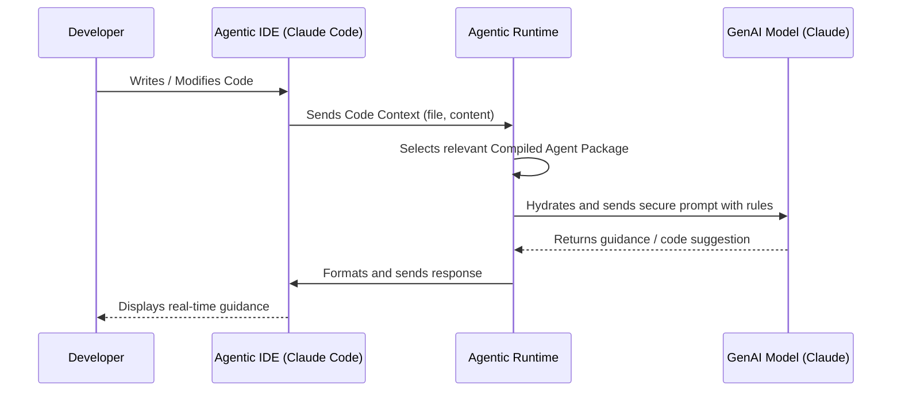
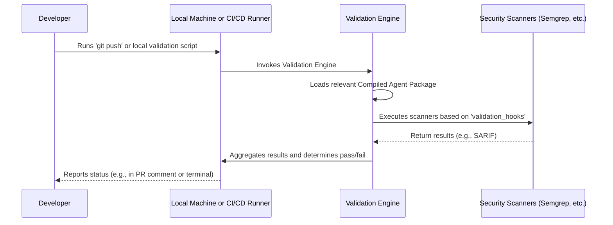

# **Core Workflows**

This section illustrates the key operational sequences of the system, corresponding to the "Multi-Loop Feedback" architectural pattern.

## **Workflow 1: Inner Loop \- Real-time IDE Guidance**

This sequence diagram shows the flow of information when a developer receives "just-in-time" security feedback as they are writing code.

## **Workflow 2: Outer Loops \- Local & CI/CD Validation**

This sequence diagram shows the "post-code" validation flow, which is identical whether run manually by a developer pre-commit or automatically by the CI/CD pipeline.

