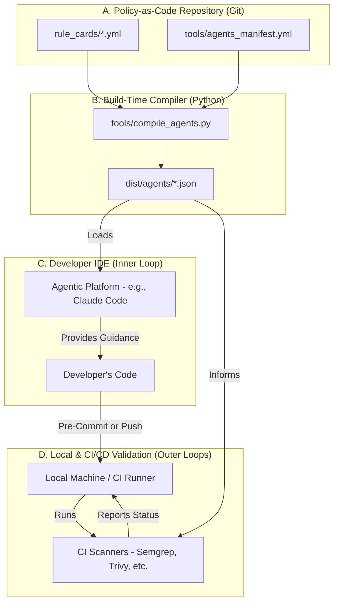

# **High Level Architecture**

This section defines the overall architectural style, key components, and core patterns that will govern the system's design and implementation.

## **Technical Summary**

The system is designed as a **decoupled, event-driven security framework** that operates in multiple distinct feedback loops: a "just-in-time" guidance loop within the developer's agentic IDE, a manual "pre-commit" validation loop on the local machine, and an automated "post-commit" validation loop in the CI/CD pipeline. The architecture's core is a **Policy-as-Code repository** containing human-readable security "Rule Cards" in YAML. At build time, a Python-based **compiler** transforms these rules into versioned, machine-readable JSON packages. These compiled packages are then consumed by GenAI sub-agents to provide guidance, and by CI/CD scanners to enforce policy, ensuring 100% consistency across all feedback loops. The system is model-agnostic and relies on a curated set of best-in-class open-source scanners for deterministic validation.

## **Platform and Infrastructure Choice**

The system is platform-agnostic by design and does not require a complex infrastructure. The primary "platform" is the developer's toolchain and the organization's existing CI/CD service.

* **Platform**: The system is designed to run within standard development and CI/CD environments.  
  * **Primary Agentic Platform (MVP)**: Claude Code  
  * **CI/CD Service**: GitHub Actions or GitLab CI  
* **Key Services**:  
  * **Source Control**: Git (e.g., GitHub, GitLab) is the central platform for managing the Rule Card repository.  
  * **CI/CD Runners**: Standard Linux-based runners with Docker support are required to execute the compiler and scanning tools.  
* **Deployment Host**: The compiled agent JSON packages will be versioned and can be hosted in a simple, reliable object store (e.g., AWS S3, Google Cloud Storage) or distributed via a package manager for consumption by the agentic runtimes.

## **Repository Structure**

The project will be organized as a **monorepo** to facilitate the management of the interconnected components (Rule Cards, compiler, agent runtime, CI configurations).

* **Structure**: A single Git repository will contain all source code and configuration.  
* **Monorepo Tool**: While no complex tool like Nx is needed for the MVP, the structure is designed to be compatible with them for future scalability.  
* **Package Organization**: The repository is logically divided into directories for rule\_cards, tools, dist (compiled output), ci configurations, and docs. This provides a clear separation of concerns.

## **High Level Architecture Diagram**

This diagram illustrates the flow of information and the interaction between the core components of the system.

## **Architectural Patterns**

The system's design is guided by several key architectural patterns that ensure its effectiveness, maintainability, and trustworthiness.

* **Policy-as-Code**: The single source of truth for all security rules is human-readable, version-controlled YAML files. This provides auditability, transparency, and allows security policy to be managed with the same rigor as application code.  
* **Compiled Knowledge (No Runtime RAG)**: To ensure speed, determinism, and simplicity, the system avoids a runtime Retrieval-Augmented Generation (RAG) database for the MVP. Instead, a build-time **compiler** ingests the Rule Cards and produces optimized, self-contained JSON packages for the agents. This is a key pattern for ensuring reliability.  
* **Multi-Loop Feedback**: The architecture creates three distinct but perfectly synchronized feedback loops that provide a consistent experience for the developer:  
  1. **Inner Loop (Real-time IDE Guidance)**: Provides immediate, "just-in-time" security advice from the GenAI agent as the developer is writing code.  
  2. **Local Outer Loop (Pre-Commit Validation)**: Allows the developer to manually run the full suite of security scanners on their local machine before committing. This is a "post-code, pre-push" check that validates the changes against the full policy set.  
  3. Formal Outer Loop (CI/CD Validation): The automated, authoritative gate that runs the same scanners in the CI/CD pipeline upon a pull request.  
     Because all three loops are powered by the same compiled knowledge base, the feedback is guaranteed to be consistent, which is crucial for building developer trust.  
* **Human-in-the-Loop Governance**: The entire system is governed by human experts (Leo, the AppSec Engineer). The AI agents are enforcers of human-defined policy, not autonomous decision-makers. All rule changes are subject to a Git-based peer review process.
