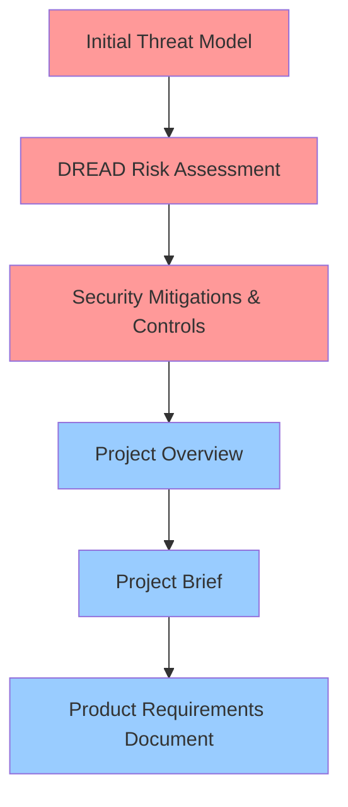

# BMad Security Agent Documentation

This directory contains the complete documentation for the **BMad Security Agent** project - an AI-powered DevSecOps assistant designed to provide developers with just-in-time, actionable security guidance directly within their IDE.

## Document Reading Order

The documents in this directory should be read in the following order, which reflects both their creation chronology and logical flow:

### 1. Foundation & Threat Analysis (August 29, 10:44 - 11:32)

| Order | Document | Created | Purpose |
|-------|----------|---------|---------|
| **1** | [BMadSecurityAgentInitialThreatModel.md](BMadSecurityAgentInitialThreatModel.md) | 10:44 AM | **Initial threat modeling** using STRIDE methodology identifying 16 distinct security threats across knowledge ingestion, agent orchestrator, and CI/CD validation components |
| **2** | [BMadSecurityAgentDREADRiskAssessment.md](BMadSecurityAgentDREADRiskAssessment.md) | 10:48 AM | **Quantitative risk assessment** using DREAD methodology, prioritizing threats from the initial threat model with risk scores and impact analysis |
| **3** | [BMadSecurityAgentSecurityMitigationsandControls.md](BMadSecurityAgentSecurityMitigationsandControls.md) | 11:32 AM | **Comprehensive mitigation strategies** and security controls to address identified threats, including implementation recommendations and validation approaches |

### 2. Project Definition & Planning (August 29, 12:10 - 13:11)

| Order | Document | Created | Purpose |
|-------|----------|---------|---------|
| **4** | [BMadSecurityAgentProjectOverview.md](BMadSecurityAgentProjectOverview.md) | 12:10 PM | **High-level project overview** establishing vision, scope, and strategic context for the BMad Security Agent initiative |
| **5** | [ProjectBriefAIPoweredDevSecOpsAssistant.md](ProjectBriefAIPoweredDevSecOpsAssistant.md) | 12:32 PM | **Comprehensive project brief** detailing problem statement, solution approach, user personas (Daniella, Leo, Sara), and business justification |
| **6** | [PRD.md](PRD.md) | 13:11 PM | **Product Requirements Document** with detailed functional requirements, user stories, acceptance criteria, and implementation roadmap |

## Key Concepts & Architecture

### Core Problem
- **Delayed security feedback** causing expensive context switching for developers
- **Unscalable security policies** that become "shelf-ware" in wikis
- **Inconsistent CI/CD security gates** creating friction and eroding trust

### Solution Approach
- **Hybrid knowledge base** combining industry standards (OWASP) with codified internal security lessons
- **IDE-integrated guidance** providing immediate, actionable security feedback
- **Human-governed policy-as-code** ensuring consistency from IDE to CI/CD pipeline

### User Personas
- **Daniella the Deadline-Driven Developer**: Needs just-in-time security guidance in IDE workflow
- **Leo the Lead AppSec Engineer**: Needs to codify security policies and scale expertise
- **Sara the Senior Platform Engineer**: Needs consistent, reliable CI/CD security validation

## Security Analysis Summary

### Threat Landscape (16 identified threats)
- **Knowledge Base Poisoning**: Malicious data injection into training corpus
- **Agent Prompt Injection**: Manipulation of LLM reasoning and outputs
- **Tool Execution Vulnerabilities**: Risks from automated security scanner integration
- **CI/CD Pipeline Compromise**: Threats to build and deployment integrity

### Risk Priority (DREAD Scores)
1. **High Risk** (8.0-9.0): Knowledge base poisoning, prompt injection attacks
2. **Medium Risk** (6.0-7.0): Tool execution vulnerabilities, data leakage
3. **Lower Risk** (4.0-5.0): DoS attacks, configuration tampering

### Mitigation Strategy
- **Input validation and sanitization** for all knowledge sources
- **Sandboxed execution environments** for agent operations
- **Multi-layered authentication and authorization**
- **Comprehensive monitoring and incident response**

## Implementation Roadmap

The PRD outlines a phased implementation approach:

1. **Epic 1**: Knowledge Management & Basic Agent Framework
2. **Epic 2**: IDE Integration & Developer Experience  
3. **Epic 3**: CI/CD Pipeline Integration & Validation
4. **Epic 4**: Advanced Features & Scalability

## Document Relationships

**Security Analysis Phase** (Red): Threat identification → Risk quantification → Mitigation planning  
**Project Definition Phase** (Blue): Vision → Problem/Solution → Implementation requirements

## Usage Guidelines

- **Start with security analysis** (documents 1-3) to understand the threat landscape and security posture
- **Review project definition** (documents 4-6) to understand business context and implementation approach  
- **Reference PRD** for detailed functional requirements and user stories during development
- **Use threat model and mitigations** as living documents for ongoing security reviews

This documentation provides the complete foundation for developing a secure, effective AI-powered DevSecOps assistant that bridges the gap between security policy and developer workflow.